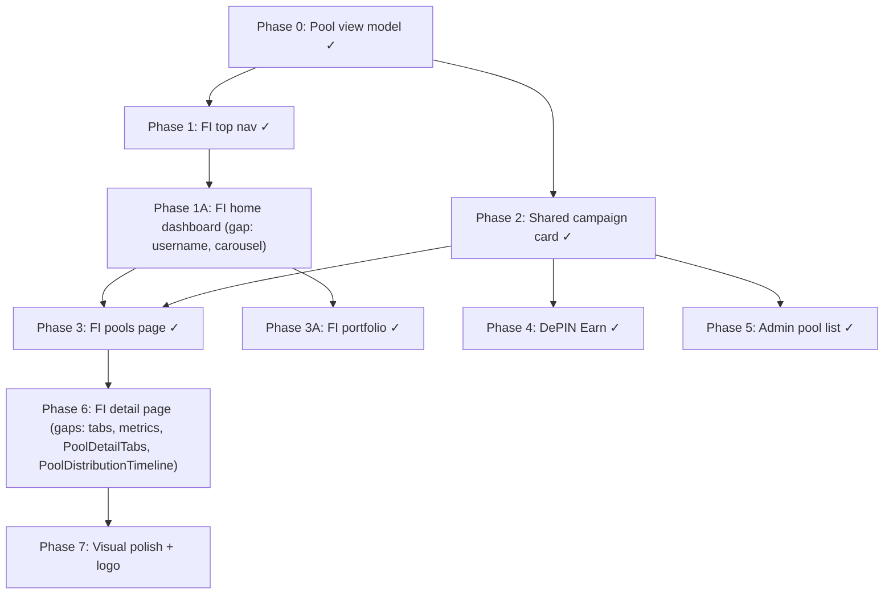

# Design Document — Nemesis FI UI/UX Rework

## Overview

This rework transforms the Nemesis FI investor product from a sidebar-heavy internal portal into a calm, professional financing workspace. The implementation plan (`docs/implementation_plan.md`) defines eight phases. Phases 0–6 are largely implemented; this design document covers the remaining gaps and the visual polish rules that apply across all phases.

### Scope of remaining work

The following items are not yet implemented or have confirmed gaps:

| Gap | Location |
|---|---|
| `FiFeaturedAssetCarousel` only shows `pools[0]`; no multi-pool cycling or indicators | `frontend/src/components/fi/FiFeaturedAssetCarousel.tsx` |
| Hardcoded username `"Selembar Awan"` in `FiHomeDashboard` | `frontend/src/components/fi/FiHomeDashboard.tsx` |
| Pool detail tab labels do not match spec (`documents` tab exists; should be exactly 5 tabs: `Overview`, `Details`, `Reports`, `Impact`, `Calculate`) | `frontend/src/app/(fi)/fi/pools/[poolId]/page.tsx` |
| `PoolDetailTabs` does not exist as a standalone component (tabs are inline in the page) | new file: `frontend/src/components/fi/PoolDetailTabs.tsx` |
| `PoolDistributionTimeline` does not exist (distribution history is an inline table) | new file: `frontend/src/components/fi/PoolDistributionTimeline.tsx` |
| Logo in `FiTopNav` uses a text/icon placeholder instead of `/public/noc-logo.png` | `frontend/src/components/fi/FiTopNav.tsx` |
| Root layout does not set favicon to `/public/noc-logo.png` | `frontend/src/app/layout.tsx` |
| Pool economics in the `Overview` tab use individual `Metric` mini-cards instead of definition list / inline rows | `frontend/src/app/(fi)/fi/pools/[poolId]/page.tsx` |
| Tab content is split across multiple `Card` components instead of one card per tab | `frontend/src/app/(fi)/fi/pools/[poolId]/page.tsx` |

---

## Architecture

The system follows a unidirectional data flow:

```
NemesisStore (Zustand, persisted)
  └─ selectors / getPublicPools / selectInvestorPortfolio / selectAssetsByPool
       └─ buildPoolCampaignViewModel (lib/poolCampaignViewModel.ts)
            └─ UI components (FiHomeDashboard, FiFeaturedAssetCarousel,
                              PoolCampaignCard, PoolDetailTabs, PoolDistributionTimeline)
```

All display data flows from `useNemesisStore` through typed selectors and the view model adapter. No component computes labels, images, or economics independently.

### Execution order (phases already defined in implementation plan)



---

## Components and Interfaces

### FiTopNav — logo fix

**File:** `frontend/src/components/fi/FiTopNav.tsx`

Replace the current text/icon logo block with a Next.js `<Image>` pointing to `/public/noc-logo.png`.

```tsx
import Image from "next/image";

// Inside the logo <Link>:
<Image
  src="/noc-logo.png"
  alt="Nemesis FI"
  width={40}
  height={40}
  className="rounded-2xl"
  priority
/>
```

The surrounding `<Link href="/fi">` and `aria-label` remain unchanged.

### Root layout — favicon

**File:** `frontend/src/app/layout.tsx`

Add an `icons` entry to the `metadata` export:

```ts
export const metadata: Metadata = {
  // ...existing fields...
  icons: {
    icon: "/noc-logo.png",
    shortcut: "/noc-logo.png",
    apple: "/noc-logo.png",
  },
};
```

This replaces the default `app/favicon.ico` with the NOC logo for all browser tabs.

### FiHomeDashboard — username fix

**File:** `frontend/src/components/fi/FiHomeDashboard.tsx`

Remove the hardcoded `"Selembar Awan"` string. Replace with a wallet-aware greeting:

```tsx
// Read wallet public key from useSolanaWallet (already used in portfolio page)
const { publicKey } = useSolanaWallet();
const shortAddress = publicKey
  ? `${publicKey.toBase58().slice(0, 4)}…${publicKey.toBase58().slice(-4)}`
  : null;

// In JSX:
<h1 className="mt-4 text-3xl font-black tracking-tight text-zinc-950 md:text-4xl">
  {shortAddress ? `Welcome back, ${shortAddress}` : "Welcome to Nemesis FI"}
</h1>
```

No other changes to `FiHomeDashboard` are required.

### FiFeaturedAssetCarousel — multi-pool support

**File:** `frontend/src/components/fi/FiFeaturedAssetCarousel.tsx`

**Current state:** renders only `pools[0]`, no indicators.

**Required changes:**

1. Add `activeIndex` state (`useState(0)`).
2. Derive `vm` from `pools[activeIndex]` instead of `pools[0]`.
3. Render indicator dots when `pools.length > 1`.
4. Each dot is a `<button>` with `aria-label="Go to campaign N"` and `aria-current` when active.

**Interface (unchanged):**
```ts
interface Props {
  pools: StakingPool[];
}
```

**Indicator markup pattern:**
```tsx
{pools.length > 1 && (
  <div className="flex items-center justify-center gap-2 py-3">
    {pools.map((_, i) => (
      <button
        key={i}
        onClick={() => setActiveIndex(i)}
        aria-label={`Go to campaign ${i + 1}`}
        aria-current={i === activeIndex ? "true" : undefined}
        className={`h-2 rounded-full transition-all ${
          i === activeIndex ? "w-6 bg-zinc-950" : "w-2 bg-zinc-300"
        }`}
      />
    ))}
  </div>
)}
```

The carousel does not auto-advance; navigation is user-driven only.

### PoolDetailTabs — new standalone component

**File:** `frontend/src/components/fi/PoolDetailTabs.tsx`

Extract the tab bar and tab content rendering from the pool detail page into a standalone component. This isolates tab state and makes the page file leaner.

**Props interface:**
```ts
interface PoolDetailTabsProps {
  pool: StakingPool;
  poolAssets: RegisteredVehicle[];
  reports: PoolReport[];
  distributions: YieldDistribution[];
  teamMembers: { name: string; role: string; bio: string }[];
}
```

**Tab definition (exactly five):**
```ts
type TabKey = "overview" | "details" | "reports" | "impact" | "calculate";

const TABS: { key: TabKey; label: string }[] = [
  { key: "overview",  label: "Overview"  },
  { key: "details",   label: "Details"   },
  { key: "reports",   label: "Reports"   },
  { key: "impact",    label: "Impact"    },
  { key: "calculate", label: "Calculate" },
];
```

The `documents` tab is removed. Documents are surfaced inside the `Details` tab if `pool.documents` is non-empty.

**Single-card-per-tab rule:**

Each tab renders its content inside exactly one white card wrapper:

```tsx
<div className="bg-white rounded-2xl p-6 shadow-sm border border-zinc-950/10">
  {/* all sections for this tab live here */}
</div>
```

Sections within a tab are separated by `<hr className="border-zinc-100" />` or a heading, not by additional card wrappers.

### PoolDistributionTimeline — new component

**File:** `frontend/src/components/fi/PoolDistributionTimeline.tsx`

Replaces the inline distribution table in the `Reports` tab.

**Props interface:**
```ts
interface PoolDistributionTimelineProps {
  distributions: YieldDistribution[];
}
```

**Layout:** A vertical timeline list. Each entry shows:
- Date (formatted `dd MMM yyyy`)
- Cash yield distributed (teal, bold)
- Principal returned
- Reserve delta
- Collection health percentage

When `distributions` is empty, render a quiet empty state: `"No distributions recorded yet."`.

**Markup pattern:**
```tsx
<ol className="relative border-l-2 border-zinc-100 space-y-6 pl-6 py-2">
  {distributions.map((dist) => (
    <li key={dist.id} className="relative">
      <span className="absolute -left-[31px] top-1 h-3 w-3 rounded-full bg-teal-500 ring-4 ring-white" />
      <time className="text-xs font-bold text-zinc-400">
        {new Date(dist.date).toLocaleDateString("id-ID", { day: "2-digit", month: "short", year: "numeric" })}
      </time>
      <dl className="mt-1 flex flex-wrap gap-x-6 gap-y-1 text-sm">
        <div className="flex gap-2">
          <dt className="text-zinc-500">Cash yield</dt>
          <dd className="font-semibold text-teal-700">{formatIDRXFull(dist.yieldDistributed)}</dd>
        </div>
        <div className="flex gap-2">
          <dt className="text-zinc-500">Principal</dt>
          <dd className="font-semibold text-zinc-950">{formatIDRXFull(dist.principalReturned)}</dd>
        </div>
        <div className="flex gap-2">
          <dt className="text-zinc-500">Health</dt>
          <dd className="font-semibold text-zinc-950">{dist.collectionHealthPct.toFixed(1)}%</dd>
        </div>
      </dl>
    </li>
  ))}
</ol>
```

---

## Data Models

### Data flow diagram

```
useNemesisStore
├── pools: StakingPool[]
│     ├── getPublicPools(pools) → FiFeaturedAssetCarousel, FI pools page stats
│     ├── buildPoolCampaignViewModel(pool, {index, linkedAssets}) → PoolCampaignCard
│     └── pools.find(id) → PoolDetailTabs, PoolDetailSummaryRail
├── poolReports: PoolReport[]
│     ├── filter(isPublished) → ReportsTab, PoolDistributionTimeline
│     └── FiProjectUpdates, FiNotificationsPanel
├── investments: InvestorPosition[]
│     └── selectInvestorPortfolio(state) → FiHomeDashboard, PortfolioYieldAreaChart
└── assets: RegisteredVehicle[]
      └── selectAssetsByPool(state, poolId) → PoolOperatingAssetsTable, PoolDetailTabs Details tab
```

### PoolCampaignViewModel (existing, no changes)

All fields are already defined in `frontend/src/lib/poolCampaignViewModel.ts`. No new fields are needed for the gap items.

### YieldDistribution (existing, from `frontend/src/data/pools.ts`)

`PoolDistributionTimeline` consumes `YieldDistribution[]` from `MOCK_YIELD_DISTRIBUTIONS[pool.id]`. No new type is needed.

---

## Layout Specifications

### FI pools page — hero section

The hero section on `/fi/pools` is a simple stacked vertical block. No grid, no multi-column layout.

```
┌─────────────────────────────────────────────────────┐
│  [label: "Nemesis FI · Financing"]                  │
│  Headline text                                      │
│  Description text (one sentence, muted)             │
└─────────────────────────────────────────────────────┘
```

Tailwind: `<div className="space-y-2">` containing `<p>` (label), `<h1>` (headline), `<p>` (description). No `grid`, no `flex` with `justify-between`, no `lg:grid-cols-*`.

### Pool detail page — two-column layout

Desktop layout uses CSS grid with the summary rail on the right:

```
┌──────────────────────────────┬──────────────────┐
│  Tab bar                     │                  │
│  ┌────────────────────────┐  │  Summary Rail    │
│  │  Single white card     │  │  (sticky)        │
│  │  (all tab content)     │  │                  │
│  └────────────────────────┘  │                  │
│  PoolOperatingAssetsTable    │                  │
└──────────────────────────────┴──────────────────┘
```

Grid class: `grid gap-8 lg:grid-cols-[1fr_380px] xl:grid-cols-[1fr_420px]`

The tab content column is `min-w-0` to prevent overflow. The summary rail column uses `<div className="lg:sticky lg:top-24">`.

### Pool detail — single card per tab

Each tab renders one card:

```tsx
// PoolDetailTabs.tsx — tab content wrapper
<div className="bg-white rounded-2xl p-6 shadow-sm border border-zinc-950/10">
  {activeTab === "overview" && <OverviewContent ... />}
  {activeTab === "details"  && <DetailsContent  ... />}
  {activeTab === "reports"  && <ReportsContent  ... />}
  {activeTab === "impact"   && <ImpactContent   ... />}
  {activeTab === "calculate"&& <CalculateContent ... />}
</div>
```

Sections within a tab (e.g., "Deal terms" + "Project Overview" + "Delivery Timeline" in Overview) are separated by `<hr className="my-6 border-zinc-100" />`, not by separate card wrappers.

### Pool economics — definition list pattern

Pool economics fields (target APY, collateral, minimum investment, unit count, tenor, etc.) are rendered as inline label-value rows using `<dl>`:

```tsx
<dl className="divide-y divide-zinc-100">
  <div className="flex justify-between py-3 text-sm">
    <dt className="text-zinc-500">Target APY</dt>
    <dd className="font-semibold text-zinc-950">{pool.performanceTargetYield}%</dd>
  </div>
  <div className="flex justify-between py-3 text-sm">
    <dt className="text-zinc-500">Collateral</dt>
    <dd className="font-semibold text-zinc-950">{pool.collateralDescription || "Revenue Contract"}</dd>
  </div>
  <div className="flex justify-between py-3 text-sm">
    <dt className="text-zinc-500">Min investment</dt>
    <dd className="font-semibold text-zinc-950">Rp {formatNumber(pool.minInvestment)}</dd>
  </div>
  <div className="flex justify-between py-3 text-sm">
    <dt className="text-zinc-500">Units</dt>
    <dd className="font-semibold text-zinc-950">{pool.unitCount}</dd>
  </div>
  <div className="flex justify-between py-3 text-sm">
    <dt className="text-zinc-500">Tenor</dt>
    <dd className="font-semibold text-zinc-950">{pool.tenorMonths} months</dd>
  </div>
</dl>
```

The existing `Metric` component (individual `rounded-2xl bg-zinc-50 p-4` mini-cards) is NOT used for these fields. `Metric` is retained only for the `Calculate` tab projected output values, where the card treatment is appropriate for emphasis.

---

## Correctness Properties

*A property is a characteristic or behavior that should hold true across all valid executions of a system — essentially, a formal statement about what the system should do. Properties serve as the bridge between human-readable specifications and machine-verifiable correctness guarantees.*

> Note: This is a UI/UX rework. The user has explicitly stated that no property-based testing is needed. The properties below are documented for completeness and traceability, but the testing strategy (below) focuses on unit/example tests only.

### Property 1: View model completeness and derivation

*For any* valid `StakingPool` input, calling `buildPoolCampaignViewModel` should return an object with all required fields (`id`, `href`, `image`, `name`, `productLabel`, `operator`, `region`, `status`, `statusLabel`, `description`, `cashYield`, `principalRecovery`, `tenor`, `unitCount`, `supplied`, `target`, `fillPct`, `minInvestment`, `tags`, `proofLabel`, `energyPointsEligible`) present and correctly derived from the pool's own fields.

**Validates: Requirements 1.1, 1.2**

### Property 2: getPublicPools filter

*For any* array of `StakingPool` objects, `getPublicPools` should return only pools whose `status` is `"active"`, `"filled"`, or `"upcoming"`, and should never return pools with status `"pending_approval"` or `"closed"`.

**Validates: Requirements 1.5**

### Property 3: unitCount derivation

*For any* pool and any non-empty `linkedAssets` array, the view model's `unitCount` should equal `linkedAssets.length`; when `linkedAssets` is empty or absent, `unitCount` should equal `pool.unitCount`.

**Validates: Requirements 1.6**

### Property 4: Active nav link state

*For any* nav item in `FiTopNav`, when the current pathname matches that item's `href`, the link element should have the active CSS class applied; when the pathname does not match, the active class should be absent.

**Validates: Requirements 2.6**

### Property 5: Carousel indicators match pool count

*For any* list of N public pools where N > 1, `FiFeaturedAssetCarousel` should render exactly N indicator buttons; when N = 1, no indicators should be rendered; when N = 0, the empty state should be rendered.

**Validates: Requirements 4.4, 11.1**

### Property 6: Product type filter

*For any* selected product type filter on the FI pools page, all rendered `PoolCampaignCard` components should correspond to pools whose `productType` matches the selected filter; no card for a non-matching pool type should be visible.

**Validates: Requirements 6.5**

---

## Error Handling

### Pool not found

When `poolId` does not match any pool in the store, the detail page renders a not-found state with a link back to `/fi/pools`. This is already implemented.

### Empty carousel

When `getPublicPools` returns an empty array, `FiFeaturedAssetCarousel` renders a quiet empty state message. No error is thrown.

### Empty distribution timeline

When `MOCK_YIELD_DISTRIBUTIONS[pool.id]` is undefined or empty, `PoolDistributionTimeline` renders `"No distributions recorded yet."` instead of an empty list or error.

### Wallet not connected

`FiHomeDashboard` reads `publicKey` from `useSolanaWallet`. When `publicKey` is null (wallet not connected), the greeting falls back to `"Welcome to Nemesis FI"`. No error state is shown.

### Missing pool fields

`buildPoolCampaignViewModel` uses nullish coalescing for optional fields (`pool.unitCount || 0`, `pool.tags ?? []`). Components consuming the view model should not crash on missing optional pool data.

---

## Testing Strategy

This is a UI/UX rework. The user has confirmed that property-based testing is not required. Testing focuses on unit/example tests that verify specific behaviors and structural requirements.

### Unit / example tests

Each test below maps to a specific acceptance criterion.

**View model tests** (`lib/poolCampaignViewModel.test.ts`):
- Given a pool with all fields, `buildPoolCampaignViewModel` returns an object with all 22 required fields non-null.
- Given a pool with `imageUrl: ""`, the view model uses a fallback image from `FALLBACK_POOL_IMAGES`.
- Given a pool with `imageUrl: "/images/pool-1.jpg"`, the view model uses a fallback image.
- `getPublicPools` with a mixed-status array returns only active/filled/upcoming pools.
- `getStatusTone` returns a non-empty string for each of the 5 `PoolStatus` values.
- Given `linkedAssets` with 3 items, `unitCount` is 3 regardless of `pool.unitCount`.
- Given no `linkedAssets`, `unitCount` equals `pool.unitCount`.

**FiTopNav tests** (`components/fi/FiTopNav.test.tsx`):
- Renders a logo `<Image>` with `src="/noc-logo.png"` inside a link to `/fi`.
- Renders nav links for EV Assets (`/fi/pools`), Portfolio (`/fi/portfolio`), Future $NMS (`/fi/stake`).
- When `pathname === "/fi/pools"`, the EV Assets link has the active class; others do not.
- The component does not import or render `AppSidebar`.

**FiHomeDashboard tests** (`components/fi/FiHomeDashboard.test.tsx`):
- Rendered output does not contain the string `"Selembar Awan"`.
- When wallet is connected, greeting includes the shortened public key.
- When wallet is not connected, greeting is `"Welcome to Nemesis FI"`.

**FiFeaturedAssetCarousel tests** (`components/fi/FiFeaturedAssetCarousel.test.tsx`):
- Given 0 pools, renders the empty state message.
- Given 1 pool, renders the pool and no indicator dots.
- Given 3 pools, renders 3 indicator buttons.
- Clicking indicator 2 displays the second pool's name.

**FI pools page hero tests** (`app/(fi)/fi/pools/page.test.tsx`):
- The hero section container does not have a `grid` or `lg:grid-cols` class.
- The headline element appears before the description element in the DOM.

**Pool detail page tests** (`app/(fi)/fi/pools/[poolId]/page.test.tsx`):
- Renders exactly 5 tab buttons with labels: Overview, Details, Reports, Impact, Calculate.
- Does not render a tab labeled "Documents".
- The active tab content is wrapped in exactly one `bg-white rounded-2xl` container.
- Pool economics fields (Target APY, Collateral, Min investment, Units, Tenor) are rendered inside a `<dl>` element, not inside individual `rounded-2xl bg-zinc-50` mini-card divs.
- When `poolId` does not match any pool, renders the not-found state with a link to `/fi/pools`.

**PoolDistributionTimeline tests** (`components/fi/PoolDistributionTimeline.test.tsx`):
- Given an empty array, renders `"No distributions recorded yet."`.
- Given distributions, renders one list item per distribution with date, cash yield, and health.

**Portfolio page tests** (`app/(fi)/fi/portfolio/page.test.tsx`):
- When wallet is not connected, renders a connect-wallet prompt (not a portfolio dashboard).
- Rendered output does not contain the text `"Principal recovered"` as a KPI card heading.

### Integration / browser QA checklist

After implementation, verify manually in a browser:

- `/fi` — home dashboard loads, carousel cycles through pools, no hardcoded name.
- `/fi/pools` — hero is a stacked block, stats derive from store, cards render.
- `/fi/pools/[poolId]` — exactly 5 tabs, single card per tab, metrics as definition list.
- `/fi/portfolio` — wallet disconnect state is real, no principal recovered KPI.
- `/depin/earn` — cards match FI visual system.
- `/admin/pools` — admin actions work, status changes propagate to FI/Earn.
- Responsive: desktop, tablet (~768px), mobile (~375px).
- Favicon shows NOC logo in browser tab.
- Logo in FiTopNav shows NOC logo image.
