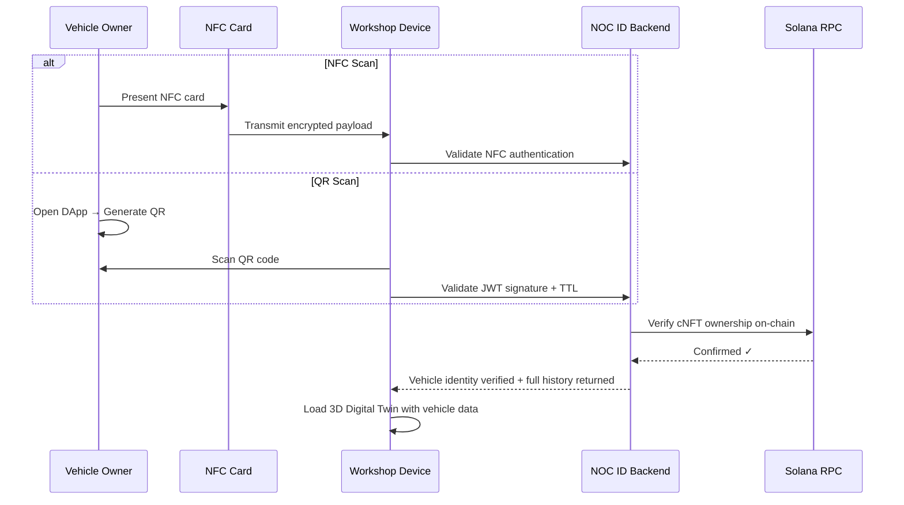
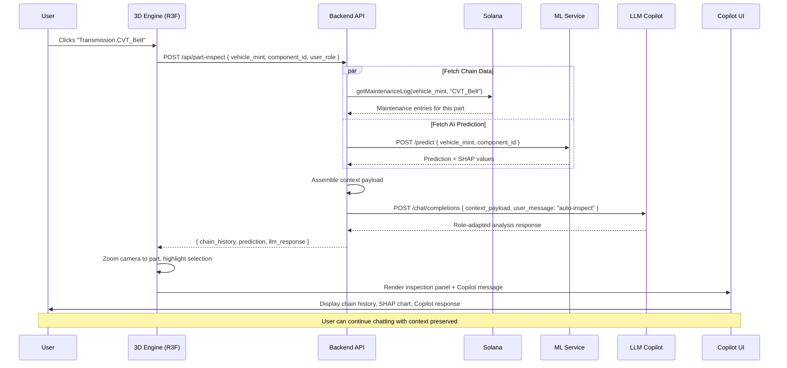
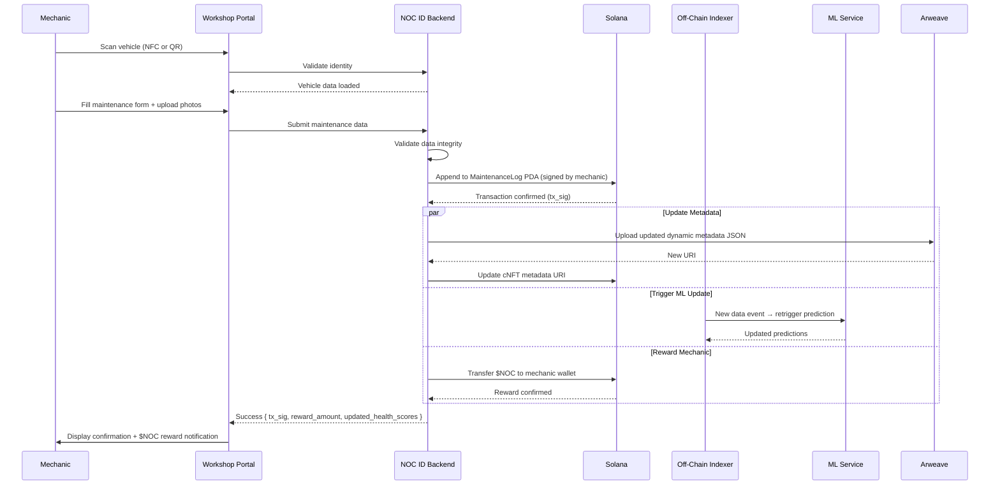
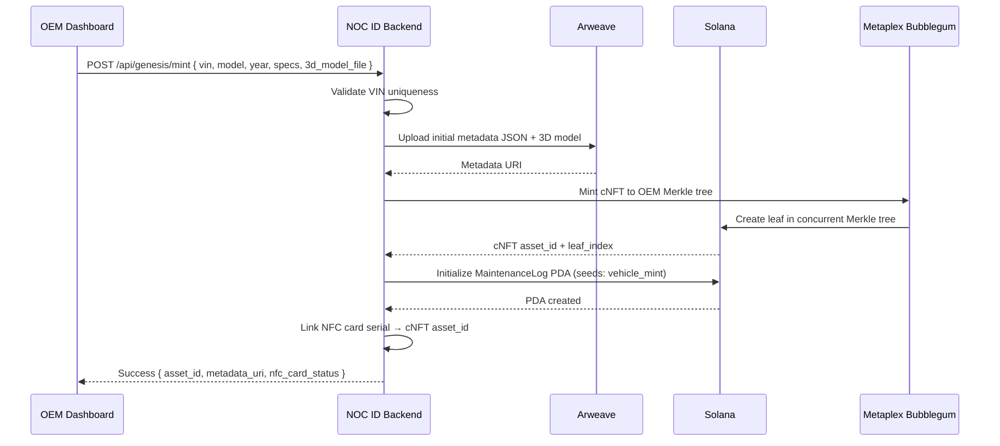
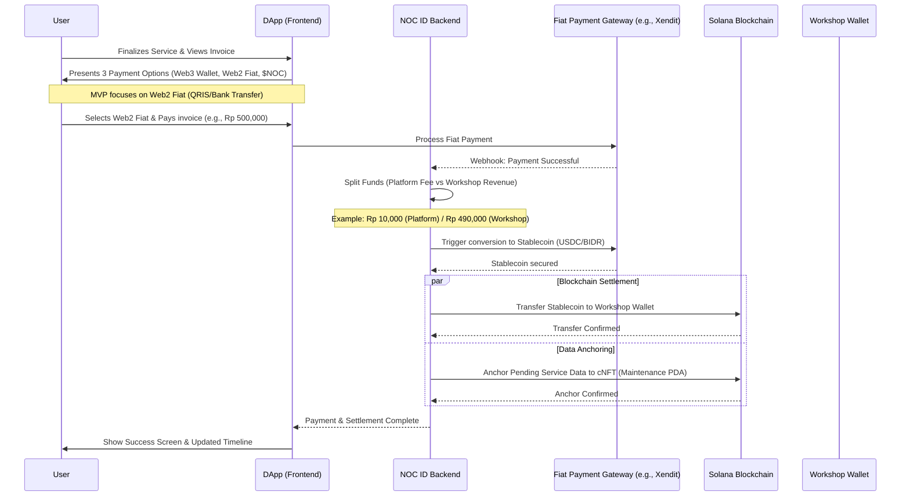
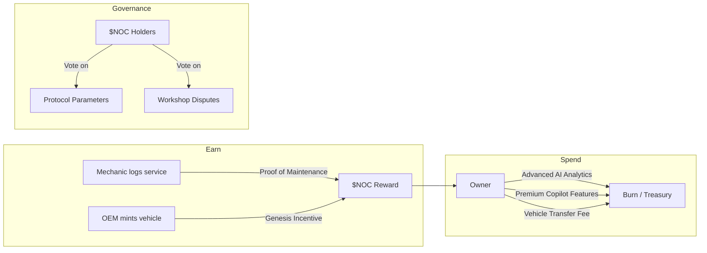

# NOC ID — Product Requirements Document (PRD)

| Field | Value |
|---|---|
| **Product Name** | NOC ID (Nusantara Otomotif Chain ID) |
| **Version** | 2.1.0 |
| **Status** | Implementation Complete — Frontend MVP |
| **Author** | NOC ID Product Team |
| **Created** | 2026-03-18 |
| **Last Updated** | 2026-04-12 |

---

## Table of Contents

1. [Executive Summary](#1-executive-summary)
2. [Problem Statement](#2-problem-statement)
3. [Vision & Objectives](#3-vision--objectives)
4. [Target Users & Personas](#4-target-users--personas)
5. [System Architecture Overview](#5-system-architecture-overview)
6. [Application Layers & Feature Requirements](#6-application-layers--feature-requirements)
7. [Core Technological Pillars](#7-core-technological-pillars)
8. [Detailed Feature Specifications](#8-detailed-feature-specifications)
9. [Data Model & On-Chain Schema](#9-data-model--on-chain-schema)
10. [Non-Functional Requirements](#10-non-functional-requirements)
11. [Security & Compliance](#11-security--compliance)
12. [Tokenomics ($NOC)](#12-tokenomics-noc)
13. [Business Model & Revenue Schema](#13-business-model--revenue-schema)
14. [Release Strategy & Milestones](#14-release-strategy--milestones)
15. [Success Metrics & KPIs](#15-success-metrics--kpis)
16. [Risks & Mitigations](#16-risks--mitigations)
17. [Glossary](#17-glossary)
18. [Appendices](#18-appendices)

---

## 1. Executive Summary

**NOC ID (Nusantara Otomotif Chain ID)** is a decentralized digital passport and vehicle performance tracking system built on the **Solana blockchain**. It creates an immutable, transparent, and verifiable lifecycle record for every vehicle — from the manufacturer's assembly line to the end consumer's garage.

The platform solves systemic fraud in the used-vehicle market (odometer tampering, hidden accident history, counterfeit parts) by anchoring every service event, diagnostic scan, and part replacement to an on-chain identity. A **Unified 3D Digital Twin** acts as the primary interface, letting any stakeholder visually inspect the real-time health of every component. An **Explainable AI (XAI) engine** forecasts part failures and provides actionable insights, while a **context-aware LLM Copilot** adapts recommendations based on the user role and the specific part being inspected.

The system is designed for **enterprise-grade scalability**, leveraging Solana's sub-second finality and Compressed NFTs (cNFTs) to keep per-vehicle minting costs below $0.01, making it viable for mass adoption by OEMs across Southeast Asia.

### 1.1. Frontend MVP Status

> **As of v2.1.0, the complete frontend MVP has been implemented and is fully operational.** The application consists of **54 pages** (59 routes — see Appendix D) across **5 portal ecosystems**, powered by **3 Zustand stores** with **5 React Context shims** for hook access, and **30+ components** (11 UI + 6 3D + 2 layout + portal-specific domain components). All portals share a unified Solana-inspired dark theme with role-specific accent colors.
>
> The Admin/Superadmin portal — not part of the original 4-layer design — has been added as a 5th application layer to provide platform-wide governance, wallet-based RBAC, dispute escalation, and system configuration capabilities.

---

## 2. Problem Statement

### 2.1. Industry Pain Points

| Pain Point | Impact | Current Workaround |
|---|---|---|
| **Odometer fraud** | ~40% of used cars in Southeast Asia have tampered mileage, costing consumers billions annually. | Paper-based service books that are trivially forged. |
| **Hidden accident & flood history** | Buyers discover structural damage post-purchase, facing costly repairs. | Reliance on manual inspections that miss internal damage. |
| **Counterfeit parts** | Fake brake pads, filters, and fluids compromise safety and void warranties. | Trust-based system with no cryptographic proof of part origin. |
| **Opaque maintenance records** | No single source of truth; records are fragmented across workshops. | Isolated dealership databases with no interoperability. |
| **Manufacturer warranty disputes** | Costly legal proceedings due to lack of verifiable maintenance proof. | Manual reconciliation of paper/digital records. |
| **Lack of predictive maintenance** | Reactive repair culture leads to higher total cost of ownership. | Generic OEM schedules that ignore real-world usage patterns. |

### 2.2. Why Blockchain?

A centralized database could store records, but it cannot guarantee **immutability** (records can be altered by the operator), **censorship resistance** (a single entity can deny access), or **trustless verification** (third parties must trust the database operator). Solana provides all three, with the throughput (65,000+ TPS) and cost structure ($0.00025/tx) necessary for high-frequency automotive data.

---

## 3. Vision & Objectives

### 3.1. Product Vision

> "To become the universal, trustless identity layer for every vehicle on the road — making fraud impossible, maintenance predictive, and ownership transparent."

### 3.2. Strategic Objectives

| # | Objective | Key Result | Timeframe | Implementation Status |
|---|---|---|---|---|
| O1 | Eliminate used-car fraud in partner networks | 95% reduction in odometer tampering reports on partner platforms | 24 months | Frontend UI built (service timeline, part verification, on-chain anchoring UI) |
| O2 | Onboard OEM manufacturers as genesis minters | ≥ 3 OEM partnerships signed | 12 months | Enterprise mint console built (manual + batch CSV + part catalog) |
| O3 | Build a verified workshop network | ≥ 500 workshops actively logging maintenance | 18 months | Workshop portal built (13 pages, KYC workflow, queue, verification) |
| O4 | Deliver AI-powered predictive maintenance | XAI model achieves ≥ 85% accuracy on part-failure forecasts | 12 months | AI Insights UI + Copilot Chat UI built (mock data, no ML backend yet) |
| O5 | Achieve consumer adoption | ≥ 50,000 active vehicle passports | 24 months | DApp built (13 pages, booking flow, notifications, 3D twin) |

---

## 4. Target Users & Personas

### 4.1. Persona: Vehicle Owner (Consumer)

| Attribute | Detail |
|---|---|
| **Name** | Rina, 32, Jakarta |
| **Role** | Car owner, daily commuter |
| **Goal** | Verify the integrity of a used car before purchase; track maintenance of her current vehicle. |
| **Pain** | Was sold a flood-damaged car with a forged service book. |
| **NOC ID Value** | Can scan any vehicle's NOC ID to see the full, immutable history. Gets AI-driven alerts about upcoming maintenance. |

### 4.2. Persona: Workshop Mechanic / Dealer

| Attribute | Detail |
|---|---|
| **Name** | Pak Hendra, 45, Surabaya |
| **Role** | Independent workshop owner, 15 years experience |
| **Goal** | Build trust with customers by offering verifiable, on-chain service records. Earn $NOC tokens. |
| **Pain** | Loses customers to dealerships because he can't provide "official" digital records. |
| **NOC ID Value** | Gains verified mechanic status. Every service he logs is immutable. Earns $NOC for "Proof of Maintenance". |

### 4.3. Persona: OEM / Manufacturer

| Attribute | Detail |
|---|---|
| **Name** | PT Astra Manufacturing, Enterprise |
| **Role** | Vehicle manufacturer, fleet operator |
| **Goal** | Issue digital passports at the factory, track warranty compliance, and pull macro analytics. |
| **Pain** | Warranty disputes cost millions. No visibility into post-sale maintenance quality. |
| **NOC ID Value** | Mints genesis cNFTs at near-zero cost. Full lifecycle visibility. Data-driven warranty decisions. |

### 4.4. Persona: Insurance / Financial Institution (Future Phase)

| Attribute | Detail |
|---|---|
| **Name** | PT Asuransi Nusantara, Enterprise |
| **Role** | Vehicle insurance provider |
| **Goal** | Accurate risk assessment based on verifiable vehicle history. |
| **Pain** | Relies on self-reported data that is frequently inaccurate. |
| **NOC ID Value** | Read-only API access to verified on-chain history for underwriting. |

### 4.5. Persona: Platform Administrator (Superadmin)

| Attribute | Detail |
|---|---|
| **Name** | NOC ID Core Team, Internal |
| **Role** | Platform operator responsible for ecosystem governance |
| **Goal** | Manage all platform entities (enterprises, workshops, users), configure fees/parameters, resolve escalated disputes, and maintain audit trails. |
| **Pain** | Without centralized oversight, bad actors (fraudulent workshops, counterfeit part sellers) can damage platform reputation. |
| **NOC ID Value** | Wallet-based RBAC with full audit logging. Configurable platform fees and feature flags. Escalated dispute resolution. Cross-portal notification system. |

---

## 5. System Architecture Overview

### 5.1. High-Level Architecture Diagram

```
┌──────────────────────────────────────────────────────────────────────────┐
│                          CLIENT LAYER                                    │
│                                                                          │
│  ┌──────────┐ ┌──────────┐ ┌──────────┐ ┌──────────┐ ┌──────────────┐  │
│  │ Landing  │ │  User    │ │ Workshop │ │Enterprise│ │    Admin     │  │
│  │  Page    │ │  DApp    │ │  Portal  │ │Dashboard │ │  / Superadmin│  │
│  └──────────┘ └────┬─────┘ └────┬─────┘ └────┬─────┘ └──────┬───────┘  │
│                     │           │            │              │           │
│         ┌───────────┴───────────┴────────────┴──────────────┘           │
│         │      Shared Components Layer                                  │
│         │   (3D Twin, Copilot, Wallet, Notifications, Maps)            │
│         └───────────┬───────────────────────────────────────            │
│                     │                                                    │
│         ┌───────────┴───────────────────────────────────────┐           │
│         │   State Management: Zustand Stores + Context Shims  │           │
│         │   useAdminStore · useBookingStore · useEnterpriseStore│         │
│         │   BookingCtx · AdminCtx · EnterpriseCtx  (shims)  │           │
│         │   ActiveVehicleCtx · PartCatalogCtx (standalone)   │           │
│         │   + localStorage persistence + cross-tab sync      │           │
│         └───────────────────────────────────────────────────┘           │
└──────────────────────────────────────────────────────────────────────────┘
                           │
┌──────────────────────────┼───────────────────────────────────────────────┐
│                    API / MIDDLEWARE LAYER (Target Architecture)           │
│                                                                          │
│  ┌───────────────┐ ┌────────────────┐ ┌─────────────────┐               │
│  │  REST / GQL   │ │  WebSocket     │ │  Solana RPC     │               │
│  │  API Gateway  │ │  (Real-time)   │ │  Adapter        │               │
│  └───────┬───────┘ └────────┬───────┘ └────────┬────────┘               │
│          │                  │                  │                         │
│  ┌───────┴──────────────────┴──────────────────┴────────┐               │
│  │              Backend Services (Node.js / Rust)        │               │
│  │  ┌──────────┐ ┌──────────┐ ┌──────────┐ ┌──────────┐│               │
│  │  │ Identity │ │Maintenan-│ │   AI /   │ │  Token   ││               │
│  │  │ Service  │ │ce Service│ │ ML Svc   │ │  Service ││               │
│  │  └──────────┘ └──────────┘ └──────────┘ └──────────┘│               │
│  └──────────────────────────────────────────────────────┘               │
│                                                                          │
│  ⚠️ NOTE: Backend layer is target architecture. Frontend MVP uses       │
│  React Context + localStorage with simulated/mock data.                 │
└──────────────────────────┼───────────────────────────────────────────────┘
                           │
┌──────────────────────────┼───────────────────────────────────────────────┐
│                     DATA / CHAIN LAYER                                   │
│                                                                          │
│  ┌───────────────────┐ ┌─────────────────┐ ┌──────────────────────────┐ │
│  │  Solana Mainnet   │ │  Off-Chain DB   │ │  Decentralized Storage  │ │
│  │  ┌─────────────┐  │ │  (PostgreSQL)   │ │  (Arweave / IPFS)       │ │
│  │  │ cNFT (Bubb.)│  │ │                 │ │                          │ │
│  │  │ PDA (Maint.)│  │ │  - User profiles│ │  - Dynamic metadata JSON│ │
│  │  │ $NOC (SPL)  │  │ │  - ML features  │ │  - 3D model assets      │ │
│  │  │ Merkle Tree │  │ │  - Session cache│ │  - Diagnostic images     │ │
│  │  └─────────────┘  │ │                 │ │                          │ │
│  └───────────────────┘ └─────────────────┘ └──────────────────────────┘ │
└──────────────────────────────────────────────────────────────────────────┘
```

### 5.2. Key Architectural Decisions

| Decision | Rationale |
|---|---|
| **Solana over Ethereum/Polygon** | Sub-second finality, sub-cent transaction costs, native support for Compressed NFTs via Bubblegum. Critical for high-frequency maintenance logging. |
| **cNFTs over standard NFTs** | Genesis minting cost drops from ~$2 to ~$0.005 per vehicle. Essential for OEM mass adoption (millions of vehicles). |
| **PDAs for Maintenance Logs** | Program Derived Addresses provide deterministic, vehicle-specific on-chain storage without requiring new keypairs. Enables efficient lookups. |
| **Off-chain ML, on-chain anchoring** | ML inference is too compute-intensive for on-chain execution. Predictions are computed off-chain and their hashes are anchored on-chain for auditability. |
| **React Three Fiber (R3F)** | Production-grade 3D rendering in React. Enables component-level interaction, animation, and integration with the existing React component tree. |
| **RAG-based LLM over fine-tuned model** | RAG allows the Copilot to leverage real-time on-chain data without expensive retraining. Context injection per-click ensures relevance. |
| **Zustand for client state (Active)** | 3 Zustand stores (`useAdminStore`, `useBookingStore`, `useEnterpriseStore`) serve as the primary client-state layer. Each store persists to localStorage independently. Chosen for minimal boilerplate, devtools support, and easy migration to server-side state when the backend is integrated. |
| **React Context as shim layer** | 5 Context providers wrap the Zustand stores (`AdminContext`, `BookingContext`, `EnterpriseContext`) for backward-compatible hook access (`useAdmin()`, `useBooking()`, `useEnterprise()`). `ActiveVehicleContext` and `PartCatalogContext` remain standalone with `StorageEvent` cross-tab sync. |
| **Framer Motion for animations** | Production-grade animation library for React. Used for page transitions, micro-interactions, and UI state animations across all 5 portals. Replaced React Spring in the initial tech stack. |

---

## 6. Application Layers & Feature Requirements

### 6.1. Layer 1: Public Landing Page

**Purpose:** Marketing, education, and conversion funnel.
**Route:** `/`

| ID | Feature | Priority | Description | Status |
|---|---|---|---|---|
| LP-01 | Hero Section with 3D Preview | P0 | Animated hero with vehicle visual, CTA buttons for all 4 portals. | ✅ Built |
| LP-02 | How It Works | P0 | Feature cards explaining the ecosystem: Mint, Track, Predict. | ✅ Built |
| LP-03 | Ecosystem Partners | P1 | Logo carousel of OEMs, workshops, and insurance partners. | ✅ Built |
| LP-04 | Live Stats Banner | P1 | Counters: vehicles registered, maintenance events logged, $NOC distributed. | ✅ Built |
| LP-05 | Interactive Demo | P2 | Sandboxed 3D Digital Twin with sample data. | ⬜ Planned |
| LP-06 | SEO & i18n | P1 | Full Bahasa Indonesia + English. SEO-optimized meta tags. | ⬜ Partial |
| LP-07 | Portal Navigation | P0 | Desktop nav + mobile hamburger menu linking to DApp, Workshop, Enterprise, Admin portals. | ✅ Built |

---

### 6.2. Layer 2: User DApp (Vehicle Owner)

**Purpose:** Primary interface for vehicle owners to view history, interact with the 3D twin, book workshops, and manage their NOC ID.
**Route prefix:** `/dapp`
**Pages:** 13

| ID | Feature | Priority | Route | Description | Status |
|---|---|---|---|---|---|
| UD-01 | Wallet Connection | P0 | (header) | Shared `ConnectWalletButton` component with `variant="dapp"`. | ✅ Built |
| UD-02 | Vehicle Dashboard | P0 | `/dapp` | Overview cards: health score, next service, active vehicle selector, quick actions. | ✅ Built |
| UD-03 | Vehicle Identity | P0 | `/dapp/identity` | Detailed vehicle profile: VIN, owner, mileage, health, license plate. | ✅ Built |
| UD-04 | 3D Digital Twin Viewer | P0 | `/dapp/viewer` | Full interactive 3D model (R3F). Color-coded health per component. Click-to-inspect. | ✅ Built |
| UD-05 | Service Timeline | P0 | `/dapp/timeline` | Chronological list of all completed service events from `BookingContext.completedBookings`. | ✅ Built |
| UD-06 | AI Predictive Insights | P0 | `/dapp/insights` | XAI-powered part-failure forecasts with SHAP-style visualizations. | ✅ Built |
| UD-07 | Dynamic QR Code | P0 | `/dapp/qr` | Time-sensitive QR for workshop scanning. Full-screen display mode. | ✅ Built |
| UD-08 | NFC Scan | P1 | `/dapp/nfc` | NFC scan interface (WebNFC API) for vehicle identity verification. | ✅ Built |
| UD-09 | Token Wallet | P1 | `/dapp/wallet` | $NOC balance display, transaction history, payment methods. | ✅ Built |
| UD-10 | Notifications Center | P1 | `/dapp/notifications` | Push notifications filtered by `targetRole: "user"`. Mark read, delete, mark all read. | ✅ Built |
| UD-11 | Vehicle Transfer | P2 | `/dapp/transfer` | On-chain ownership transfer interface. | ✅ Built |
| UD-12 | Workshop Booking Flow | P0 | `/dapp/book` | Workshop discovery with map (LeafletMap), search, filter. | ✅ Built |
| UD-13 | Workshop Detail & Book | P0 | `/dapp/book/[workshopId]` | Workshop profile, reviews, service breakdown, booking form. | ✅ Built |
| UD-14 | Booking Status Tracker | P0 | `/dapp/book/status` | Real-time booking status: PENDING → ACCEPTED → IN_SERVICE → INVOICE_SENT → PAID → COMPLETED. Payment modal, review submission. | ✅ Built |

---

### 6.3. Layer 3: Workshop / Dealer Portal

**Purpose:** Interface for verified mechanics to scan vehicles, manage bookings, input maintenance data, verify parts, and track performance.
**Route prefix:** `/workshop`
**Pages:** 13

| ID | Feature | Priority | Route | Description | Status |
|---|---|---|---|---|---|
| WP-01 | Workshop Dashboard | P0 | `/workshop` | Overview: active bookings, today's queue, revenue, quick actions. | ✅ Built |
| WP-02 | Vehicle Scan (NFC/QR) | P0 | `/workshop/scan` | Dual-mode scanner. NFC reader + QR camera scanner. Creates walk-in session via `createWalkinSession()`. | ✅ Built |
| WP-03 | Active Service Queue | P0 | `/workshop/queue` | Live queue of ACCEPTED + IN_SERVICE bookings. Start service, log service actions. Links to maintenance form with `fromBooking=true`. | ✅ Built |
| WP-04 | Maintenance / Invoice Form | P0 | `/workshop/maintenance` | Structured data entry: service type, parts (OEM toggle), pricing, mechanic notes. Submits invoice via `sendInvoice()`. | ✅ Built |
| WP-05 | Service History | P0 | `/workshop/history` | All completed bookings for this workshop from `completedBookings`. | ✅ Built |
| WP-06 | Booking Management | P0 | `/workshop/bookings` | Accept/reject incoming bookings. Status management for pending requests. | ✅ Built |
| WP-07 | Vehicle Detail View | P1 | `/workshop/vehicle/[vin]` | Detailed vehicle profile when scanned or selected from queue. | ✅ Built |
| WP-08 | Part Verification Scanner | P1 | `/workshop/verification` | Scan part serial/QR to verify authenticity against `PartCatalogContext`. Flags counterfeit parts. | ✅ Built |
| WP-09 | 3D Digital Twin (Mechanic View) | P0 | `/workshop/viewer` | Same 3D model with mechanic-specific overlays. Click a part → diagnostic from LLM Copilot. | ✅ Built |
| WP-10 | Workshop Analytics | P1 | `/workshop/analytics` | Services performed, revenue trends, common repairs, part usage. | ✅ Built |
| WP-11 | Reputation Dashboard | P1 | `/workshop/reputation` | Customer ratings, review feed, reputation score, badges earned. | ✅ Built |
| WP-12 | Workshop Wallet | P1 | `/workshop/wallet` | $NOC balance, payout history, payment method configuration. | ✅ Built |
| WP-13 | Workshop Notifications | P1 | `/workshop/notifications` | Notifications filtered by `targetRole: "workshop"`. Booking alerts, KYC updates, recall instructions. | ✅ Built |

---

### 6.4. Layer 4: Enterprise / Manufacturer Dashboard

**Purpose:** For OEMs to mint genesis NOC IDs, manage fleets, consume macro analytics, handle warranties, manage workshops, and process disputes.
**Route prefix:** `/enterprise`
**Pages:** 12

| ID | Feature | Priority | Route | Description | Status |
|---|---|---|---|---|---|
| ED-01 | Genesis Minting Console | P0 | `/enterprise/mint` | Batch-mint cNFTs. Tabs: Manual, Batch CSV, Part Catalog (writes to `PartCatalogContext`). | ✅ Built |
| ED-02 | Enterprise Overview | P0 | `/enterprise` | KPIs from `EnterpriseContext.metrics`: vehicles minted, active sessions, monthly revenue, avg fleet health. Activity feed, workshop network status. | ✅ Built |
| ED-03 | Fleet Map | P0 | `/enterprise/fleet` | `FleetLeafletMap` component with vehicle markers. Health-based coloring (green/yellow/red). Regional stats sidebar. | ✅ Built |
| ED-04 | Macro Analytics Dashboard | P0 | `/enterprise/analytics` | Aggregate statistics from `EnterpriseContext`: health scores by model, failure points, service type distribution, OEM vs aftermarket parts, workshop performance. | ✅ Built |
| ED-05 | Warranty Management | P1 | `/enterprise/warranty` | Warranty claims CRUD. Approve/reject pushes `warranty_update` notifications to user + workshop via `addNotification()`. | ✅ Built |
| ED-06 | Workshop Network Management | P1 | `/enterprise/workshops` | Workshop directory from `workshopsData`. Live metrics per workshop from `completedBookings`. KYC status badges. | ✅ Built |
| ED-07 | Workshop Detail | P1 | `/enterprise/workshops/[workshopId]` | Individual workshop profile: service history, reviews, revenue chart, OEM part usage, KYC status. | ✅ Built |
| ED-08 | Recall Management | P1 | `/enterprise/recalls` | Issue recalls with modal form. Pushes `recall_notice` to users + workshops. Campaign table with affected count. | ✅ Built |
| ED-09 | Recall Campaign Detail | P1 | `/enterprise/recalls/[campaignId]` | Per-vehicle compliance tracking, workshop execution status, timeline. | ✅ Built |
| ED-10 | Transaction Monitoring | P1 | `/enterprise/transactions` | Enterprise-scoped on-chain activity. Filter by type, date, amount, status. | ✅ Built |
| ED-11 | Dispute Management | P1 | `/enterprise/disputes` | Manage user-workshop conflicts. Types: payment, service quality, part authenticity, warranty. Resolution actions. | ✅ Built |
| ED-12 | Enterprise Settings | P1 | `/enterprise/settings` | Notification preferences, display settings, team management. | ✅ Built |

---

### 6.5. Layer 5: Admin / Superadmin Portal

**Purpose:** Platform-wide governance for the NOC ID ecosystem. Manages all entities (enterprises, workshops, users), configures platform parameters, resolves escalated disputes, and maintains comprehensive audit trails.
**Route prefix:** `/admin`
**Pages:** 10
**Context:** `AdminContext` — wallet-based RBAC + platform config + audit logging + dispute management

**Role Hierarchy:** `Superadmin > Admin > Enterprise > Workshop > User`

**Visual Identity:** Same Solana-inspired dark theme, with **orange accent** (`#F97316`) distinguishing admin from other portals (green for DApp, purple for Workshop/Enterprise).

| ID | Feature | Priority | Route | Description | Status |
|---|---|---|---|---|---|
| AD-01 | Platform Dashboard | P0 | `/admin` | KPIs: total vehicles, active workshops, total users, on-chain transactions, platform revenue, active disputes. Entity distribution chart, daily activity trend, recent events. | ✅ Built |
| AD-02 | Users & Roles (RBAC) | P0 | `/admin/roles` | Wallet whitelist CRUD. Columns: wallet, role, entity name, status (active/suspended/pending), registered, last active. Actions: add wallet, edit role, suspend, activate, remove. Filter by role tab. Search by wallet/entity. Superadmin-only: promote to Admin. | ✅ Built |
| AD-03 | Enterprise Directory | P1 | `/admin/enterprises` | All registered enterprises. Name, wallet, vehicles minted, active workshops, status, plan tier. Onboard new enterprise. Suspend/activate. | ✅ Built |
| AD-04 | Workshop KYC Management | P0 | `/admin/workshops` | Master workshop directory across all enterprises. KYC approval workflow: queue pending, approve/reject with reason. Pushes `kyc_change` notification to workshop + enterprise. Compliance flags. | ✅ Built |
| AD-05 | Vehicle Registry | P1 | `/admin/vehicles` | Master vehicle table: VIN, model, minting enterprise, owner wallet, health, status, mint date. Filter by enterprise, model, health range. Search by VIN. | ✅ Built |
| AD-06 | Transaction Monitoring | P1 | `/admin/transactions` | Platform-wide on-chain activity. Columns: TX sig, type, from, to, amount, currency, gas, block, timestamp. Anomaly flags for suspicious patterns. | ✅ Built |
| AD-07 | Dispute Escalation | P0 | `/admin/disputes` | Escalated disputes from enterprise level. Detail: booking record, invoice, review. Resolution: force refund, ban workshop, split payment. Pushes `dispute_resolved` to user + workshop + enterprise. Every action logged to audit. | ✅ Built |
| AD-08 | Platform Analytics | P1 | `/admin/analytics` | Cross-entity analytics: revenue by enterprise, growth trends, engagement metrics, quality scores, geographic distribution. | ✅ Built |
| AD-09 | System Configuration | P0 | `/admin/config` | 4 config sections managed via `PlatformConfig`: **Fees** (platformFeePercent, gasSubsidyPercent, minServiceFee, maxServiceFee), **Tokens** (nocTokenRate, usdcRate), **Minting & Security** (maxBatchMintSize, qrExpirySeconds), **Feature Flags** (aiInsights, digitalTwin, copilot, walletPayments). | ✅ Built |
| AD-10 | Audit Logs | P0 | `/admin/audit` | Full audit trail. Columns: timestamp, admin wallet, action type, target entity, details. Action types: `role_change`, `kyc_approval`, `kyc_revoke`, `dispute_resolution`, `config_change`, `enterprise_onboard`, `wallet_whitelist`, `wallet_suspend`, `wallet_remove`. Filter by admin, action type, date, target. | ✅ Built |

**`PlatformConfig` Schema (from `AdminContext.tsx`):**

```typescript
interface PlatformConfig {
  platformFeePercent: number;   // Default: 2.5%
  gasSubsidyPercent: number;    // Default: 0%
  minServiceFee: number;        // Default: Rp 50,000
  maxServiceFee: number;        // Default: Rp 50,000,000
  nocTokenRate: number;         // Default: 52 IDR per NOC
  usdcRate: number;             // Default: 16,000 IDR per USDC
  maxBatchMintSize: number;     // Default: 10,000
  qrExpirySeconds: number;     // Default: 300 (5 min)
  features: {
    aiInsights: boolean;        // Default: true
    digitalTwin: boolean;       // Default: true
    copilot: boolean;           // Default: true
    walletPayments: boolean;    // Default: false
  };
}
```

---

## 7. Core Technological Pillars

### 7.1. Solana Blockchain — Dual-Asset Architecture

#### 7.1.1. Identity Asset: Dynamic Compressed NFT (cNFT)

| Attribute | Specification |
|---|---|
| **Standard** | Metaplex Bubblegum (cNFT) |
| **Compression** | State compression via concurrent Merkle trees |
| **Minting Cost** | ~$0.005 per vehicle (vs. ~$2 for standard NFTs) |
| **Metadata** | Dynamic, off-chain JSON hosted on Arweave. URI stored in the Merkle tree leaf. |
| **Update Authority** | Manufacturer (genesis) → NOC ID Protocol (subsequent updates via authorized services) |

**cNFT Metadata Schema (Dynamic JSON):**

```json
{
  "name": "NOC ID #00001",
  "symbol": "NOCID",
  "description": "Digital Vehicle Passport for VIN: MHKA1BA1JFK000001",
  "image": "https://arweave.net/{tx_id}/vehicle_thumbnail.png",
  "external_url": "https://nocid.io/vehicle/MHKA1BA1JFK000001",
  "attributes": [
    { "trait_type": "VIN", "value": "MHKA1BA1JFK000001" },
    { "trait_type": "Make", "value": "Toyota" },
    { "trait_type": "Model", "value": "Avanza" },
    { "trait_type": "Year", "value": "2025" },
    { "trait_type": "Color", "value": "Silver Metallic" },
    { "trait_type": "Engine_Type", "value": "1.5L 2NR-VE" },
    { "trait_type": "Transmission", "value": "CVT" },
    { "trait_type": "Current_Mileage_KM", "value": "34521" },
    { "trait_type": "Health_Score", "value": "87" },
    { "trait_type": "Last_Service_Date", "value": "2026-02-10" },
    { "trait_type": "Total_Service_Events", "value": "12" },
    { "trait_type": "AI_Risk_Level", "value": "Low" },
    { "trait_type": "Genesis_Timestamp", "value": "1703980800" }
  ],
  "properties": {
    "files": [
      { "uri": "https://arweave.net/{tx_id}/3d_model.glb", "type": "model/gltf-binary" }
    ],
    "category": "vehicle_passport",
    "creators": [
      { "address": "OEM_WALLET_ADDRESS", "share": 100 }
    ]
  }
}
```

#### 7.1.2. Utility Token: $NOC (SPL Token)

| Attribute | Specification |
|---|---|
| **Standard** | SPL Token (Token-2022 for future extensions like transfer hooks) |
| **Total Supply** | 1,000,000,000 $NOC (capped) |
| **Decimals** | 6 |
| **Utility** | Proof of Maintenance rewards, advanced analytics access, governance (future) |

> [!IMPORTANT]
> The $NOC token is a **utility token**, not a security. All tokenomics design must comply with applicable regulations. Legal counsel review is required before any public distribution.

#### 7.1.3. Program Derived Addresses (PDAs)

**Maintenance Log PDA Schema:**

```
Seeds: ["maintenance_log", vehicle_cnft_mint_address]
```

```rust
#[account]
pub struct MaintenanceLog {
    pub vehicle_mint: Pubkey,          // 32 bytes — cNFT mint address
    pub authority: Pubkey,             // 32 bytes — NOC ID protocol authority
    pub total_entries: u32,            // 4 bytes
    pub last_updated: i64,            // 8 bytes — Unix timestamp
    pub entries: Vec<MaintenanceEntry>, // Dynamic
}

#[derive(AnchorSerialize, AnchorDeserialize, Clone)]
pub struct MaintenanceEntry {
    pub entry_id: u64,
    pub timestamp: i64,
    pub mechanic: Pubkey,              // Verified mechanic wallet
    pub workshop_id: [u8; 32],         // Workshop DID hash
    pub service_type: ServiceType,     // Enum
    pub mileage_km: u32,
    pub parts_replaced: Vec<PartRecord>,
    pub obd_codes: Vec<[u8; 5]>,       // OBD-II DTC codes
    pub diagnostic_hash: [u8; 32],     // SHA-256 of full diagnostic data
    pub photo_evidence_uri: String,    // Arweave URI
    pub ai_prediction_hash: [u8; 32], // Hash of XAI prediction at time of service
}

#[derive(AnchorSerialize, AnchorDeserialize, Clone)]
pub struct PartRecord {
    pub part_category: PartCategory,   // Enum: Engine, Transmission, Brakes, etc.
    pub oem_part_number: String,
    pub is_oem_verified: bool,
    pub condition_before: u8,          // 0-100 health score
    pub condition_after: u8,           // 0-100 health score
}
```

---

### 7.2. Smart Identity System (NFC/RFID + Dynamic QR)

#### 7.2.1. NFC/RFID Smart Card

| Attribute | Specification |
|---|---|
| **Form Factor** | ISO 14443-A/B NFC card (credit card size) |
| **Chip** | NTAG 424 DNA (tamper-proof, with AES-128 SUN authentication) |
| **Data Stored** | Encrypted vehicle identifier, cNFT mint address reference, counter-based authentication payload |
| **Interaction** | Tap-to-read via WebNFC API (Chrome Android) or native NFC readers |
| **Security** | Each tap generates a unique, one-time authentication code. Prevents cloning/replay attacks. |

#### 7.2.2. Dynamic QR Code (Fallback)

| Attribute | Specification |
|---|---|
| **Generation** | Server-side, cryptographically signed |
| **TTL** | 5 minutes (configurable via `PlatformConfig.qrExpirySeconds`) |
| **Payload** | Signed JWT containing: vehicle_mint, owner_wallet (hashed), timestamp, nonce |
| **Verification** | Workshop scans → backend validates signature + TTL + nonce (prevents replay) |
| **Delivery** | Displayed in User DApp (`/dapp/qr`). Optional: printed as a secure physical sticker with rotating e-ink display (future hardware). |

**Dual-Verification Flow:**



---

### 7.3. Explainable AI (XAI) Predictive Maintenance

#### 7.3.1. ML Pipeline Architecture

```
┌─────────────┐    ┌──────────────┐    ┌──────────────┐    ┌──────────────┐
│  On-Chain    │───▶│  Feature     │───▶│  Model       │───▶│  Prediction  │
│  Data Ingest │    │  Engineering │    │  Inference   │    │  API + SHAP  │
└─────────────┘    └──────────────┘    └──────────────┘    └──────────────┘
       │                  │                   │                    │
  Solana Indexer    PostgreSQL          XGBoost / LightGBM    REST API
  (Helius/Triton)   + Redis Cache       Model Registry        + Arweave
                                        (MLflow)              (hash anchor)
```

> **Note:** The frontend MVP (`/dapp/insights`, `/workshop/viewer`) renders AI insights using simulated data. The ML pipeline above represents the target backend architecture.

#### 7.3.2. Feature Engineering

| Feature Category | Examples |
|---|---|
| **Mileage-based** | Current mileage, mileage since last service, average daily km |
| **Time-based** | Days since last service, vehicle age, seasonal patterns |
| **Component-specific** | Service count per part, part replacement frequency, OBD-II code history |
| **Workshop quality** | Average reputation score of servicing workshops |
| **Environmental** | Climate zone (derived from GPS), urban vs. highway usage ratio |

#### 7.3.3. Model Specifications

| Attribute | Specification |
|---|---|
| **Algorithm** | XGBoost (primary), LightGBM (ensemble) |
| **Output** | Per-component failure probability (0.0–1.0) + estimated days until failure |
| **Explainability** | SHAP (SHapley Additive exPlanations) values per prediction per feature |
| **Retraining** | Automated weekly retraining via Airflow pipeline when new on-chain data exceeds threshold |
| **Serving** | TorchServe / FastAPI behind API Gateway with <200ms P95 latency |
| **Auditability** | SHA-256 hash of model version + prediction payload anchored to Solana for tamper-proof audit trail |

#### 7.3.4. SHAP Value Presentation

For each part prediction, the UI renders:

1. **Risk Score Bar:** 0–100 health score with color gradient (green → yellow → red).
2. **Top Contributing Factors:** Waterfall chart showing top 5 SHAP values (e.g., "High mileage since last oil change contributes +0.32 to risk").
3. **Recommended Action:** AI-generated suggestion based on the risk level and contributing factors.

---

### 7.4. Unified 3D Digital Twin

#### 7.4.1. Technical Stack

| Component | Technology |
|---|---|
| **Rendering Engine** | React Three Fiber (R3F) `^9.5.0` + Three.js `^0.183.2` |
| **Helpers** | @react-three/drei `^10.7.7` (OrbitControls, GLTF loader, Environment, etc.) |
| **Animation** | Framer Motion `^12.38.0` (UI transitions), custom GLSL shaders (3D effects) |
| **3D Models** | glTF 2.0 / GLB format (Draco compressed) |
| **Model Source** | Manufacturer-provided CAD → optimized for web (Blender pipeline) |
| **Interaction** | Raycasting for click detection, orbit controls, zoom-to-part |

**Implemented 3D Model Components** (in `frontend/src/components/3d/`):

| Component | File | Vehicle |
|---|---|---|
| `CarModel` | `CarModel.tsx` | Toyota Avanza 2025 |
| `BMWM4Model` | `BMWM4Model.tsx` | BMW M4 G82 2025 |
| `MotorcycleModel` | `MotorcycleModel.tsx` | Honda Beat 2024 |
| `HarleyDavidsonModel` | `HarleyDavidsonModel.tsx` | Harley-Davidson Sportster S |
| `SharedDigitalTwinViewer` | `SharedDigitalTwinViewer.tsx` | Unified viewer wrapping all models with shared controls |

#### 7.4.2. Component Hierarchy

Every 3D model MUST follow a standardized component hierarchy to enable consistent click-to-inspect behavior:

```
Vehicle Root
├── Body
│   ├── Hood
│   ├── Front_Bumper
│   ├── Rear_Bumper
│   ├── Left_Door_Front
│   ├── Left_Door_Rear
│   ├── Right_Door_Front
│   ├── Right_Door_Rear
│   └── Trunk
├── Chassis
│   ├── Frame
│   ├── Suspension_FL / FR / RL / RR
├── Engine
│   ├── Engine_Block
│   ├── Cylinder_Head
│   ├── Intake_Manifold / Exhaust_Manifold
│   ├── Turbocharger (if applicable)
│   ├── Oil_Filter / Air_Filter
├── Transmission
│   ├── Gearbox
│   ├── Clutch (if manual) / Torque_Converter (if auto) / CVT_Belt (if CVT)
├── Brakes
│   ├── Brake_Disc_FL / Brake_Pad_FL (repeat for FR, RL, RR)
├── Electrical
│   ├── Battery / Alternator / Starter_Motor
├── Cooling
│   ├── Radiator / Thermostat / Water_Pump
├── Tires
│   ├── Tire_FL / FR / RL / RR
└── Fluids (virtual overlay)
    ├── Engine_Oil / Coolant / Brake_Fluid / Transmission_Fluid / Power_Steering_Fluid
```

#### 7.4.3. Health-to-Color Mapping

| Health Score | Color | Hex | State |
|---|---|---|---|
| 90–100 | Green | `#22C55E` | Excellent |
| 70–89 | Lime-Yellow | `#A3E635` | Good |
| 50–69 | Yellow/Amber | `#FACC15` | Warning |
| 30–49 | Orange | `#F97316` | Critical |
| 0–29 | Red (pulsing) | `#EF4444` | Danger |

#### 7.4.4. Animation Capabilities

| Animation | Trigger | Description |
|---|---|---|
| **Explode / Strip Body** | Button or gesture | Smoothly removes outer body panels to reveal chassis and engine. |
| **X-Ray Mode** | Toggle | Semi-transparent body with highlighted internal components. |
| **Zoom-to-Part** | Click on part | Camera smoothly animates to focus on the selected component. |
| **Health Pulse** | Auto (critical parts) | Parts with health ≤30 emit a subtle pulsing glow. |
| **Part Highlight** | Hover | Hovered part receives an outline/glow effect with tooltip. |

---

### 7.5. Context-Aware LLM Copilot

#### 7.5.1. Architecture

```
┌────────────────────────────────────────────────────────────┐
│                     LLM Copilot System                      │
│                                                              │
│  ┌──────────┐   ┌──────────────┐   ┌─────────────────────┐ │
│  │ User     │──▶│ Context      │──▶│ LLM (GPT-4 /       │ │
│  │ Message  │   │ Builder      │   │ Claude / Gemini)     │ │
│  └──────────┘   └──────┬───────┘   └──────────┬──────────┘ │
│                        │                       │             │
│          ┌─────────────┼───────────────────────┘             │
│          │             │                                     │
│  ┌───────▼───────┐  ┌─▼──────────────┐                     │
│  │ RAG Pipeline  │  │ Response       │                     │
│  │ (Vector DB)   │  │ Formatter      │                     │
│  └───────────────┘  └────────────────┘                     │
│                                                              │
│  Knowledge Sources:                                          │
│  • On-chain history (real-time Solana query)                │
│  • XAI prediction + SHAP values                             │
│  • OEM service manuals (vectorized)                         │
│  • Community repair guides                                   │
│  • Parts marketplace inventory                               │
└────────────────────────────────────────────────────────────┘
```

> **Frontend Implementation:** The Copilot UI is built as two shared components — `CopilotChatPanel` (inline chat) and `GlobalCopilotSidebar` (slide-out panel). Both are available in DApp and Workshop portals. Currently uses simulated responses; RAG pipeline is target architecture.

#### 7.5.2. Context Injection Protocol

When a user clicks a 3D part, the following context payload is assembled and injected as the system prompt for the LLM:

```json
{
  "context_type": "part_inspection",
  "user_role": "owner | mechanic | manufacturer",
  "vehicle": {
    "vin": "MHKA1BA1JFK000001",
    "make": "Toyota",
    "model": "Avanza",
    "year": 2025,
    "current_mileage_km": 34521
  },
  "selected_part": {
    "component_id": "Transmission.CVT_Belt",
    "display_name": "CVT Belt",
    "health_score": 42,
    "health_status": "Critical",
    "last_service_date": "2025-08-15",
    "mileage_at_last_service": 28000,
    "service_count": 1
  },
  "chain_history": [ "..." ],
  "ai_prediction": {
    "failure_probability": 0.67,
    "estimated_days_until_failure": 45,
    "top_shap_factors": [ "..." ]
  },
  "instruction": "Respond as the NOC ID Copilot. Adapt depth and terminology to the user_role."
}
```

#### 7.5.3. Role-Adaptive Response Examples

**For Owner (Rina):**
> "⚠️ Your CVT Belt is showing signs of wear. Based on your driving patterns, our AI estimates it may need replacement within 45 days. The biggest factor is the 6,521 km driven since your last CVT service. I'd recommend scheduling a CVT inspection soon."

**For Mechanic (Pak Hendra):**
> "🔧 **CVT Belt — Critical (Health: 42/100)**\n\n**Diagnostic Summary:** Single CVT fluid replacement at 28,000 km. Current mileage: 34,521 km (6,521 km interval). XAI model flags `mileage_since_last_cvt_service` as primary risk driver (SHAP +0.38).\n\n**Recommended Procedure:**\n1. Inspect CVT belt for glazing, cracking, or width reduction.\n2. If belt width < 21.0 mm, replace with OEM part #K0800-4A00C."

---

## 8. Detailed Feature Specifications

### 8.1. Critical Interaction Flow: 3D Part Click → Chain + AI + Chat



### 8.2. Mechanic Service Submission Flow



### 8.3. Genesis Minting Flow (OEM)



### 8.4. Service Payment & Settlement Flow (Web2.5 MVP)



### 8.5. Booking & Service Lifecycle Flow (Implemented)

The complete booking-to-completion pipeline is implemented in `BookingContext` with the following state machine:

```
                    ┌──────────┐
                    │  PENDING  │  ← submitBooking()
                    └────┬─────┘
                         │
              ┌──────────┼──────────┐
              ▼                      ▼
        ┌──────────┐          ┌──────────┐
        │ ACCEPTED │          │ REJECTED │  ← rejectBooking()
        └────┬─────┘          └──────────┘
             │ startService()
             ▼
        ┌──────────────┐
        │  IN_SERVICE   │
        └────┬─────────┘
             │ sendInvoice(invoice)
             ▼
        ┌───────────────┐
        │ INVOICE_SENT  │
        └────┬──────────┘
             │ payInvoice()
             ▼
        ┌──────────┐
        │   PAID    │
        └────┬─────┘
             │ payInvoice() triggers blockchain anchoring
             ▼
        ┌────────────┐
        │  ANCHORING │  → Broadcasting service data to Solana
        └────┬───────┘
             │ (on-chain confirmation received)
             ▼
        ┌────────────┐
        │  ANCHORED  │  → Service record permanently on-chain
        └────┬───────┘
             │ submitReview(review)
             ▼
        ┌───────────┐
        │ COMPLETED │  → Creates CompletedBooking entry
        └───────────┘    → txSig stored; accessible at /dapp/timeline/[txSig]
```

**Two entry points:**
1. **Booking flow:** User discovers workshop on `/dapp/book` → selects workshop → fills booking form → workshop accepts/rejects
2. **Walk-in flow:** Workshop scans NFC/QR at `/workshop/scan` → `createWalkinSession()` → starts at ACCEPTED status

**Data persistence:** All state persists to localStorage (`noc-booking-state`, `noc-completed-bookings`) with cross-tab synchronization via `StorageEvent`.

### 8.6. Cross-Portal Notification System (Implemented)

Notifications flow through `BookingContext.addNotification()` and are consumed by each portal's notification page filtered by `targetRole`.

**Notification Types:**

| Type | Trigger | Target Role(s) |
|---|---|---|
| `booking_pending` | User submits booking / Walk-in arrives | workshop |
| `booking_accepted` | Workshop accepts booking | user |
| `booking_rejected` | Workshop rejects booking | user |
| `booking_service` | Workshop starts service | user |
| `booking_invoice` | Workshop sends invoice | user |
| `booking_paid` | User completes payment | workshop |
| `booking_completed` | User submits review | user, workshop |
| `warranty_update` | Enterprise approves/rejects warranty claim | user, workshop |
| `recall_notice` | Enterprise issues recall campaign | user, workshop |
| `kyc_change` | Admin approves/rejects workshop KYC | workshop, enterprise |
| `dispute_filed` | User or workshop files dispute | admin, enterprise |
| `dispute_resolved` | Admin resolves dispute | user, workshop, enterprise |

---

## 9. Data Model & On-Chain Schema

### 9.1. On-Chain Data (Solana)

| Entity | Storage | Description |
|---|---|---|
| **Vehicle Identity** | cNFT (Bubblegum Merkle tree) | Immutable genesis record. Dynamic metadata URI points to Arweave. |
| **Maintenance Log** | PDA (per vehicle) | Append-only log of all service events, part replacements, and diagnostics. |
| **Mechanic Credential** | PDA (per mechanic) | Verified identity, reputation score, total services performed. |
| **$NOC Token** | SPL Token mint | Token accounts for all participants. |
| **Workshop Registry** | PDA (global) | List of verified workshops with metadata. |

### 9.2. Off-Chain Data (PostgreSQL)

| Table | Purpose |
|---|---|
| `users` | User profiles, preferences, notification settings |
| `vehicles_cache` | Denormalized vehicle data for fast API responses |
| `ml_features` | Engineered features for ML pipeline |
| `ml_predictions` | Latest predictions per vehicle per component |
| `chat_sessions` | Copilot conversation history with context |
| `nfc_cards` | NFC card serial ↔ vehicle mapping |
| `qr_sessions` | Active QR session tokens with TTL |
| `workshops` | Workshop metadata, license info, KYC status |
| `audit_log` | All API actions for compliance |

### 9.3. Decentralized Storage (Arweave)

| Asset | Format | Update Frequency |
|---|---|---|
| Vehicle Metadata JSON | JSON | On every service event |
| 3D Model Files | GLB | On vehicle model update |
| Diagnostic Photos | WebP | On every service event |
| ML Prediction Snapshots | JSON | On every prediction update |

### 9.4. Frontend State Model (Implemented TypeScript Interfaces)

The frontend MVP manages state through 5 React Context providers. Below are the key TypeScript interfaces that define the data model:

#### BookingContext (`frontend/src/context/BookingContext.tsx`)

```typescript
type BookingStatus = "PENDING" | "ACCEPTED" | "REJECTED" | "IN_SERVICE" | "INVOICE_SENT" | "PAID" | "COMPLETED";
type SessionType = "booking" | "walkin";

interface Workshop {
  id: string; name: string; location: string; city: string; address: string;
  rating: number; totalReviews: number; totalServices: number;
  verified: boolean; oem: boolean; specialization: string; phone: string;
  operatingHours: { weekday: string; weekend: string };
  coordinates: { lat: number; lng: number };
  badges: string[]; serviceBreakdown: Record<string, number>;
  reviews: WorkshopReview[];
}

interface InvoicePart {
  name: string; partNumber: string; manufacturer: string;
  price: number; isOEM: boolean;
}

interface InvoiceData {
  parts: InvoicePart[]; serviceCost: number; gasFee: number;
  totalIDR: number; serviceType: string; mechanicNotes: string;
}

interface BookingRequest {
  id: string; type: SessionType; workshop: Workshop;
  form: BookingForm; status: BookingStatus; createdAt: string;
  invoice: InvoiceData | null; review: ReviewData | null;
}

interface CompletedBooking {
  id: string; bookingId: string; workshopName: string; workshopId: string;
  vehicleName: string; vehicleKey: VehicleKey; vin: string;
  serviceType: string; date: string; parts: InvoicePart[];
  serviceCost: number; gasFee: number; totalIDR: number;
  mechanicNotes: string; review: ReviewData | null;
  completedAt: string; txSig: string;
}

interface BookingNotification {
  id: string;
  type: "booking_pending" | "booking_accepted" | "booking_rejected" | "booking_service"
       | "booking_invoice" | "booking_paid" | "booking_completed"
       | "warranty_update" | "recall_notice" | "kyc_change"
       | "dispute_filed" | "dispute_resolved";
  title: string; message: string; time: string; read: boolean;
  targetRole: "user" | "workshop" | "enterprise" | "admin";
}
```

#### AdminContext (`frontend/src/context/AdminContext.tsx`)

```typescript
type PlatformRole = "superadmin" | "admin" | "enterprise" | "workshop" | "user";

interface WalletEntry {
  wallet: string; role: PlatformRole; entityName: string;
  status: "active" | "suspended" | "pending";
  registeredAt: string; lastActive: string;
}

interface PlatformConfig { /* See Section 6.5 */ }

interface AuditLogEntry {
  id: string; timestamp: string; adminWallet: string;
  action: string; targetEntity: string; details: string;
}

interface DisputeEntry {
  id: string; type: "payment" | "service_quality" | "part_authenticity" | "warranty";
  userWallet: string; workshopId: string; workshopName: string;
  bookingId: string; amountIDR: number;
  status: "open" | "investigating" | "resolved" | "escalated";
  createdAt: string; resolvedAt: string | null;
  resolution: string | null; assignedAdmin: string | null;
}
```

#### EnterpriseContext (`frontend/src/context/EnterpriseContext.tsx`)

```typescript
interface WorkshopMetrics {
  workshopId: string; workshopName: string;
  servicesThisMonth: number; revenueThisMonth: number;
  totalServices: number; totalRevenue: number;
  avgRating: number; ratingCount: number;
  oemPartsUsed: number; aftermarketPartsUsed: number;
}

interface FleetVehicle {
  key: VehicleKey; name: string; vin: string; health: number;
  owner: string; mileage: string; licensePlate: string; region: string;
}

interface EnterpriseMetrics {
  totalVehicles: number; avgFleetHealth: number; vehicles: FleetVehicle[];
  activeServiceSessions: number; totalCompletedServices: number; completedThisMonth: number;
  totalRevenue: number; revenueThisMonth: number; avgCostPerService: number;
  totalOemParts: number; totalAftermarketParts: number; oemRate: number;
  avgRating: number; totalReviews: number;
  workshopMetrics: WorkshopMetrics[];
  serviceTypeDistribution: Record<string, number>;
  partFrequency: { name: string; count: number }[];
  completedBookings: CompletedBooking[]; workshops: Workshop[];
}
```

#### ActiveVehicleContext (`frontend/src/context/ActiveVehicleContext.tsx`)

```typescript
const vehicleData = {
  avanza: { name: "Toyota Avanza 2025", vin: "MHKA1BA1JFK000001", health: 87, ... },
  bmw_m4: { name: "BMW M4 G82 2025", vin: "WBA43AZ0X0CH00001", health: 95, ... },
  beat:   { name: "Honda Beat 2024", vin: "MH1JFZ110K000042", health: 92, ... },
  harley: { name: "Harley-Davidson Sportster S", vin: "HD1ME23145K998212", health: 98, ... },
};
type VehicleKey = "avanza" | "bmw_m4" | "beat" | "harley";
```

#### PartCatalogContext (`frontend/src/context/PartCatalogContext.tsx`)

```typescript
interface CatalogPart {
  id: string; name: string; partNumber: string; manufacturer: string;
  compatibleModels: string[]; priceIDR: number; isOEM: boolean;
  mintedAt: string; txSig: string;
  status: "active" | "recalled" | "discontinued";
}
```

---

## 10. Non-Functional Requirements

### 10.1. Performance

| Metric | Target | Measurement |
|---|---|---|
| 3D Twin initial load | < 3 seconds (3G connection) | Lighthouse / WebPageTest |
| 3D interaction latency | < 16ms (60 FPS) | Chrome DevTools Performance tab |
| API response time (P95) | < 200ms | Datadog / Grafana |
| On-chain transaction confirmation | < 1 second | Solana Explorer |
| ML prediction latency (P95) | < 500ms | Custom metrics |
| Copilot response time (first token) | < 1 second | Streaming SSE measurement |

> **Note:** API latency and ML prediction metrics are not yet measurable as the backend has not been implemented. The frontend MVP targets these performance goals for the client-side rendering layer.

### 10.2. Scalability

| Dimension | Target | Strategy |
|---|---|---|
| Concurrent users | 10,000+ | Horizontal scaling, CDN, WebSocket clustering |
| Vehicles registered | 1,000,000+ | cNFT compression, database sharding |
| Maintenance events/day | 50,000+ | Event-driven architecture, queue-based processing |
| 3D model library | 500+ vehicle models | Asset CDN with progressive loading |

### 10.3. Availability & Reliability

| Metric | Target |
|---|---|
| Uptime (API services) | 99.9% |
| RPO (Recovery Point Objective) | 1 hour |
| RTO (Recovery Time Objective) | 4 hours |
| Data durability (on-chain) | 100% (Solana consensus) |
| Data durability (off-chain) | 99.999% (Arweave permanence) |

### 10.4. Accessibility

- WCAG 2.1 AA compliance for all non-3D interfaces.
- 3D Twin must provide a 2D fallback for screen readers (component list with health scores).
- All text content available in Bahasa Indonesia and English.

---

## 11. Security & Compliance

### 11.1. Security Architecture

| Layer | Measure |
|---|---|
| **Authentication** | Solana wallet signature (primary), OAuth 2.0 + JWT (enterprise), WebAuthn (MFA). |
| **Authorization** | Role-based access control (RBAC). Roles: `Superadmin > Admin > Enterprise > Workshop > User`. Frontend MVP implements wallet-based RBAC via `AdminContext` with whitelist management. |
| **Data in Transit** | TLS 1.3 (all APIs). WSS for WebSocket. |
| **Data at Rest** | AES-256 encryption for PII in PostgreSQL. |
| **NFC Security** | NTAG 424 SUN authentication (AES-128). Unique per-tap codes. Anti-cloning. |
| **QR Security** | HMAC-SHA256 signed JWTs with configurable TTL (default 5 min) and single-use nonce. |
| **Smart Contract** | Formal audit by a reputable firm (e.g., OtterSec, Neodyme) before mainnet deployment. |
| **API Security** | Rate limiting, input validation, CORS policies, CSP headers. |
| **Dependency Management** | Automated vulnerability scanning (Snyk / Dependabot). |
| **Admin Audit Trail** | Every admin action logged with wallet, timestamp, action type, target entity, and details. Persisted in `AdminContext.auditLogs`. |

> ⚠️ **MVP Limitation:** The current RBAC implementation is client-side only. Wallet whitelisting is stored in localStorage. **Server-side authorization MUST be implemented before any production deployment.**

### 11.2. Privacy & Compliance

| Regulation | Approach |
|---|---|
| **Indonesia PP 71/2019** (Personal Data Protection) | PII never stored on-chain. On-chain data is pseudonymous (wallet addresses only). |
| **GDPR (for future EU expansion)** | Right to erasure supported for off-chain data. On-chain data is non-PII by design. |
| **OJK Regulations** (if token is classified) | Legal opinion required. $NOC designed as utility token. No investment promises. |

### 11.3. Audit Trail

Every state-changing action is logged with:
- Timestamp (UTC)
- Actor (wallet address or user ID)
- Action type
- Before/after state hash
- Solana transaction signature (if on-chain)

---

## 12. Tokenomics ($NOC)

### 12.1. Distribution

| Allocation | % | Amount | Vesting |
|---|---|---|---|
| **Ecosystem Rewards** (Proof of Maintenance) | 40% | 400,000,000 | Emitted over 5 years via smart contract |
| **Development & Team** | 20% | 200,000,000 | 12-month cliff, 36-month linear vesting |
| **Treasury / DAO** | 15% | 150,000,000 | Governance-controlled |
| **Strategic Partners / OEMs** | 10% | 100,000,000 | 6-month cliff, 24-month linear vesting |
| **Community & Airdrops** | 10% | 100,000,000 | Milestone-based releases |
| **Liquidity Provision** | 5% | 50,000,000 | Locked in protocol-owned liquidity |

### 12.2. Token Flow



### 12.3. Anti-Abuse Mechanisms

| Mechanism | Description |
|---|---|
| **Reputation-Weighted Rewards** | New workshops earn lower $NOC per service until building reputation. |
| **Duplicate Detection** | On-chain deduplication prevents logging the same service twice. |
| **Anomaly Flagging** | ML model detects suspicious patterns (e.g., 50 oil changes in a day). |
| **Slashing** | Verified fraudulent entries result in $NOC stake slashing and credential revocation. |

---

## 13. Business Model & Revenue Schema

### 13.1. Revenue Stream Overview

NOC ID operates a **multi-sided platform** connecting vehicle owners, workshops, OEM manufacturers, and insurance providers. Revenue is generated through 8 complementary streams:

| # | Revenue Stream | Type | Description | Status |
|---|---|---|---|---|
| R1 | Platform Transaction Fee | Per-transaction | Percentage of every service payment processed through the platform | ✅ Configurable via `PlatformConfig` |
| R2 | Enterprise SaaS Subscription | Recurring | Monthly subscription for OEM/manufacturer dashboard access | 📋 Planned |
| R3 | Workshop KYC & Certification | One-time + Annual | Verification and onboarding fees for workshops | 📋 Planned |
| R4 | NFT Minting Fee | Per-vehicle | Fee charged to enterprises for minting vehicle cNFTs | 📋 Planned |
| R5 | Premium AI/Analytics | $NOC-gated | Advanced predictive insights and analytics access | ✅ Feature flag in config |
| R6 | API Access Fees | Usage-based | Third-party data access for insurance, finance, used-car platforms | 📋 Planned |
| R7 | Data Marketplace | Subscription | Anonymized fleet maintenance data sold to analytics providers | 📋 Planned |
| R8 | $NOC Token Economics | Ecosystem | Burns, staking, and treasury revenue from token velocity | 📋 Planned |

### 13.2. Platform Transaction Fee Model

The primary revenue driver. Configurable via the Admin System Configuration page (`/admin/config`).

**Fee Parameters (from `PlatformConfig`):**

| Parameter | Default Value | Description |
|---|---|---|
| `platformFeePercent` | 2.5% | Percentage of each service transaction taken as platform revenue |
| `gasSubsidyPercent` | 0% | Percentage of Solana gas fees subsidized by the platform |
| `minServiceFee` | Rp 50,000 | Minimum service transaction amount allowed on-platform |
| `maxServiceFee` | Rp 50,000,000 | Maximum service transaction amount allowed on-platform |

**Example Fee Calculation:**

```
Service Invoice:           Rp 500,000
Platform Fee (2.5%):     - Rp  12,500  → Platform Treasury
Gas Fee (Solana):        - Rp   4,000  → Network
Workshop Receives:         Rp 483,500

Annual Projection (500 workshops, 50 services/month each):
= 500 × 50 × 12 × Rp 12,500
= Rp 3,750,000,000 (~$234,000 USD) platform revenue/year
```

### 13.3. Enterprise SaaS Subscription Tiers

| Tier | Monthly Price | Vehicles | Workshops | Features |
|---|---|---|---|---|
| **Starter** | Rp 5,000,000 (~$312) | ≤ 500 | ≤ 10 | Mint console, fleet map, basic analytics, warranty management |
| **Growth** | Rp 15,000,000 (~$937) | ≤ 5,000 | ≤ 50 | + Advanced analytics, recall management, API access, priority support |
| **Enterprise** | Custom pricing | Unlimited | Unlimited | + Custom integrations, SLA, dedicated account manager, white-label option |

**Revenue Projection:**
```
Year 1: 3 Starter + 1 Growth = Rp 30M/month = Rp 360M/year (~$22,500)
Year 2: 5 Starter + 3 Growth + 1 Enterprise = Rp 95M+/month = Rp 1.14B+/year (~$71,250)
```

### 13.4. Workshop Certification Economics

| Fee | Amount | Frequency | Description |
|---|---|---|---|
| KYC Verification | Rp 500,000 (~$31) | One-time | Document review, identity verification, on-chain credential issuance |
| Annual Re-certification | Rp 250,000 (~$16) | Annual | Compliance review, credential renewal |
| OEM Certification Badge | Rp 1,000,000 (~$62) | Per-OEM | Verified specialist status for specific manufacturers |
| Premium Listing | Rp 200,000 (~$12) | Monthly | Boosted visibility in workshop discovery (`/dapp/book`) |

**Revenue Projection (500 workshops):**
```
Year 1: 500 × Rp 500,000 (KYC) + 100 × Rp 1,000,000 (OEM) = Rp 350M (~$21,875)
Year 2: 500 × Rp 250,000 (renewal) + 300 × Rp 200,000/mo (premium) = Rp 845M/year (~$52,800)
```

### 13.5. NFT Minting Fee Schedule

| Volume Tier | Price per Vehicle | Solana Cost | Platform Margin |
|---|---|---|---|
| 1–100 | $0.50 | ~$0.005 | ~$0.495 |
| 101–1,000 | $0.30 | ~$0.005 | ~$0.295 |
| 1,001–10,000 | $0.15 | ~$0.005 | ~$0.145 |
| 10,001+ | Custom | ~$0.005 | Negotiated |

**Revenue Projection:**
```
Year 1: 10,000 vehicles × $0.30 avg = $3,000
Year 2: 50,000 vehicles × $0.20 avg = $10,000
(Volume play — small margin, large scale)
```

### 13.6. Premium Feature Monetization

Features gated by $NOC token or premium subscription:

| Feature | Access Model | $NOC Cost | Description |
|---|---|---|---|
| AI Predictive Insights | $NOC burn | 10 $NOC/query | Component-level failure predictions with SHAP explanations |
| 3D Digital Twin (Full) | Free tier limited | 50 $NOC/month | Unlimited 3D model access with X-ray, explode view, animation |
| LLM Copilot (Advanced) | $NOC burn | 5 $NOC/conversation | Extended context, OEM manual references, repair cost estimates |
| Data Export (PDF/CSV) | $NOC burn | 20 $NOC/export | Full vehicle history export for resale or insurance |

Feature flags (`PlatformConfig.features`) control which premium features are active platform-wide.

### 13.7. Data Marketplace

Anonymized, aggregated fleet data sold to third-party consumers:

| Data Product | Target Buyer | Pricing Model | Example |
|---|---|---|---|
| Maintenance Pattern Data | Insurance companies | Rp 50M/year subscription | Part failure frequencies by model, age, and region |
| Workshop Quality Benchmarks | OEM quality teams | Per-query API (Rp 10,000/query) | Workshop rating distributions, service completion rates |
| Regional Vehicle Health | Government/regulators | Custom contract | Road safety metrics, emission compliance indicators |
| Part Demand Forecasts | Aftermarket suppliers | Rp 100M/year subscription | Predicted part replacement volumes by region |

### 13.8. $NOC Token Revenue Loop

```
┌──────────────────────────────────────────────────────┐
│                  $NOC Revenue Cycle                    │
│                                                        │
│   Platform Fees ──▶ 30% converted to $NOC ──▶ Buy    │
│                                                ↓       │
│   Premium Features ──▶ $NOC Burn ──────────▶ Supply ↓ │
│                                                ↓       │
│   Staking Rewards ◀── Treasury ◀───── Protocol Revenue│
│        ↓                                               │
│   Workshop Grants ──▶ Network Growth ──▶ More Fees    │
│                                                        │
│   DAO Governance ──▶ Parameter Voting ──▶ Fee Tuning  │
└──────────────────────────────────────────────────────┘
```

**Token utility creates a deflationary loop:** As more services are processed, more $NOC is burned for premium features, reducing circulating supply while demand grows from workshop onboarding grants and staking rewards.

### 13.9. Market Sizing (Indonesia Focus)

| Metric | Value | Source |
|---|---|---|
| Registered vehicles in Indonesia | ~165,000,000 | BPS 2025 |
| Annual vehicle sales | ~1,100,000 (cars) + ~6,500,000 (motorcycles) | Gaikindo/AISI 2025 |
| Registered workshops | ~150,000+ | Kemenperin estimate |
| Average annual maintenance spend per vehicle | Rp 2,500,000 (~$156) | Industry survey |
| Total addressable market (TAM) | Rp 412.5T (~$25.8B) | 165M × Rp 2.5M |
| Serviceable addressable market (SAM) | Rp 12.5T (~$781M) | Top-tier workshops in Java + Bali (3% of TAM) |
| Serviceable obtainable market (SOM, Year 2) | Rp 125B (~$7.8M) | 50,000 vehicles, 500 workshops (1% of SAM) |

**Combined Revenue Projection (Year 2):**

| Stream | Annual Revenue |
|---|---|
| Platform transaction fees | Rp 3,750,000,000 |
| Enterprise SaaS | Rp 1,140,000,000 |
| Workshop certification | Rp 845,000,000 |
| NFT minting | Rp 160,000,000 |
| Premium features ($NOC) | Rp 500,000,000 |
| Data marketplace | Rp 300,000,000 |
| **Total** | **Rp 6,695,000,000 (~$418,000)** |

> Note: Projections are conservative estimates for Year 2 with 500 active workshops and 50,000 vehicle passports. Revenue scales non-linearly with network effects — each new workshop and vehicle increases platform value for all participants.

---

## 14. Release Strategy & Milestones

### Phase 0: Foundation (Month 1–3)

- [x] Design system & component library (Solana-inspired dark theme, CSS variables)
- [x] CI/CD pipeline (Next.js build system, zero-error TypeScript compilation)
- [ ] Smart contract development (cNFT minting, Maintenance Log PDA, $NOC token)
- [ ] Smart contract security audit
- [ ] Backend API scaffolding (Identity, Maintenance, Token services)
- [ ] Database schema & migration setup

### Phase 1: Genesis MVP — Frontend (Month 4–6) ✅ COMPLETE

- [x] Public landing page with portal navigation (1 page)
- [x] User DApp: wallet connection, vehicle dashboard, identity, timeline, booking flow, notifications (13 pages)
- [x] Workshop Portal: NFC/QR scan, queue management, maintenance form, booking management, verification, analytics, reputation, wallet, notifications (13 pages)
- [x] Enterprise Dashboard: mint console, fleet map, analytics, warranty, workshops, recalls, transactions, disputes, settings (12 pages)
- [x] 3D Digital Twin: 4 vehicle models (Avanza, BMW M4, Beat, Harley-Davidson), SharedDigitalTwinViewer
- [x] Booking lifecycle: PENDING → ACCEPTED → IN_SERVICE → INVOICE_SENT → PAID → COMPLETED
- [x] Cross-portal notification system (12 types, 4 target roles)
- [x] Shared components: ConnectWalletButton (4 variants), LeafletMap, FleetLeafletMap, CopilotChatPanel, Toast, PaymentModal, etc.
- [x] 5 React Context providers with localStorage persistence + cross-tab sync
- [ ] Testnet deployment + internal QA

### Phase 1.5: Platform Administration ✅ COMPLETE

- [x] Admin/Superadmin portal (10 pages)
- [x] AdminContext: wallet-based RBAC with 5-tier role hierarchy
- [x] Platform configuration (fees, tokens, minting, security, feature flags)
- [x] Audit logging (action tracking for all admin operations)
- [x] Dispute management (filing, investigation, resolution, escalation)
- [x] KYC workflow (workshop approval/rejection with notifications)
- [x] Cross-portal notification wiring (warranty → user/workshop, recalls → user/workshop, KYC → workshop/enterprise, disputes → user/workshop/enterprise)

### Phase 2: Intelligence Layer (Month 7–9)

- [x] AI Predictive Insights UI (`/dapp/insights`) — built with simulated data
- [x] LLM Copilot UI (`/workshop/copilot`, `CopilotChatPanel`) — built with simulated responses
- [x] Dynamic QR code UI (`/dapp/qr`) — built, configurable TTL via admin config
- [ ] XAI Predictive Maintenance pipeline (data ingestion → training → serving)
- [ ] SHAP value visualization (real ML data, not simulated)
- [ ] RAG pipeline for Copilot
- [ ] $NOC token distribution for Proof of Maintenance
- [ ] Devnet public beta with select workshop partners

### Phase 3: Production Launch (Month 10–12)

- [ ] Backend API implementation (Node.js/Fastify + PostgreSQL)
- [ ] Mainnet deployment
- [ ] OEM partnership integration (first manufacturers onboarded)
- [ ] Multi-vehicle model support (expand 3D model library beyond 4)
- [ ] Mobile-responsive optimization
- [ ] Workshop onboarding campaign (target: 100 workshops)

### Phase 4: Ecosystem Expansion (Month 13–18)

- [ ] Vehicle transfer on-chain (smart contract)
- [ ] Insurance partner API integration
- [ ] Part verification against on-chain registry
- [ ] Advanced analytics marketplace ($NOC-gated)
- [ ] DAO governance module
- [ ] Fiat payment gateway integration (Xendit/QRIS)

### Phase 5: Scale (Month 19–24)

- [ ] ERP/SAP enterprise integration
- [ ] Regional expansion beyond Indonesia
- [ ] Mobile native app (React Native)
- [ ] NFC hardware partnerships (smart card manufacturing)
- [ ] Community-contributed 3D models
- [ ] Data marketplace launch

---

## 15. Success Metrics & KPIs

### 15.1. Product Metrics

| Metric | Target (12mo) | Target (24mo) |
|---|---|---|
| Vehicles registered (cNFTs minted) | 10,000 | 50,000 |
| Active workshops | 100 | 500 |
| Monthly maintenance events logged | 5,000 | 50,000 |
| User DApp MAU | 3,000 | 25,000 |
| Copilot interactions/month | 10,000 | 100,000 |

### 15.2. Technical Metrics

| Metric | Target |
|---|---|
| 3D Twin FPS (mobile) | ≥ 30 FPS |
| 3D Twin FPS (desktop) | ≥ 60 FPS |
| API uptime | ≥ 99.9% |
| ML prediction accuracy | ≥ 85% |
| On-chain transaction success rate | ≥ 99.5% |

### 15.3. Business Metrics

| Metric | Target (24mo) |
|---|---|
| OEM partnerships | ≥ 3 |
| Insurance partner integrations | ≥ 2 |
| $NOC token velocity (daily active transactions) | ≥ 1,000 |
| Fraud detection rate (tampered vehicles flagged) | ≥ 90% |
| Platform transaction revenue | ≥ Rp 3.75B/year |
| Enterprise SaaS ARR | ≥ Rp 1.14B/year |

### 15.4. Frontend Readiness (Current)

| Metric | Status |
|---|---|
| Pages built | 49/49 |
| Context providers | 5/5 |
| Portal layouts | 5/5 |
| Shared UI components | 12/12 |
| 3D vehicle models | 4/4 |
| TypeScript build errors | 0 |

---

## 16. Risks & Mitigations

| # | Risk | Probability | Impact | Mitigation |
|---|---|---|---|---|
| R1 | Solana network congestion or outages | Medium | High | Implement retry logic with exponential backoff. Cache recent data off-chain. Design for graceful degradation. |
| R2 | Low workshop adoption | High | Critical | Subsidize NFC cards. Offer onboarding grants in $NOC. Provide free hardware (NFC readers). |
| R3 | Regulatory classification of $NOC as a security | Medium | Critical | Engage legal counsel early. Design token with clear utility. Avoid investment language. |
| R4 | 3D model performance on low-end devices | Medium | Medium | Progressive LOD (Level of Detail). WebGL capability detection. 2D fallback mode. |
| R5 | Smart contract vulnerabilities | Low | Critical | Multiple independent audits. Bug bounty program. Timelock on upgrades. |
| R6 | Data quality from manual mechanic input | High | High | Structured forms with validation. Photo evidence requirements. Anomaly detection ML. Community dispute resolution (DAO). |
| R7 | LLM hallucination in Copilot | Medium | Medium | RAG grounding with citation enforcement. Confidence score display. "Verify on-chain" links for every claim. |
| R8 | NFC card cloning/tampering | Low | High | NTAG 424 DNA anti-cloning. Per-tap unique authentication. Server-side validation of tap counters. |
| R9 | Competitor with centralized solution | Medium | Medium | Emphasize trustless verification as differentiator. Open-source core protocol for ecosystem lock-in. |
| R10 | ML model bias or poor predictions | Medium | Medium | Diverse training data. Regular fairness audits. Clear confidence intervals in predictions. |
| R11 | **All state stored in localStorage** | High | Medium | Data is lost on browser clear. Mitigation: Backend API integration in Phase 3. Export functionality as interim solution. |
| R12 | **No backend API (frontend-only MVP)** | High | High | All 49 pages use simulated/mock data. Mitigation: Context provider pattern isolates data access — swap localStorage for API calls with minimal frontend changes. |
| R13 | **Admin RBAC is client-side only** | High | Critical | Wallet whitelisting stored in localStorage with no server-side enforcement. **Must not deploy to production without backend authorization.** |

---

## 17. Glossary

| Term | Definition |
|---|---|
| **cNFT** | Compressed NFT — a lightweight NFT stored in a Merkle tree on Solana, reducing minting cost by ~1000x. |
| **PDA** | Program Derived Address — a deterministic Solana account address derived from a set of seeds and a program ID. |
| **Bubblegum** | Metaplex's protocol for minting and managing Compressed NFTs on Solana. |
| **SPL Token** | Solana Program Library Token — the standard for fungible tokens on Solana. |
| **SHAP** | SHapley Additive exPlanations — a game-theoretic approach to explain ML model predictions. |
| **XAI** | Explainable AI — ML techniques that provide human-interpretable explanations for predictions. |
| **RAG** | Retrieval-Augmented Generation — an LLM architecture that retrieves relevant documents before generating responses. |
| **R3F** | React Three Fiber — a React renderer for Three.js, enabling declarative 3D scene graphs. |
| **OBD-II** | On-Board Diagnostics II — a standardized system for vehicle self-diagnostics and fault reporting. |
| **DID** | Decentralized Identifier — a W3C standard for self-sovereign identity. |
| **VIN** | Vehicle Identification Number — a unique 17-character code assigned to every motor vehicle. |
| **NFC** | Near-Field Communication — short-range wireless technology for contactless data exchange. |
| **WebNFC** | A Web API that allows websites to read/write NFC tags (Chrome Android only). |
| **LOD** | Level of Detail — a rendering optimization that reduces model complexity at distance. |
| **TSB** | Technical Service Bulletin — manufacturer-issued notices about known vehicle issues. |
| **BookingContext** | Primary React Context provider managing the booking lifecycle, completed bookings, and cross-portal notifications. |
| **AdminContext** | React Context provider for platform administration: wallet-based RBAC, configuration, audit logging, and dispute management. |
| **EnterpriseContext** | React Context provider that aggregates metrics from BookingContext and ActiveVehicleContext for enterprise consumption. |
| **ActiveVehicleContext** | React Context provider managing the vehicle registry and active vehicle selection state. |
| **PartCatalogContext** | React Context provider for the shared OEM part catalog used by enterprise mint and workshop verification. |
| **RBAC** | Role-Based Access Control — authorization model where permissions are assigned to roles (Superadmin, Admin, Enterprise, Workshop, User). |
| **localStorage** | Web Storage API used by the frontend MVP for persisting state between sessions. Cross-tab sync via StorageEvent. |

---

## 18. Appendices

### Appendix A: Technology Stack Summary

> [!IMPORTANT]
> Frontend versions are from the actual `package.json` as of 2026-03-28. Backend, ML, and LLM sections represent target architecture (not yet implemented).

#### Frontend (Implemented)

| Package | Version | Role |
|---|---|---|
| **React** | `19.2.3` | UI framework |
| **Next.js** | `16.1.7` | Full-stack React framework (App Router) |
| **TypeScript** | `^5` | Type safety |
| **Tailwind CSS** | `^4` | Utility-first CSS framework |
| **Framer Motion** | `^12.38.0` | Animation library for page transitions and micro-interactions |
| **Lucide React** | `^0.577.0` | Icon library |
| **React Three Fiber** | `^9.5.0` | Declarative React renderer for Three.js |
| **Three.js** | `^0.183.2` | 3D rendering engine (WebGL/WebGPU) |
| **@react-three/drei** | `^10.7.7` | R3F helpers (OrbitControls, GLTF loader, Environment, etc.) |
| **Leaflet** | `^1.9.4` | Interactive map library |
| **react-leaflet** | `^5.0.0` | React wrapper for Leaflet |
| **@tanstack/react-query** | `^5.90.21` | Server-state management (installed, ready for API integration) |
| **Zustand** | `^5.0.12` | Client-side state management — **active** (`useAdminStore`, `useBookingStore`, `useEnterpriseStore`) |

#### 3D Pipeline

| Tool | Version | Role |
|---|---|---|
| **Blender** | `4.x` (latest) | CAD → Web-optimized 3D model conversion |
| **glTF / GLB** | 2.0 | Standard 3D model format |
| **Draco Compression** | latest | Geometry compression for GLB files |

#### Blockchain — Solana (Target Architecture)

| Package | Version | Role |
|---|---|---|
| **Solana CLI** | `2.x` (latest stable) | On-chain program deployment & management |
| **Anchor Framework** | `0.31.x` (latest) | Solana smart contract development framework |
| **Metaplex Bubblegum** | latest | Compressed NFT (cNFT) minting & management |
| **SPL Token / Token-2022** | latest | $NOC fungible token standard |
| **@solana/web3.js** | `2.x` (latest) | JavaScript SDK for Solana RPC interaction |

> ⚠️ Blockchain packages are target architecture. Not yet integrated into the frontend `package.json`.

#### Backend (Target Architecture)

| Package | Version | Role |
|---|---|---|
| **Node.js** | `22.x LTS` | Server runtime |
| **Fastify** | `5.x` | HTTP framework (high-performance) |
| **PostgreSQL** | `17.x` | Primary relational database |
| **Drizzle ORM** | `0.31.x` | Type-safe SQL ORM |
| **Redis** | `7.x` | Caching, session store, pub/sub |
| **Zod** | `3.x` | Runtime schema validation |

> ⚠️ Backend is target architecture. Frontend MVP uses React Context + localStorage.

#### ML / AI (Target Architecture)

| Package | Version | Role |
|---|---|---|
| **Python** | `3.12.x` | ML runtime |
| **XGBoost** | `2.x` | Primary gradient boosting model |
| **LightGBM** | `4.x` | Ensemble gradient boosting model |
| **SHAP** | `0.46.x` | Explainable AI |
| **FastAPI** | `0.128.0` | ML model serving REST API |
| **MLflow** | `2.x` | Model registry, experiment tracking |
| **Apache Airflow** | `2.x` | Pipeline orchestration & scheduling |

> ⚠️ ML pipeline is target architecture. Frontend uses simulated AI data.

#### LLM / RAG (Target Architecture)

| Package | Version | Role |
|---|---|---|
| **LangChain** | latest | LLM orchestration, RAG pipeline, tool agents |
| **Pinecone** | latest | Vector database for semantic search |
| **OpenAI / Anthropic / Google AI** | latest API | LLM inference (GPT-4o, Claude, Gemini) |

> ⚠️ RAG pipeline is target architecture. Copilot UI uses simulated responses.

#### Storage

| Service | Role |
|---|---|
| **Arweave** | Permanent decentralized storage (metadata JSON, 3D models, photos) |
| **AWS S3 / Cloudflare R2** | CDN cache layer for 3D assets and media |
| **PostgreSQL** | Structured off-chain data |

#### Infrastructure & DevOps

| Tool | Role |
|---|---|
| **Vercel** | Frontend deployment (Next.js optimized) |
| **AWS / GCP** | Cloud hosting (backend) |
| **Docker** | Containerization |
| **GitHub Actions** | CI/CD pipeline |

---

### Appendix B: API Contract Overview (High-Level)

| Endpoint Group | Base Path | Auth | Description |
|---|---|---|---|
| Identity | `/api/v1/identity` | Wallet Signature | CRUD for vehicle passports, ownership verification |
| Maintenance | `/api/v1/maintenance` | Wallet Signature (Mechanic) | Log services, query history, validate parts |
| Predictions | `/api/v1/predictions` | JWT | Fetch AI predictions and SHAP explanations |
| Copilot | `/api/v1/copilot` | JWT | Chat with context-aware LLM assistant |
| Token | `/api/v1/token` | Wallet Signature | $NOC balance, rewards, transfers |
| Enterprise | `/api/v1/enterprise` | OAuth 2.0 + API Key | Genesis minting, fleet management, analytics |
| Workshop | `/api/v1/workshop` | Wallet Signature (Verified) | KYC, scanner, bulk operations |
| Admin | `/api/v1/admin` | Wallet Signature (Admin+) | RBAC management, config, audit, disputes |

---

### Appendix C: Competitive Landscape

| Competitor | Approach | NOC ID Differentiator |
|---|---|---|
| CARFAX | Centralized database, US-focused | Decentralized, trustless, SEA-focused, 3D Digital Twin |
| VINchain | Blockchain vehicle history | No 3D Twin, no AI, no NFC/QR dual-verify |
| CarVertical | Ethereum-based reports | Expensive per-report model, no real-time tracking, no predictive AI |
| AutoDNA | Centralized + API aggregation | Centralized trust model, no token incentives for data quality |

---

### Appendix D: Frontend Route Map

| # | Portal | Route | Page Name | PRD ID |
|---|---|---|---|---|
| 1 | Landing | `/` | Public Landing Page | LP-01~07 |
| 2 | DApp | `/dapp` | Vehicle Dashboard | UD-02 |
| 3 | DApp | `/dapp/identity` | Vehicle Identity | UD-03 |
| 4 | DApp | `/dapp/viewer` | 3D Digital Twin | UD-04 |
| 5 | DApp | `/dapp/timeline` | Service Timeline | UD-05 |
| 6 | DApp | `/dapp/insights` | AI Predictive Insights | UD-06 |
| 7 | DApp | `/dapp/qr` | Dynamic QR Code | UD-07 |
| 8 | DApp | `/dapp/nfc` | NFC Scan | UD-08 |
| 9 | DApp | `/dapp/wallet` | Token Wallet | UD-09 |
| 10 | DApp | `/dapp/notifications` | Notifications Center | UD-10 |
| 11 | DApp | `/dapp/transfer` | Vehicle Transfer | UD-11 |
| 12 | DApp | `/dapp/book` | Workshop Discovery | UD-12 |
| 13 | DApp | `/dapp/book/[workshopId]` | Workshop Detail & Book | UD-13 |
| 14 | DApp | `/dapp/book/status` | Booking Status Tracker | UD-14 |
| 15 | Workshop | `/workshop` | Workshop Dashboard | WP-01 |
| 16 | Workshop | `/workshop/scan` | Vehicle Scan (NFC/QR) | WP-02 |
| 17 | Workshop | `/workshop/queue` | Active Service Queue | WP-03 |
| 18 | Workshop | `/workshop/maintenance` | Maintenance / Invoice Form | WP-04 |
| 19 | Workshop | `/workshop/history` | Service History | WP-05 |
| 20 | Workshop | `/workshop/bookings` | Booking Management | WP-06 |
| 21 | Workshop | `/workshop/vehicle/[vin]` | Vehicle Detail View | WP-07 |
| 22 | Workshop | `/workshop/verification` | Part Verification Scanner | WP-08 |
| 23 | Workshop | `/workshop/viewer` | 3D Digital Twin (Mechanic) | WP-09 |
| 24 | Workshop | `/workshop/analytics` | Workshop Analytics | WP-10 |
| 25 | Workshop | `/workshop/reputation` | Reputation Dashboard | WP-11 |
| 26 | Workshop | `/workshop/wallet` | Workshop Wallet | WP-12 |
| 27 | Workshop | `/workshop/notifications` | Workshop Notifications | WP-13 |
| 28 | Enterprise | `/enterprise` | Enterprise Overview | ED-02 |
| 29 | Enterprise | `/enterprise/mint` | Genesis Minting Console | ED-01 |
| 30 | Enterprise | `/enterprise/fleet` | Fleet Map | ED-03 |
| 31 | Enterprise | `/enterprise/analytics` | Macro Analytics | ED-04 |
| 32 | Enterprise | `/enterprise/warranties` | Warranty Management | ED-05 |
| 33 | Enterprise | `/enterprise/workshops` | Workshop Network | ED-06 |
| 34 | Enterprise | `/enterprise/workshops/[workshopId]` | Workshop Detail | ED-07 |
| 35 | Enterprise | `/enterprise/recalls` | Recall Management | ED-08 |
| 36 | Enterprise | `/enterprise/recalls/[campaignId]` | Recall Campaign Detail | ED-09 |
| 37 | Enterprise | `/enterprise/transactions` | Transaction Monitoring | ED-10 |
| 38 | Enterprise | `/enterprise/disputes` | Dispute Management | ED-11 |
| 39 | Enterprise | `/enterprise/settings` | Enterprise Settings | ED-12 |
| 40 | Admin | `/admin` | Platform Dashboard | AD-01 |
| 41 | Admin | `/admin/roles` | Users & Roles (RBAC) | AD-02 |
| 42 | Admin | `/admin/enterprises` | Enterprise Directory | AD-03 |
| 43 | Admin | `/admin/workshops` | Workshop KYC Management | AD-04 |
| 44 | Admin | `/admin/vehicles` | Vehicle Registry | AD-05 |
| 45 | Admin | `/admin/transactions` | Transaction Monitoring | AD-06 |
| 46 | Admin | `/admin/disputes` | Dispute Escalation | AD-07 |
| 47 | Admin | `/admin/analytics` | Platform Analytics | AD-08 |
| 48 | Admin | `/admin/config` | System Configuration | AD-09 |
| 49 | Admin | `/admin/audit` | Audit Logs | AD-10 |
| 50 | DApp | `/dapp/timeline/[txSig]` | Transaction Detail | UD-05-D |
| 51 | Workshop | `/workshop/bookings/[bookingId]` | Booking Detail | WP-06-D |
| 52 | Workshop | `/workshop/queue/[queueId]` | Queue Item Detail | WP-03-D |
| 53 | Enterprise | `/enterprise/transfer` | Vehicle Transfer Wizard | ED-13 |
| 54 | Enterprise | `/enterprise/models` | 3D Model Management | ED-14 |
| 55 | Enterprise | `/enterprise/warranties/[claimId]` | Warranty Claim Detail | ED-05-D |
| 56 | Enterprise | `/enterprise/disputes/[disputeId]` | Dispute Case Detail | ED-11-D |
| 57 | Admin | `/admin/vehicles/[vin]` | Vehicle Detail | AD-05-D |
| 58 | Admin | `/admin/disputes/[disputeId]` | Dispute Case Detail | AD-07-D |
| 59 | Admin | `/admin/workshops/[workshopId]` | Workshop Detail | AD-04-D |

---

### Appendix E: Shared Components Registry

#### UI Components (`frontend/src/components/ui/`)

| Component | File | Consuming Portals | Description |
|---|---|---|---|
| `ConnectWalletButton` | `ConnectWalletButton.tsx` | DApp, Workshop, Enterprise, Admin | Shared wallet connection button with `variant` prop for portal-specific accent colors |
| `CopilotChatPanel` | `CopilotChatPanel.tsx` | DApp, Workshop | Inline chat panel for LLM Copilot interactions |
| `GlobalCopilotSidebar` | `GlobalCopilotSidebar.tsx` | DApp, Workshop | Slide-out sidebar variant of Copilot |
| `LeafletMap` | `LeafletMap.tsx` | DApp (booking) | Interactive map for workshop discovery |
| `FleetLeafletMap` | `FleetLeafletMap.tsx` | Enterprise | Vehicle fleet map with health-based markers |
| `InteractiveDonutChart` | `InteractiveDonutChart.tsx` | Enterprise, Admin | SVG donut chart with hover interactions |
| `WorkshopRevenueChart` | `WorkshopRevenueChart.tsx` | Enterprise, Workshop | Revenue trend visualization |
| `PaymentModal` | `PaymentModal.tsx` | DApp | Multi-method payment modal (wallet, fiat, $NOC) |
| `SharedNotificationCard` | `SharedNotificationCard.tsx` | All portals | Unified notification display card |
| `SharedServiceCard` | `SharedServiceCard.tsx` | DApp, Workshop | Service history card with invoice details |
| `Toast` | `Toast.tsx` | All portals | Toast notification provider with auto-dismiss |

#### 3D Components (`frontend/src/components/3d/`)

| Component | File | Vehicle Model |
|---|---|---|
| `CarModel` | `CarModel.tsx` | Generic car (base geometry / fallback) |
| `SupraModel` | `SupraModel.tsx` | Toyota Supra |
| `BMWM4Model` | `BMWM4Model.tsx` | BMW M4 G82 2025 |
| `MotorcycleModel` | `MotorcycleModel.tsx` | Honda Beat 2024 |
| `HarleyDavidsonModel` | `HarleyDavidsonModel.tsx` | Harley-Davidson Sportster S |
| `SharedDigitalTwinViewer` | `SharedDigitalTwinViewer.tsx` | Unified viewer wrapping all models |

---

### Appendix F: Context Provider Architecture

#### Provider Nesting Hierarchy

```
<ActiveVehicleProvider>          ← Vehicle registry + selection
  <BookingProvider>              ← Booking lifecycle + notifications
    <PartCatalogProvider>        ← OEM part catalog
      <EnterpriseProvider>       ← Aggregation (reads Booking + ActiveVehicle)
        <AdminProvider>          ← RBAC + config + audit + disputes
          <App />
        </AdminProvider>
      </EnterpriseProvider>
    </PartCatalogProvider>
  </BookingProvider>
</ActiveVehicleProvider>
```

#### Zustand Store Layer (Primary State)

Three Zustand stores form the actual state layer. The three Context providers — `AdminContext`, `BookingContext`, `EnterpriseContext` — are thin shims that expose these stores via hooks:

| Store | File | State Managed |
|---|---|---|
| `useAdminStore` | `store/useAdminStore.ts` | `WalletEntry[]`, `PlatformConfig`, `AuditLogEntry[]`, `DisputeEntry[]` |
| `useBookingStore` | `store/useBookingStore.ts` | `BookingRequest \| null`, `CompletedBooking[]`, `BookingNotification[]`, `WarrantyClaimRecord[]` |
| `useEnterpriseStore` | `store/useEnterpriseStore.ts` | `EnterpriseMetrics`, `FleetVehicle[]`, `WorkshopMetrics[]` |

> `ActiveVehicleContext` and `PartCatalogContext` are **standalone** (no Zustand backing) and retain direct localStorage access with `StorageEvent` cross-tab sync.

#### localStorage Key Registry

| Key | Context | Data Type | Description |
|---|---|---|---|
| `noc_active_vehicle` | ActiveVehicleContext | `VehicleKey` (string) | Currently selected vehicle |
| `noc-booking-state` | BookingContext | `BookingRequest \| null` | Active booking/walk-in session |
| `noc-completed-bookings` | BookingContext | `CompletedBooking[]` | All completed service records |
| `noc-booking-notifications` | BookingContext | `BookingNotification[]` | All cross-portal notifications |
| `noc-admin-wallets` | AdminContext | `WalletEntry[]` | Wallet whitelist with roles |
| `noc-admin-config` | AdminContext | `PlatformConfig` | Platform configuration |
| `noc-admin-audit` | AdminContext | `AuditLogEntry[]` | Admin audit log |
| `noc-admin-disputes` | AdminContext | `DisputeEntry[]` | Dispute records |
| `noc-part-catalog` | PartCatalogContext | `CatalogPart[]` | OEM part catalog |

---

### Appendix G: Frontend Folder Structure

Complete `src/` directory tree as implemented (v2.1.0). Files listed are `.tsx`/`.ts` unless noted.

```
frontend/src/
│
├── app/                                          # Next.js App Router
│   ├── globals.css
│   ├── favicon.ico
│   ├── layout.tsx                                # Root layout (wraps all providers)
│   ├── template.tsx                              # Page transition wrapper
│   │
│   ├── (marketing)/
│   │   └── page.tsx                              # / — Public landing page
│   │
│   └── (app)/                                    # Protected portal group
│       │
│       ├── dapp/                                 # User DApp Portal (10 pages)
│       │   ├── layout.tsx
│       │   ├── page.tsx                          # /dapp — Dashboard
│       │   ├── loading.tsx
│       │   ├── error.tsx
│       │   ├── identity/page.tsx                 # /dapp/identity
│       │   ├── viewer/page.tsx                   # /dapp/viewer
│       │   ├── insights/page.tsx                 # /dapp/insights
│       │   ├── notifications/page.tsx            # /dapp/notifications
│       │   ├── timeline/
│       │   │   ├── page.tsx                      # /dapp/timeline
│       │   │   └── [txSig]/page.tsx              # /dapp/timeline/[txSig] ← detail
│       │   └── book/
│       │       ├── page.tsx                      # /dapp/book
│       │       ├── status/page.tsx               # /dapp/book/status
│       │       └── [workshopId]/page.tsx         # /dapp/book/[workshopId]
│       │
│       ├── workshop/                             # Workshop Portal (14 pages)
│       │   ├── layout.tsx
│       │   ├── page.tsx                          # /workshop — Dashboard
│       │   ├── loading.tsx
│       │   ├── error.tsx
│       │   ├── scan/page.tsx                     # /workshop/scan
│       │   ├── maintenance/page.tsx              # /workshop/maintenance
│       │   ├── history/page.tsx                  # /workshop/history
│       │   ├── analytics/page.tsx                # /workshop/analytics
│       │   ├── reputation/page.tsx               # /workshop/reputation
│       │   ├── viewer/page.tsx                   # /workshop/viewer
│       │   ├── verification/page.tsx             # /workshop/verification
│       │   ├── notifications/page.tsx            # /workshop/notifications
│       │   ├── vehicle/[vin]/page.tsx            # /workshop/vehicle/[vin]
│       │   ├── queue/
│       │   │   ├── page.tsx                      # /workshop/queue
│       │   │   └── [queueId]/page.tsx            # /workshop/queue/[queueId] ← detail
│       │   └── bookings/
│       │       ├── page.tsx                      # /workshop/bookings
│       │       └── [bookingId]/page.tsx          # /workshop/bookings/[bookingId] ← detail
│       │
│       ├── enterprise/                           # Enterprise Portal (16 pages)
│       │   ├── layout.tsx
│       │   ├── page.tsx                          # /enterprise — Dashboard
│       │   ├── loading.tsx
│       │   ├── error.tsx
│       │   ├── mint/page.tsx                     # /enterprise/mint
│       │   ├── transfer/page.tsx                 # /enterprise/transfer
│       │   ├── models/page.tsx                   # /enterprise/models
│       │   ├── fleet/page.tsx                    # /enterprise/fleet
│       │   ├── analytics/page.tsx                # /enterprise/analytics
│       │   ├── transactions/page.tsx             # /enterprise/transactions
│       │   ├── settings/page.tsx                 # /enterprise/settings
│       │   ├── workshops/
│       │   │   ├── page.tsx                      # /enterprise/workshops
│       │   │   └── [workshopId]/page.tsx         # /enterprise/workshops/[workshopId]
│       │   ├── recalls/
│       │   │   ├── page.tsx                      # /enterprise/recalls
│       │   │   └── [campaignId]/page.tsx         # /enterprise/recalls/[campaignId]
│       │   ├── warranties/
│       │   │   ├── page.tsx                      # /enterprise/warranties
│       │   │   └── [claimId]/page.tsx            # /enterprise/warranties/[claimId] ← detail
│       │   └── disputes/
│       │       ├── page.tsx                      # /enterprise/disputes
│       │       └── [disputeId]/page.tsx          # /enterprise/disputes/[disputeId] ← detail
│       │
│       └── admin/                                # Admin Portal (13 pages)
│           ├── layout.tsx
│           ├── page.tsx                          # /admin — Dashboard
│           ├── loading.tsx
│           ├── error.tsx
│           ├── roles/page.tsx                    # /admin/roles
│           ├── enterprises/page.tsx              # /admin/enterprises
│           ├── transactions/page.tsx             # /admin/transactions
│           ├── analytics/page.tsx                # /admin/analytics
│           ├── config/page.tsx                   # /admin/config
│           ├── audit/page.tsx                    # /admin/audit
│           ├── workshops/
│           │   ├── page.tsx                      # /admin/workshops
│           │   └── [workshopId]/page.tsx         # /admin/workshops/[workshopId] ← detail
│           ├── vehicles/
│           │   ├── page.tsx                      # /admin/vehicles
│           │   └── [vin]/page.tsx                # /admin/vehicles/[vin] ← detail
│           └── disputes/
│               ├── page.tsx                      # /admin/disputes
│               └── [disputeId]/page.tsx          # /admin/disputes/[disputeId] ← detail
│
├── components/
│   ├── 3d/                                       # 3D / R3F components (7 files)
│   │   ├── SharedDigitalTwinViewer.tsx           # Unified viewer (all portals)
│   │   ├── CarModel.tsx                          # Generic car geometry
│   │   ├── SupraModel.tsx                        # Toyota Supra
│   │   ├── BMWM4Model.tsx                        # BMW M4 G82
│   │   ├── MotorcycleModel.tsx                   # Honda Beat
│   │   ├── HarleyDavidsonModel.tsx               # Harley-Davidson Sportster S
│   │   └── fix_rounded_box.js                    # Three.js geometry utility
│   │
│   ├── layout/                                   # Portal layout components (2 files)
│   │   ├── PortalLayout.tsx                      # Multi-portal layout wrapper
│   │   └── AppSidebar.tsx                        # Navigation sidebar
│   │
│   ├── ui/                                       # Shared UI components (11 files)
│   │   ├── ConnectWalletButton.tsx
│   │   ├── Toast.tsx
│   │   ├── CopilotChatPanel.tsx
│   │   ├── GlobalCopilotSidebar.tsx
│   │   ├── LeafletMap.tsx
│   │   ├── FleetLeafletMap.tsx
│   │   ├── SharedNotificationCard.tsx
│   │   ├── SharedServiceCard.tsx
│   │   ├── PaymentModal.tsx
│   │   ├── InteractiveDonutChart.tsx
│   │   └── WorkshopRevenueChart.tsx
│   │
│   ├── landing/
│   │   └── HeroCanvas.tsx                        # Landing page 3D hero
│   │
│   ├── dapp/
│   │   └── status/
│   │       ├── StatusCards.tsx
│   │       └── ServiceDetailPanel.tsx
│   │
│   ├── enterprise/
│   │   ├── mint/
│   │   │   ├── VehicleForm.tsx
│   │   │   ├── PartCatalogForm.tsx
│   │   │   ├── CsvImportModal.tsx
│   │   │   └── MintSummary.tsx
│   │   └── transfer/
│   │       ├── VehicleSelectStep.tsx
│   │       ├── BuyerInfoStep.tsx
│   │       ├── SaleVerifyStep.tsx
│   │       ├── ConfirmStep.tsx
│   │       ├── TransferComplete.tsx
│   │       └── types.ts
│   │
│   └── workshop/
│       └── maintenance/
│           ├── PartsTable.tsx
│           ├── InvoiceBreakdown.tsx
│           ├── ScanPartModal.tsx
│           └── types.ts
│
├── context/                                      # Context providers (5 files)
│   ├── Providers.tsx                             # Root provider composition
│   ├── AdminContext.tsx                          # Shim → useAdminStore
│   ├── BookingContext.tsx                        # Shim → useBookingStore
│   ├── EnterpriseContext.tsx                     # Shim → useEnterpriseStore
│   ├── PartCatalogContext.tsx                    # Standalone
│   └── ActiveVehicleContext.tsx                  # Standalone
│
├── store/                                        # Zustand stores (3 files)
│   ├── useAdminStore.ts
│   ├── useBookingStore.ts
│   └── useEnterpriseStore.ts
│
├── types/                                        # TypeScript definitions (2 files)
│   ├── admin.ts                                  # PlatformRole, WalletEntry, PlatformConfig, AuditLogEntry, DisputeEntry
│   └── booking.ts                                # Workshop, BookingRequest, BookingStatus, InvoiceData, WarrantyClaimRecord, …
│
├── lib/                                          # Utilities (3 files)
│   ├── booking.ts
│   ├── health.ts
│   └── middleware.ts
│
├── data/                                         # Static seed data (3 files)
│   ├── workshops.ts
│   ├── enterprise-models.ts
│   └── status.ts
│
├── constants/
│   └── status.ts                                 # Status enums / constants
│
└── middleware.ts                                 # Next.js request middleware
```

**Page counts by portal:**

| Portal | Route Prefix | Pages | Dynamic Detail Pages |
|---|---|---|---|
| Landing | `/` | 1 | — |
| User DApp | `/dapp` | 10 | `timeline/[txSig]` |
| Workshop | `/workshop` | 14 | `queue/[queueId]`, `bookings/[bookingId]` |
| Enterprise | `/enterprise` | 16 | `warranties/[claimId]`, `disputes/[disputeId]` |
| Admin | `/admin` | 13 | `vehicles/[vin]`, `disputes/[disputeId]`, `workshops/[workshopId]` |
| **Total** | | **54** | **7 dynamic detail routes** |

---

> [!NOTE]
> This PRD is a living document. It should be updated as the project evolves, new stakeholders provide feedback, and market conditions change. All major revisions should be tracked in the version history below.

### Version History

| Version | Date | Author | Changes |
|---|---|---|---|
| 1.0.0 | 2026-03-18 | NOC ID Product Team | Initial PRD draft |
| 1.1.0 | 2026-03-18 | NOC ID Product Team | Tech stack versions validated via Context7. Frontend updated: React Query → TanStack Query v5.84.1, added shadcn/ui v3.5.0 + Tailwind CSS v4. Appendix A expanded with per-package version tables. |
| 2.0.0 | 2026-03-28 | NOC ID Product Team | **Major update:** Reflects complete frontend MVP (49 pages, 5 portals, 5 contexts, 17 components). Added Section 6.5 (Admin/Superadmin Portal), Section 8.5-8.6 (Booking Lifecycle, Notification System), Section 9.4 (Frontend State Model), Section 13 (Business Model & Revenue Schema with 8 revenue streams). Updated Release Strategy with completion status. Added Appendices D-F (Route Map, Components Registry, Context Architecture). Corrected tech stack in Appendix A from actual package.json. Added 3 new risks (R11-R13) for MVP limitations. |
| 2.1.0 | 2026-04-12 | NOC ID Product Team | **Sync with actual frontend codebase.** Updated page count to 54 pages / 59 routes. Migrated state management description from React Context to Zustand-primary architecture (3 stores + 5 Context shims). Updated booking lifecycle (§8.5) with ANCHORING → ANCHORED states confirmed in `types/booking.ts`. Added 10 missing routes to Appendix D (detail pages: `[txSig]`, `[bookingId]`, `[queueId]`, `[claimId]`, `[disputeId]`, `[vin]`, `[workshopId]`); fixed `/enterprise/warranty` → `/enterprise/warranties`. Added `SupraModel.tsx` to Appendix E 3D components; corrected `CarModel.tsx` description. Updated Appendix A Zustand entry from "prepared for future use" to active. Added Zustand store layer to Appendix F. Added **Appendix G** (Frontend Folder Structure) with complete `src/` tree and page count table. |
