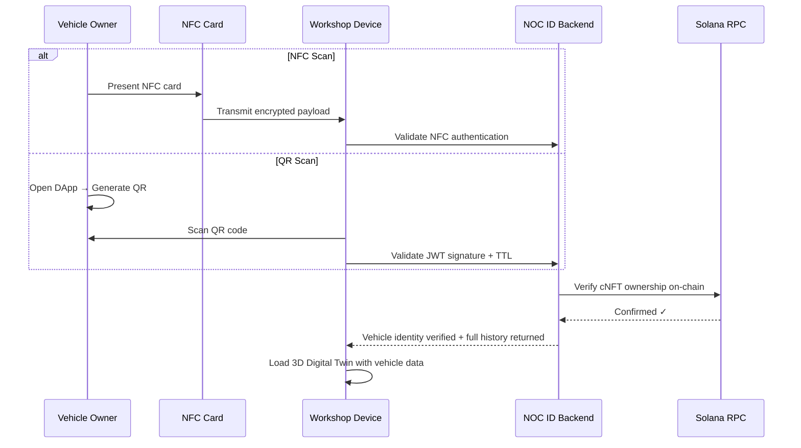
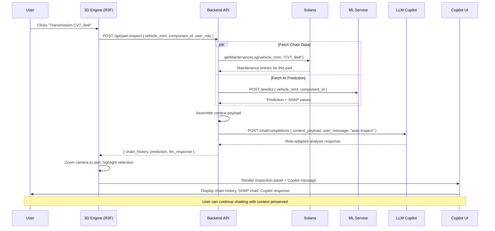
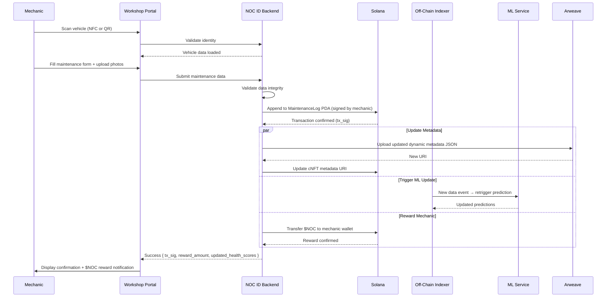
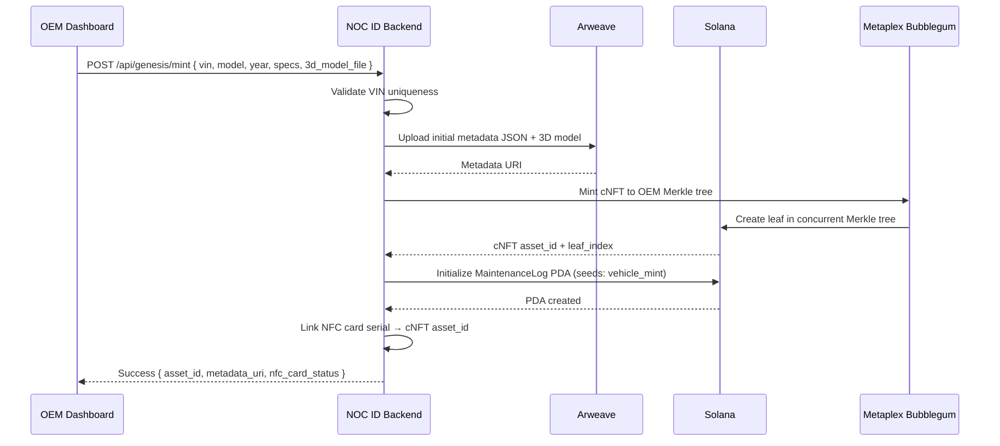
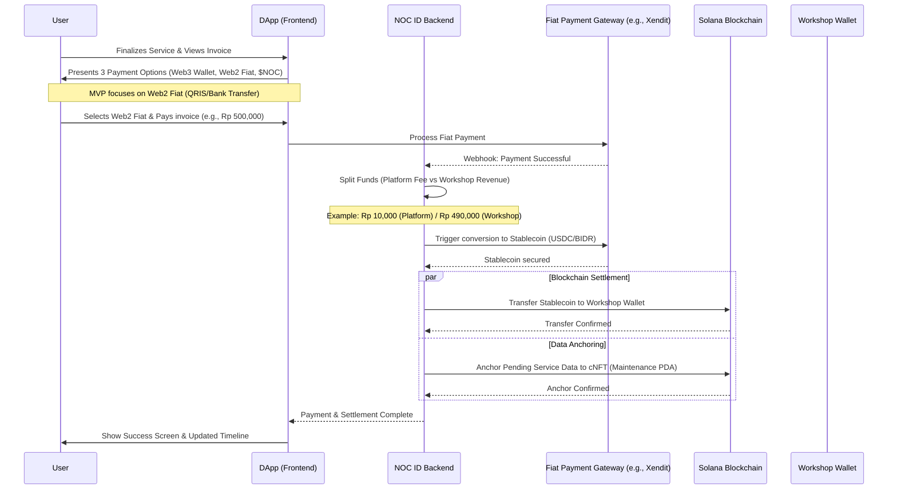
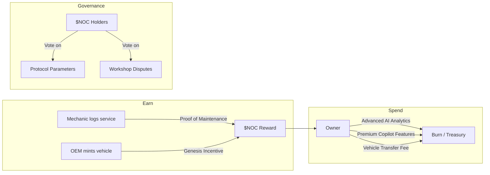

# NOC ID — Product Requirements Document (PRD)

| Field | Value |
|---|---|
| **Product Name** | NOC ID (Nusantara Otomotif Chain ID) |
| **Version** | 1.1.0 |
| **Status** | Draft |
| **Author** | NOC ID Product Team |
| **Created** | 2026-03-18 |
| **Last Updated** | 2026-03-18 |

---

## Table of Contents

1. [Executive Summary](#1-executive-summary)
2. [Problem Statement](#2-problem-statement)
3. [Vision & Objectives](#3-vision--objectives)
4. [Target Users & Personas](#4-target-users--personas)
5. [System Architecture Overview](#5-system-architecture-overview)
6. [Application Layers & Feature Requirements](#6-application-layers--feature-requirements)
7. [Core Technological Pillars](#7-core-technological-pillars)
8. [Detailed Feature Specifications](#8-detailed-feature-specifications)
9. [Data Model & On-Chain Schema](#9-data-model--on-chain-schema)
10. [Non-Functional Requirements](#10-non-functional-requirements)
11. [Security & Compliance](#11-security--compliance)
12. [Tokenomics ($NOC)](#12-tokenomics-noc)
13. [Release Strategy & Milestones](#13-release-strategy--milestones)
14. [Success Metrics & KPIs](#14-success-metrics--kpis)
15. [Risks & Mitigations](#15-risks--mitigations)
16. [Glossary](#16-glossary)
17. [Appendices](#17-appendices)

---

## 1. Executive Summary

**NOC ID (Nusantara Otomotif Chain ID)** is a decentralized digital passport and vehicle performance tracking system built on the **Solana blockchain**. It creates an immutable, transparent, and verifiable lifecycle record for every vehicle — from the manufacturer's assembly line to the end consumer's garage.

The platform solves systemic fraud in the used-vehicle market (odometer tampering, hidden accident history, counterfeit parts) by anchoring every service event, diagnostic scan, and part replacement to an on-chain identity. A **Unified 3D Digital Twin** acts as the primary interface, letting any stakeholder visually inspect the real-time health of every component. An **Explainable AI (XAI) engine** forecasts part failures and provides actionable insights, while a **context-aware LLM Copilot** adapts recommendations based on the user role and the specific part being inspected.

The system is designed for **enterprise-grade scalability**, leveraging Solana's sub-second finality and Compressed NFTs (cNFTs) to keep per-vehicle minting costs below $0.01, making it viable for mass adoption by OEMs across Southeast Asia.

---

## 2. Problem Statement

### 2.1. Industry Pain Points

| Pain Point | Impact | Current Workaround |
|---|---|---|
| **Odometer fraud** | ~40% of used cars in Southeast Asia have tampered mileage, costing consumers billions annually. | Paper-based service books that are trivially forged. |
| **Hidden accident & flood history** | Buyers discover structural damage post-purchase, facing costly repairs. | Reliance on manual inspections that miss internal damage. |
| **Counterfeit parts** | Fake brake pads, filters, and fluids compromise safety and void warranties. | Trust-based system with no cryptographic proof of part origin. |
| **Opaque maintenance records** | No single source of truth; records are fragmented across workshops. | Isolated dealership databases with no interoperability. |
| **Manufacturer warranty disputes** | Costly legal proceedings due to lack of verifiable maintenance proof. | Manual reconciliation of paper/digital records. |
| **Lack of predictive maintenance** | Reactive repair culture leads to higher total cost of ownership. | Generic OEM schedules that ignore real-world usage patterns. |

### 2.2. Why Blockchain?

A centralized database could store records, but it cannot guarantee **immutability** (records can be altered by the operator), **censorship resistance** (a single entity can deny access), or **trustless verification** (third parties must trust the database operator). Solana provides all three, with the throughput (65,000+ TPS) and cost structure ($0.00025/tx) necessary for high-frequency automotive data.

---

## 3. Vision & Objectives

### 3.1. Product Vision

> "To become the universal, trustless identity layer for every vehicle on the road — making fraud impossible, maintenance predictive, and ownership transparent."

### 3.2. Strategic Objectives

| # | Objective | Key Result | Timeframe |
|---|---|---|---|
| O1 | Eliminate used-car fraud in partner networks | 95% reduction in odometer tampering reports on partner platforms | 24 months |
| O2 | Onboard OEM manufacturers as genesis minters | ≥ 3 OEM partnerships signed | 12 months |
| O3 | Build a verified workshop network | ≥ 500 workshops actively logging maintenance | 18 months |
| O4 | Deliver AI-powered predictive maintenance | XAI model achieves ≥ 85% accuracy on part-failure forecasts | 12 months |
| O5 | Achieve consumer adoption | ≥ 50,000 active vehicle passports | 24 months |

---

## 4. Target Users & Personas

### 4.1. Persona: Vehicle Owner (Consumer)

| Attribute | Detail |
|---|---|
| **Name** | Rina, 32, Jakarta |
| **Role** | Car owner, daily commuter |
| **Goal** | Verify the integrity of a used car before purchase; track maintenance of her current vehicle. |
| **Pain** | Was sold a flood-damaged car with a forged service book. |
| **NOC ID Value** | Can scan any vehicle's NOC ID to see the full, immutable history. Gets AI-driven alerts about upcoming maintenance. |

### 4.2. Persona: Workshop Mechanic / Dealer

| Attribute | Detail |
|---|---|
| **Name** | Pak Hendra, 45, Surabaya |
| **Role** | Independent workshop owner, 15 years experience |
| **Goal** | Build trust with customers by offering verifiable, on-chain service records. Earn $NOC tokens. |
| **Pain** | Loses customers to dealerships because he can't provide "official" digital records. |
| **NOC ID Value** | Gains verified mechanic status. Every service he logs is immutable. Earns $NOC for "Proof of Maintenance". |

### 4.3. Persona: OEM / Manufacturer

| Attribute | Detail |
|---|---|
| **Name** | PT Astra Manufacturing, Enterprise |
| **Role** | Vehicle manufacturer, fleet operator |
| **Goal** | Issue digital passports at the factory, track warranty compliance, and pull macro analytics. |
| **Pain** | Warranty disputes cost millions. No visibility into post-sale maintenance quality. |
| **NOC ID Value** | Mints genesis cNFTs at near-zero cost. Full lifecycle visibility. Data-driven warranty decisions. |

### 4.4. Persona: Insurance / Financial Institution (Future Phase)

| Attribute | Detail |
|---|---|
| **Name** | PT Asuransi Nusantara, Enterprise |
| **Role** | Vehicle insurance provider |
| **Goal** | Accurate risk assessment based on verifiable vehicle history. |
| **Pain** | Relies on self-reported data that is frequently inaccurate. |
| **NOC ID Value** | Read-only API access to verified on-chain history for underwriting. |

---

## 5. System Architecture Overview

### 5.1. High-Level Architecture Diagram

```
┌──────────────────────────────────────────────────────────────────────────┐
│                          CLIENT LAYER                                    │
│                                                                          │
│  ┌──────────────┐ ┌──────────────┐ ┌───────────────┐ ┌───────────────┐  │
│  │   Landing    │ │  User DApp   │ │   Workshop    │ │  Enterprise   │  │
│  │    Page      │ │  (React)     │ │    Portal     │ │  Dashboard    │  │
│  └──────────────┘ └──────┬───────┘ └───────┬───────┘ └───────┬───────┘  │
│                          │                 │                 │           │
│              ┌───────────┴─────────────────┴─────────────────┘           │
│              │      Unified 3D Digital Twin (R3F)                        │
│              │      + LLM Copilot (RAG)                                  │
│              └───────────┬───────────────────────────────────            │
└──────────────────────────┼───────────────────────────────────────────────┘
                           │
┌──────────────────────────┼───────────────────────────────────────────────┐
│                    API / MIDDLEWARE LAYER                                 │
│                                                                          │
│  ┌───────────────┐ ┌────────────────┐ ┌─────────────────┐               │
│  │  REST / GQL   │ │  WebSocket     │ │  Solana RPC     │               │
│  │  API Gateway  │ │  (Real-time)   │ │  Adapter        │               │
│  └───────┬───────┘ └────────┬───────┘ └────────┬────────┘               │
│          │                  │                  │                         │
│  ┌───────┴──────────────────┴──────────────────┴────────┐               │
│  │              Backend Services (Node.js / Rust)        │               │
│  │  ┌──────────┐ ┌──────────┐ ┌──────────┐ ┌──────────┐│               │
│  │  │ Identity │ │Maintenan-│ │   AI /   │ │  Token   ││               │
│  │  │ Service  │ │ce Service│ │ ML Svc   │ │  Service ││               │
│  │  └──────────┘ └──────────┘ └──────────┘ └──────────┘│               │
│  └──────────────────────────────────────────────────────┘               │
│                                                                          │
└──────────────────────────┼───────────────────────────────────────────────┘
                           │
┌──────────────────────────┼───────────────────────────────────────────────┐
│                     DATA / CHAIN LAYER                                   │
│                                                                          │
│  ┌───────────────────┐ ┌─────────────────┐ ┌──────────────────────────┐ │
│  │  Solana Mainnet   │ │  Off-Chain DB   │ │  Decentralized Storage  │ │
│  │  ┌─────────────┐  │ │  (PostgreSQL)   │ │  (Arweave / IPFS)       │ │
│  │  │ cNFT (Bubb.)│  │ │                 │ │                          │ │
│  │  │ PDA (Maint.)│  │ │  - User profiles│ │  - Dynamic metadata JSON│ │
│  │  │ $NOC (SPL)  │  │ │  - ML features  │ │  - 3D model assets      │ │
│  │  │ Merkle Tree │  │ │  - Session cache│ │  - Diagnostic images     │ │
│  │  └─────────────┘  │ │                 │ │                          │ │
│  └───────────────────┘ └─────────────────┘ └──────────────────────────┘ │
└──────────────────────────────────────────────────────────────────────────┘
```

### 5.2. Key Architectural Decisions

| Decision | Rationale |
|---|---|
| **Solana over Ethereum/Polygon** | Sub-second finality, sub-cent transaction costs, native support for Compressed NFTs via Bubblegum. Critical for high-frequency maintenance logging. |
| **cNFTs over standard NFTs** | Genesis minting cost drops from ~$2 to ~$0.005 per vehicle. Essential for OEM mass adoption (millions of vehicles). |
| **PDAs for Maintenance Logs** | Program Derived Addresses provide deterministic, vehicle-specific on-chain storage without requiring new keypairs. Enables efficient lookups. |
| **Off-chain ML, on-chain anchoring** | ML inference is too compute-intensive for on-chain execution. Predictions are computed off-chain and their hashes are anchored on-chain for auditability. |
| **React Three Fiber (R3F)** | Production-grade 3D rendering in React. Enables component-level interaction, animation, and integration with the existing React component tree. |
| **RAG-based LLM over fine-tuned model** | RAG allows the Copilot to leverage real-time on-chain data without expensive retraining. Context injection per-click ensures relevance. |

---

## 6. Application Layers & Feature Requirements

### 6.1. Layer 1: Public Landing Page

**Purpose:** Marketing, education, and conversion funnel.

| ID | Feature | Priority | Description |
|---|---|---|---|
| LP-01 | Hero Section with 3D Preview | P0 | Interactive 3D vehicle model (low-poly preview) with subtle idle animation. CTA: "Scan Your Vehicle" / "Get Started". |
| LP-02 | How It Works | P0 | Three-step animated explainer: Mint → Track → Predict. |
| LP-03 | Ecosystem Partners | P1 | Logo carousel of OEMs, workshops, and insurance partners. |
| LP-04 | Live Stats Banner | P1 | Real-time counters: vehicles registered, maintenance events logged, $NOC distributed. Pulled from on-chain data. |
| LP-05 | Interactive Demo | P2 | Sandboxed 3D Digital Twin with sample data. Users can click parts and see AI predictions without connecting a wallet. |
| LP-06 | SEO & i18n | P1 | Full Bahasa Indonesia + English. SEO-optimized meta tags, structured data (JSON-LD). |

---

### 6.2. Layer 2: User DApp (Vehicle Owner)

**Purpose:** Primary interface for vehicle owners to view history, interact with the 3D twin, and manage their NOC ID.

| ID | Feature | Priority | Description |
|---|---|---|---|
| UD-01 | Wallet Connection | P0 | Solana wallet adapter (Phantom, Solflare, Backpack). Session persistence with JWT fallback for mobile. |
| UD-02 | Vehicle Dashboard | P0 | Overview cards: health score, next predicted maintenance, $NOC balance, recent service events. |
| UD-03 | 3D Digital Twin Viewer | P0 | Full interactive 3D model (React Three Fiber). Color-coded health status per component. Click-to-inspect interaction. |
| UD-04 | Complete Service Timeline | P0 | Chronological list of all on-chain maintenance events. Each entry links to Solana Explorer for independent verification. |
| UD-05 | AI Predictive Insights | P0 | XAI-powered part-failure forecasts with SHAP value explanations. Visual breakdown: "Why is this prediction made?" |
| UD-06 | LLM Copilot Chat | P0 | Context-aware chatbot. Adapts to "Owner" role. Provides plain-language explanations, OEM part suggestions, modification advice. |
| UD-07 | Dynamic QR Code | P0 | Time-sensitive QR for workshop scanning. Auto-regenerates every 5 minutes. Displays in full-screen mode for easy scanning. |
| UD-08 | NFC Card Management | P1 | View linked NFC card status, request replacement, manage permissions. |
| UD-09 | $NOC Token Wallet | P1 | Balance display, transaction history, spend $NOC for premium analytics. In-app swap integration (Jupiter). |
| UD-10 | Notifications | P1 | Push notifications for: new service logged, AI alert triggered, $NOC earned/spent. |
| UD-11 | Multi-Vehicle Support | P1 | Manage multiple vehicles under one wallet. Vehicle selector with thumbnail previews. |
| UD-12 | Vehicle Transfer | P2 | On-chain ownership transfer. Initiates a two-party signing ceremony with escrow. |

---

### 6.3. Layer 3: Workshop / Dealer Portal

**Purpose:** Interface for verified mechanics to scan vehicles, input maintenance data, and earn $NOC rewards.

| ID | Feature | Priority | Description |
|---|---|---|---|
| WP-01 | Mechanic Onboarding & KYC | P0 | Identity verification flow. Workshop license upload. On-chain DID credential issuance. |
| WP-02 | Vehicle Scan (NFC / QR) | P0 | Dual-mode scanner. NFC reader integration (WebNFC API). QR camera scanner with validation against on-chain data. |
| WP-03 | Maintenance Input Form | P0 | Structured data entry: service type, parts replaced (with OEM part numbers), mileage reading, diagnostic codes (OBD-II), technician notes, photographic evidence. |
| WP-04 | 3D Digital Twin (Mechanic View) | P0 | Same 3D model, but with mechanic-specific overlays: diagnostic data, tolerance ranges, torque specs. Click a part → deep diagnostic guidelines from LLM Copilot. |
| WP-05 | On-Chain Submission | P0 | Signs and submits maintenance data to the vehicle's Maintenance Log PDA. Transaction confirmation with Solana Explorer link. |
| WP-06 | Proof of Maintenance Reward | P0 | Automatic $NOC distribution upon valid submission. Reward amount calculated by: service complexity × workshop reputation score. |
| WP-07 | Workshop Analytics | P1 | Dashboard: services performed, $NOC earned, customer ratings, most common repairs. |
| WP-08 | Part Verification Scanner | P1 | Scan part serial/QR to verify authenticity against manufacturer registries. Flags counterfeit parts before installation. |
| WP-09 | LLM Copilot (Mechanic Mode) | P0 | Diagnostic-focused. Provides repair procedures, known issues for the specific vehicle model, and cross-references the on-chain history for patterns. |
| WP-10 | Bulk Service Logging | P2 | For high-volume dealerships: batch upload of service records with CSV/API. Each record individually signed and anchored. |

---

### 6.4. Layer 4: Enterprise / Manufacturer Dashboard

**Purpose:** For OEMs to mint genesis NOC IDs, manage fleets, and consume macro analytics.

| ID | Feature | Priority | Description |
|---|---|---|---|
| ED-01 | Genesis Minting Console | P0 | Batch-mint cNFTs for new vehicles off the assembly line. Input: VIN, model, year, initial specs. Auto-generates initial metadata JSON. |
| ED-02 | Fleet Overview | P0 | Map view + table view of all vehicles minted. Filter by model, region, health score, warranty status. |
| ED-03 | Macro Analytics Dashboard | P0 | Aggregate statistics: average health scores by model, most common failure points, geographic distribution of issues, warranty claim patterns. |
| ED-04 | Warranty Management | P1 | Automated warranty validation: cross-reference on-chain maintenance history against warranty terms. Flag non-compliant vehicles. |
| ED-05 | Workshop Network Management | P1 | Approve/revoke workshop credentials. Monitor workshop performance scores. Flag anomalous logging patterns. |
| ED-06 | Supply Chain Integration | P2 | API endpoints for ERP/SAP integration. Push/pull data between NOC ID and existing enterprise systems. |
| ED-07 | Recall Management | P2 | Issue recalls targeting specific VIN ranges. Track compliance via on-chain confirmation of recall service completion. |
| ED-08 | Data Export & Reporting | P1 | Scheduled PDF/CSV reports. API access for BI tools (Tableau, Power BI). |

---

## 7. Core Technological Pillars

### 7.1. Solana Blockchain — Dual-Asset Architecture

#### 7.1.1. Identity Asset: Dynamic Compressed NFT (cNFT)

| Attribute | Specification |
|---|---|
| **Standard** | Metaplex Bubblegum (cNFT) |
| **Compression** | State compression via concurrent Merkle trees |
| **Minting Cost** | ~$0.005 per vehicle (vs. ~$2 for standard NFTs) |
| **Metadata** | Dynamic, off-chain JSON hosted on Arweave. URI stored in the Merkle tree leaf. |
| **Update Authority** | Manufacturer (genesis) → NOC ID Protocol (subsequent updates via authorized services) |

**cNFT Metadata Schema (Dynamic JSON):**

```json
{
  "name": "NOC ID #00001",
  "symbol": "NOCID",
  "description": "Digital Vehicle Passport for VIN: MHKA1BA1JFK000001",
  "image": "https://arweave.net/{tx_id}/vehicle_thumbnail.png",
  "external_url": "https://nocid.io/vehicle/MHKA1BA1JFK000001",
  "attributes": [
    { "trait_type": "VIN", "value": "MHKA1BA1JFK000001" },
    { "trait_type": "Make", "value": "Toyota" },
    { "trait_type": "Model", "value": "Avanza" },
    { "trait_type": "Year", "value": "2025" },
    { "trait_type": "Color", "value": "Silver Metallic" },
    { "trait_type": "Engine_Type", "value": "1.5L 2NR-VE" },
    { "trait_type": "Transmission", "value": "CVT" },
    { "trait_type": "Current_Mileage_KM", "value": "34521" },
    { "trait_type": "Health_Score", "value": "87" },
    { "trait_type": "Last_Service_Date", "value": "2026-02-10" },
    { "trait_type": "Total_Service_Events", "value": "12" },
    { "trait_type": "AI_Risk_Level", "value": "Low" },
    { "trait_type": "Genesis_Timestamp", "value": "1703980800" }
  ],
  "properties": {
    "files": [
      { "uri": "https://arweave.net/{tx_id}/3d_model.glb", "type": "model/gltf-binary" }
    ],
    "category": "vehicle_passport",
    "creators": [
      { "address": "OEM_WALLET_ADDRESS", "share": 100 }
    ]
  }
}
```

#### 7.1.2. Utility Token: $NOC (SPL Token)

| Attribute | Specification |
|---|---|
| **Standard** | SPL Token (Token-2022 for future extensions like transfer hooks) |
| **Total Supply** | 1,000,000,000 $NOC (capped) |
| **Decimals** | 6 |
| **Utility** | Proof of Maintenance rewards, advanced analytics access, governance (future) |

> [!IMPORTANT]
> The $NOC token is a **utility token**, not a security. All tokenomics design must comply with applicable regulations. Legal counsel review is required before any public distribution.

#### 7.1.3. Program Derived Addresses (PDAs)

**Maintenance Log PDA Schema:**

```
Seeds: ["maintenance_log", vehicle_cnft_mint_address]
```

```rust
#[account]
pub struct MaintenanceLog {
    pub vehicle_mint: Pubkey,          // 32 bytes — cNFT mint address
    pub authority: Pubkey,             // 32 bytes — NOC ID protocol authority
    pub total_entries: u32,            // 4 bytes
    pub last_updated: i64,            // 8 bytes — Unix timestamp
    pub entries: Vec<MaintenanceEntry>, // Dynamic
}

#[derive(AnchorSerialize, AnchorDeserialize, Clone)]
pub struct MaintenanceEntry {
    pub entry_id: u64,
    pub timestamp: i64,
    pub mechanic: Pubkey,              // Verified mechanic wallet
    pub workshop_id: [u8; 32],         // Workshop DID hash
    pub service_type: ServiceType,     // Enum
    pub mileage_km: u32,
    pub parts_replaced: Vec<PartRecord>,
    pub obd_codes: Vec<[u8; 5]>,       // OBD-II DTC codes
    pub diagnostic_hash: [u8; 32],     // SHA-256 of full diagnostic data
    pub photo_evidence_uri: String,    // Arweave URI
    pub ai_prediction_hash: [u8; 32], // Hash of XAI prediction at time of service
}

#[derive(AnchorSerialize, AnchorDeserialize, Clone)]
pub struct PartRecord {
    pub part_category: PartCategory,   // Enum: Engine, Transmission, Brakes, etc.
    pub oem_part_number: String,
    pub is_oem_verified: bool,
    pub condition_before: u8,          // 0-100 health score
    pub condition_after: u8,           // 0-100 health score
}
```

---

### 7.2. Smart Identity System (NFC/RFID + Dynamic QR)

#### 7.2.1. NFC/RFID Smart Card

| Attribute | Specification |
|---|---|
| **Form Factor** | ISO 14443-A/B NFC card (credit card size) |
| **Chip** | NTAG 424 DNA (tamper-proof, with AES-128 SUN authentication) |
| **Data Stored** | Encrypted vehicle identifier, cNFT mint address reference, counter-based authentication payload |
| **Interaction** | Tap-to-read via WebNFC API (Chrome Android) or native NFC readers |
| **Security** | Each tap generates a unique, one-time authentication code. Prevents cloning/replay attacks. |

#### 7.2.2. Dynamic QR Code (Fallback)

| Attribute | Specification |
|---|---|
| **Generation** | Server-side, cryptographically signed |
| **TTL** | 5 minutes (configurable) |
| **Payload** | Signed JWT containing: vehicle_mint, owner_wallet (hashed), timestamp, nonce |
| **Verification** | Workshop scans → backend validates signature + TTL + nonce (prevents replay) |
| **Delivery** | Displayed in User DApp. Optional: printed as a secure physical sticker with rotating e-ink display (future hardware). |

**Dual-Verification Flow:**



---

### 7.3. Explainable AI (XAI) Predictive Maintenance

#### 7.3.1. ML Pipeline Architecture

```
┌─────────────┐    ┌──────────────┐    ┌──────────────┐    ┌──────────────┐
│  On-Chain    │───▶│  Feature     │───▶│  Model       │───▶│  Prediction  │
│  Data Ingest │    │  Engineering │    │  Inference   │    │  API + SHAP  │
└─────────────┘    └──────────────┘    └──────────────┘    └──────────────┘
       │                  │                   │                    │
  Solana Indexer    PostgreSQL          XGBoost / LightGBM    REST API
  (Helius/Triton)   + Redis Cache       Model Registry        + Arweave
                                        (MLflow)              (hash anchor)
```

#### 7.3.2. Feature Engineering

| Feature Category | Examples |
|---|---|
| **Mileage-based** | Current mileage, mileage since last service, average daily km |
| **Time-based** | Days since last service, vehicle age, seasonal patterns |
| **Component-specific** | Service count per part, part replacement frequency, OBD-II code history |
| **Workshop quality** | Average reputation score of servicing workshops |
| **Environmental** | Climate zone (derived from GPS), urban vs. highway usage ratio |

#### 7.3.3. Model Specifications

| Attribute | Specification |
|---|---|
| **Algorithm** | XGBoost (primary), LightGBM (ensemble) |
| **Output** | Per-component failure probability (0.0–1.0) + estimated days until failure |
| **Explainability** | SHAP (SHapley Additive exPlanations) values per prediction per feature |
| **Retraining** | Automated weekly retraining via Airflow pipeline when new on-chain data exceeds threshold |
| **Serving** | TorchServe / FastAPI behind API Gateway with <200ms P95 latency |
| **Auditability** | SHA-256 hash of model version + prediction payload anchored to Solana for tamper-proof audit trail |

#### 7.3.4. SHAP Value Presentation

For each part prediction, the UI renders:

1. **Risk Score Bar:** 0–100 health score with color gradient (green → yellow → red).
2. **Top Contributing Factors:** Waterfall chart showing top 5 SHAP values (e.g., "High mileage since last oil change contributes +0.32 to risk").
3. **Recommended Action:** AI-generated suggestion based on the risk level and contributing factors.

---

### 7.4. Unified 3D Digital Twin

#### 7.4.1. Technical Stack

| Component | Technology |
|---|---|
| **Rendering Engine** | React Three Fiber (R3F) + Three.js |
| **Physics / Animation** | React Spring (for smooth transitions), custom GLSL shaders |
| **3D Models** | glTF 2.0 / GLB format (Draco compressed) |
| **Model Source** | Manufacturer-provided CAD → optimized for web (Blender pipeline) |
| **Interaction** | Raycasting for click detection, orbit controls, zoom-to-part |

#### 7.4.2. Component Hierarchy

Every 3D model MUST follow a standardized component hierarchy to enable consistent click-to-inspect behavior:

```
Vehicle Root
├── Body
│   ├── Hood
│   ├── Front_Bumper
│   ├── Rear_Bumper
│   ├── Left_Door_Front
│   ├── Left_Door_Rear
│   ├── Right_Door_Front
│   ├── Right_Door_Rear
│   └── Trunk
├── Chassis
│   ├── Frame
│   ├── Suspension_FL
│   ├── Suspension_FR
│   ├── Suspension_RL
│   └── Suspension_RR
├── Engine
│   ├── Engine_Block
│   ├── Cylinder_Head
│   ├── Intake_Manifold
│   ├── Exhaust_Manifold
│   ├── Turbocharger (if applicable)
│   ├── Oil_Filter
│   └── Air_Filter
├── Transmission
│   ├── Gearbox
│   ├── Clutch (if manual)
│   ├── Torque_Converter (if auto)
│   └── CVT_Belt (if CVT)
├── Brakes
│   ├── Brake_Disc_FL / Brake_Pad_FL
│   ├── Brake_Disc_FR / Brake_Pad_FR
│   ├── Brake_Disc_RL / Brake_Pad_RL
│   └── Brake_Disc_RR / Brake_Pad_RR
├── Electrical
│   ├── Battery
│   ├── Alternator
│   └── Starter_Motor
├── Cooling
│   ├── Radiator
│   ├── Thermostat
│   └── Water_Pump
├── Tires
│   ├── Tire_FL / Tire_FR
│   └── Tire_RL / Tire_RR
└── Fluids (virtual overlay)
    ├── Engine_Oil
    ├── Coolant
    ├── Brake_Fluid
    ├── Transmission_Fluid
    └── Power_Steering_Fluid
```

#### 7.4.3. Health-to-Color Mapping

| Health Score | Color | Hex | State |
|---|---|---|---|
| 90–100 | Green | `#22C55E` | Excellent |
| 70–89 | Lime-Yellow | `#A3E635` | Good |
| 50–69 | Yellow/Amber | `#FACC15` | Warning |
| 30–49 | Orange | `#F97316` | Critical |
| 0–29 | Red (pulsing) | `#EF4444` | Danger |

#### 7.4.4. Animation Capabilities

| Animation | Trigger | Description |
|---|---|---|
| **Explode / Strip Body** | Button or gesture | Smoothly removes outer body panels to reveal chassis and engine. |
| **X-Ray Mode** | Toggle | Semi-transparent body with highlighted internal components. |
| **Zoom-to-Part** | Click on part | Camera smoothly animates to focus on the selected component. |
| **Health Pulse** | Auto (critical parts) | Parts with health ≤30 emit a subtle pulsing glow. |
| **Part Highlight** | Hover | Hovered part receives an outline/glow effect with tooltip. |

---

### 7.5. Context-Aware LLM Copilot

#### 7.5.1. Architecture

```
┌────────────────────────────────────────────────────────────┐
│                     LLM Copilot System                      │
│                                                              │
│  ┌──────────┐   ┌──────────────┐   ┌─────────────────────┐ │
│  │ User     │──▶│ Context      │──▶│ LLM (GPT-4 /       │ │
│  │ Message  │   │ Builder      │   │ Claude / Gemini)     │ │
│  └──────────┘   └──────┬───────┘   └──────────┬──────────┘ │
│                        │                       │             │
│          ┌─────────────┼───────────────────────┘             │
│          │             │                                     │
│  ┌───────▼───────┐  ┌─▼──────────────┐                     │
│  │ RAG Pipeline  │  │ Response       │                     │
│  │ (Vector DB)   │  │ Formatter      │                     │
│  └───────────────┘  └────────────────┘                     │
│                                                              │
│  Knowledge Sources:                                          │
│  • On-chain history (real-time Solana query)                │
│  • XAI prediction + SHAP values                             │
│  • OEM service manuals (vectorized)                         │
│  • Community repair guides                                   │
│  • Parts marketplace inventory                               │
└────────────────────────────────────────────────────────────┘
```

#### 7.5.2. Context Injection Protocol

When a user clicks a 3D part, the following context payload is assembled and injected as the system prompt for the LLM:

```json
{
  "context_type": "part_inspection",
  "user_role": "owner | mechanic | manufacturer",
  "vehicle": {
    "vin": "MHKA1BA1JFK000001",
    "make": "Toyota",
    "model": "Avanza",
    "year": 2025,
    "current_mileage_km": 34521
  },
  "selected_part": {
    "component_id": "Transmission.CVT_Belt",
    "display_name": "CVT Belt",
    "health_score": 42,
    "health_status": "Critical",
    "last_service_date": "2025-08-15",
    "mileage_at_last_service": 28000,
    "service_count": 1
  },
  "chain_history": [
    {
      "date": "2025-08-15",
      "mechanic": "Pak Hendra (★ 4.8)",
      "service": "CVT Fluid Replacement",
      "mileage": 28000,
      "tx_sig": "4xK9..."
    }
  ],
  "ai_prediction": {
    "failure_probability": 0.67,
    "estimated_days_until_failure": 45,
    "top_shap_factors": [
      { "feature": "mileage_since_last_cvt_service", "impact": 0.38 },
      { "feature": "total_mileage", "impact": 0.22 },
      { "feature": "vehicle_age_days", "impact": 0.11 }
    ]
  },
  "instruction": "Respond as the NOC ID Copilot. Adapt depth and terminology to the user_role."
}
```

#### 7.5.3. Role-Adaptive Response Examples

**For Owner (Rina):**
> "⚠️ Your CVT Belt is showing signs of wear. Based on your driving patterns, our AI estimates it may need replacement within 45 days. The biggest factor is the 6,521 km driven since your last CVT service. I'd recommend scheduling a CVT inspection soon. Would you like me to find a verified workshop near you, or show you OEM replacement parts?"

**For Mechanic (Pak Hendra):**
> "🔧 **CVT Belt — Critical (Health: 42/100)**\n\n**Diagnostic Summary:** Single CVT fluid replacement at 28,000 km. Current mileage: 34,521 km (6,521 km interval). XAI model flags `mileage_since_last_cvt_service` as primary risk driver (SHAP +0.38).\n\n**Recommended Procedure:**\n1. Inspect CVT belt for glazing, cracking, or width reduction.\n2. Check CVT fluid condition (color, smell, metal particles).\n3. If belt width < 21.0 mm, replace with OEM part #**K0800-4A00C**.\n4. Reference TSB #NTB-AT-22-006 for Avanza CVT calibration procedure.\n\n**Historical Note:** Only 1 CVT service recorded on-chain. OEM recommends every 20,000 km for this model."

---

## 8. Detailed Feature Specifications

### 8.1. Critical Interaction Flow: 3D Part Click → Chain + AI + Chat



### 8.2. Mechanic Service Submission Flow



### 8.3. Genesis Minting Flow (OEM)



### 8.4. Service Payment & Settlement Flow (Web2.5 MVP)



---

## 9. Data Model & On-Chain Schema

### 9.1. On-Chain Data (Solana)

| Entity | Storage | Description |
|---|---|---|
| **Vehicle Identity** | cNFT (Bubblegum Merkle tree) | Immutable genesis record. Dynamic metadata URI points to Arweave. |
| **Maintenance Log** | PDA (per vehicle) | Append-only log of all service events, part replacements, and diagnostics. |
| **Mechanic Credential** | PDA (per mechanic) | Verified identity, reputation score, total services performed. |
| **$NOC Token** | SPL Token mint | Token accounts for all participants. |
| **Workshop Registry** | PDA (global) | List of verified workshops with metadata. |

### 9.2. Off-Chain Data (PostgreSQL)

| Table | Purpose |
|---|---|
| `users` | User profiles, preferences, notification settings |
| `vehicles_cache` | Denormalized vehicle data for fast API responses |
| `ml_features` | Engineered features for ML pipeline |
| `ml_predictions` | Latest predictions per vehicle per component |
| `chat_sessions` | Copilot conversation history with context |
| `nfc_cards` | NFC card serial ↔ vehicle mapping |
| `qr_sessions` | Active QR session tokens with TTL |
| `workshops` | Workshop metadata, license info, KYC status |
| `audit_log` | All API actions for compliance |

### 9.3. Decentralized Storage (Arweave)

| Asset | Format | Update Frequency |
|---|---|---|
| Vehicle Metadata JSON | JSON | On every service event |
| 3D Model Files | GLB | On vehicle model update |
| Diagnostic Photos | WebP | On every service event |
| ML Prediction Snapshots | JSON | On every prediction update |

---

## 10. Non-Functional Requirements

### 10.1. Performance

| Metric | Target | Measurement |
|---|---|---|
| 3D Twin initial load | < 3 seconds (3G connection) | Lighthouse / WebPageTest |
| 3D interaction latency | < 16ms (60 FPS) | Chrome DevTools Performance tab |
| API response time (P95) | < 200ms | Datadog / Grafana |
| On-chain transaction confirmation | < 1 second | Solana Explorer |
| ML prediction latency (P95) | < 500ms | Custom metrics |
| Copilot response time (first token) | < 1 second | Streaming SSE measurement |

### 10.2. Scalability

| Dimension | Target | Strategy |
|---|---|---|
| Concurrent users | 10,000+ | Horizontal scaling, CDN, WebSocket clustering |
| Vehicles registered | 1,000,000+ | cNFT compression, database sharding |
| Maintenance events/day | 50,000+ | Event-driven architecture, queue-based processing |
| 3D model library | 500+ vehicle models | Asset CDN with progressive loading |

### 10.3. Availability & Reliability

| Metric | Target |
|---|---|
| Uptime (API services) | 99.9% |
| RPO (Recovery Point Objective) | 1 hour |
| RTO (Recovery Time Objective) | 4 hours |
| Data durability (on-chain) | 100% (Solana consensus) |
| Data durability (off-chain) | 99.999% (Arweave permanence) |

### 10.4. Accessibility

- WCAG 2.1 AA compliance for all non-3D interfaces.
- 3D Twin must provide a 2D fallback for screen readers (component list with health scores).
- All text content available in Bahasa Indonesia and English.

---

## 11. Security & Compliance

### 11.1. Security Architecture

| Layer | Measure |
|---|---|
| **Authentication** | Solana wallet signature (primary), OAuth 2.0 + JWT (enterprise), WebAuthn (MFA). |
| **Authorization** | Role-based access control (RBAC). Roles: Owner, Mechanic, Manufacturer, Admin. |
| **Data in Transit** | TLS 1.3 (all APIs). WSS for WebSocket. |
| **Data at Rest** | AES-256 encryption for PII in PostgreSQL. |
| **NFC Security** | NTAG 424 SUN authentication (AES-128). Unique per-tap codes. Anti-cloning. |
| **QR Security** | HMAC-SHA256 signed JWTs with 5-minute TTL and single-use nonce. |
| **Smart Contract** | Formal audit by a reputable firm (e.g., OtterSec, Neodyme) before mainnet deployment. |
| **API Security** | Rate limiting, input validation, CORS policies, CSP headers. |
| **Dependency Management** | Automated vulnerability scanning (Snyk / Dependabot). |

### 11.2. Privacy & Compliance

| Regulation | Approach |
|---|---|
| **Indonesia PP 71/2019** (Personal Data Protection) | PII never stored on-chain. On-chain data is pseudonymous (wallet addresses only). |
| **GDPR (for future EU expansion)** | Right to erasure supported for off-chain data. On-chain data is non-PII by design. |
| **OJK Regulations** (if token is classified) | Legal opinion required. $NOC designed as utility token. No investment promises. |

### 11.3. Audit Trail

Every state-changing action is logged with:
- Timestamp (UTC)
- Actor (wallet address or user ID)
- Action type
- Before/after state hash
- Solana transaction signature (if on-chain)

---

## 12. Tokenomics ($NOC)

### 12.1. Distribution

| Allocation | % | Amount | Vesting |
|---|---|---|---|
| **Ecosystem Rewards** (Proof of Maintenance) | 40% | 400,000,000 | Emitted over 5 years via smart contract |
| **Development & Team** | 20% | 200,000,000 | 12-month cliff, 36-month linear vesting |
| **Treasury / DAO** | 15% | 150,000,000 | Governance-controlled |
| **Strategic Partners / OEMs** | 10% | 100,000,000 | 6-month cliff, 24-month linear vesting |
| **Community & Airdrops** | 10% | 100,000,000 | Milestone-based releases |
| **Liquidity Provision** | 5% | 50,000,000 | Locked in protocol-owned liquidity |

### 12.2. Token Flow



### 12.3. Anti-Abuse Mechanisms

| Mechanism | Description |
|---|---|
| **Reputation-Weighted Rewards** | New workshops earn lower $NOC per service until building reputation. |
| **Duplicate Detection** | On-chain deduplication prevents logging the same service twice. |
| **Anomaly Flagging** | ML model detects suspicious patterns (e.g., 50 oil changes in a day). |
| **Slashing** | Verified fraudulent entries result in $NOC stake slashing and credential revocation. |

---

## 13. Release Strategy & Milestones

### Phase 0: Foundation (Month 1–3)

- [ ] Smart contract development (cNFT minting, Maintenance Log PDA, $NOC token)
- [ ] Smart contract security audit
- [ ] Backend API scaffolding (Identity, Maintenance, Token services)
- [ ] Database schema & migration setup
- [ ] CI/CD pipeline & infrastructure provisioning
- [ ] Design system & component library

### Phase 1: Genesis MVP (Month 4–6)

- [ ] Public landing page with 3D preview
- [ ] User DApp: wallet connection, vehicle dashboard, basic service timeline
- [ ] Workshop Portal: NFC/QR scan, maintenance form, on-chain submission
- [ ] Enterprise Dashboard: genesis minting console
- [ ] 3D Digital Twin: single vehicle model (Toyota Avanza), health color-coding
- [ ] Testnet deployment + internal QA

### Phase 2: Intelligence Layer (Month 7–9)

- [ ] XAI Predictive Maintenance pipeline (data ingestion → training → serving)
- [ ] SHAP value visualization in the 3D Twin
- [ ] LLM Copilot integration with RAG pipeline
- [ ] Dynamic QR code system
- [ ] $NOC token distribution for Proof of Maintenance
- [ ] Devnet public beta with select workshop partners

### Phase 3: Production Launch (Month 10–12)

- [ ] Mainnet deployment
- [ ] OEM partnership integration (first manufacturers onboarded)
- [ ] Multi-vehicle model support (expand 3D model library)
- [ ] Mobile-responsive optimization
- [ ] Workshop onboarding campaign (target: 100 workshops)

### Phase 4: Ecosystem Expansion (Month 13–18)

- [ ] Multi-vehicle support for owners
- [ ] Vehicle transfer (on-chain ownership change)
- [ ] Insurance partner API integration
- [ ] Part verification scanner
- [ ] Advanced analytics marketplace ($NOC-gated)
- [ ] DAO governance module

### Phase 5: Scale (Month 19–24)

- [ ] ERP/SAP enterprise integration
- [ ] Recall management system
- [ ] Regional expansion beyond Indonesia
- [ ] Mobile native app (React Native)
- [ ] NFC hardware partnerships (smart card manufacturing)
- [ ] Community-contributed 3D models

---

## 14. Success Metrics & KPIs

### 14.1. Product Metrics

| Metric | Target (12mo) | Target (24mo) |
|---|---|---|
| Vehicles registered (cNFTs minted) | 10,000 | 50,000 |
| Active workshops | 100 | 500 |
| Monthly maintenance events logged | 5,000 | 50,000 |
| User DApp MAU | 3,000 | 25,000 |
| Copilot interactions/month | 10,000 | 100,000 |

### 14.2. Technical Metrics

| Metric | Target |
|---|---|
| 3D Twin FPS (mobile) | ≥ 30 FPS |
| 3D Twin FPS (desktop) | ≥ 60 FPS |
| API uptime | ≥ 99.9% |
| ML prediction accuracy | ≥ 85% |
| On-chain transaction success rate | ≥ 99.5% |

### 14.3. Business Metrics

| Metric | Target (24mo) |
|---|---|
| OEM partnerships | ≥ 3 |
| Insurance partner integrations | ≥ 2 |
| $NOC token velocity (daily active transactions) | ≥ 1,000 |
| Fraud detection rate (tampered vehicles flagged) | ≥ 90% |

---

## 15. Risks & Mitigations

| # | Risk | Probability | Impact | Mitigation |
|---|---|---|---|---|
| R1 | Solana network congestion or outages | Medium | High | Implement retry logic with exponential backoff. Cache recent data off-chain. Design for graceful degradation. |
| R2 | Low workshop adoption | High | Critical | Subsidize NFC cards. Offer onboarding grants in $NOC. Provide free hardware (NFC readers). |
| R3 | Regulatory classification of $NOC as a security | Medium | Critical | Engage legal counsel early. Design token with clear utility. Avoid investment language. |
| R4 | 3D model performance on low-end devices | Medium | Medium | Progressive LOD (Level of Detail). WebGL capability detection. 2D fallback mode. |
| R5 | Smart contract vulnerabilities | Low | Critical | Multiple independent audits. Bug bounty program. Timelock on upgrades. |
| R6 | Data quality from manual mechanic input | High | High | Structured forms with validation. Photo evidence requirements. Anomaly detection ML. Community dispute resolution (DAO). |
| R7 | LLM hallucination in Copilot | Medium | Medium | RAG grounding with citation enforcement. Confidence score display. "Verify on-chain" links for every claim. |
| R8 | NFC card cloning/tampering | Low | High | NTAG 424 DNA anti-cloning. Per-tap unique authentication. Server-side validation of tap counters. |
| R9 | Competitor with centralized solution | Medium | Medium | Emphasize trustless verification as differentiator. Open-source core protocol for ecosystem lock-in. |
| R10 | ML model bias or poor predictions | Medium | Medium | Diverse training data. Regular fairness audits. Clear confidence intervals in predictions. |

---

## 16. Glossary

| Term | Definition |
|---|---|
| **cNFT** | Compressed NFT — a lightweight NFT stored in a Merkle tree on Solana, reducing minting cost by ~1000x. |
| **PDA** | Program Derived Address — a deterministic Solana account address derived from a set of seeds and a program ID. |
| **Bubblegum** | Metaplex's protocol for minting and managing Compressed NFTs on Solana. |
| **SPL Token** | Solana Program Library Token — the standard for fungible tokens on Solana. |
| **SHAP** | SHapley Additive exPlanations — a game-theoretic approach to explain ML model predictions. |
| **XAI** | Explainable AI — ML techniques that provide human-interpretable explanations for predictions. |
| **RAG** | Retrieval-Augmented Generation — an LLM architecture that retrieves relevant documents before generating responses. |
| **R3F** | React Three Fiber — a React renderer for Three.js, enabling declarative 3D scene graphs. |
| **OBD-II** | On-Board Diagnostics II — a standardized system for vehicle self-diagnostics and fault reporting. |
| **DID** | Decentralized Identifier — a W3C standard for self-sovereign identity. |
| **VIN** | Vehicle Identification Number — a unique 17-character code assigned to every motor vehicle. |
| **NFC** | Near-Field Communication — short-range wireless technology for contactless data exchange. |
| **WebNFC** | A Web API that allows websites to read/write NFC tags (Chrome Android only). |
| **LOD** | Level of Detail — a rendering optimization that reduces model complexity at distance. |
| **TSB** | Technical Service Bulletin — manufacturer-issued notices about known vehicle issues. |

---

## 17. Appendices

### Appendix A: Technology Stack Summary

> [!IMPORTANT]
> All versions below have been validated against the latest available releases via **Context7** as of 2026-03-18.

#### Frontend

| Package | Version | Role | Source |
|---|---|---|---|
| **React** | `19.2.0` | UI framework | Context7 `/facebook/react` |
| **Next.js** | `16.1.6` | Full-stack React framework (App Router) | Context7 `/vercel/next.js` |
| **TypeScript** | `5.x` (latest) | Type safety | npm registry |
| **shadcn/ui** | `shadcn@3.5.0` | Accessible, composable UI component library (Radix UI primitives) | Context7 `/shadcn-ui/ui` |
| **Tailwind CSS** | `4.x` (latest) | Utility-first CSS framework (required by shadcn/ui) | Context7 `/tailwindlabs/tailwindcss.com` |
| **TanStack Query** | `5.84.1` | Server-state management, caching, data fetching | Context7 `/tanstack/query` |
| **Zustand** | `5.0.8` | Client-side state management | Context7 `/pmndrs/zustand` |
| **React Three Fiber** | `9.x` (latest) | Declarative React renderer for Three.js | Context7 `/pmndrs/react-three-fiber` |
| **Three.js** | `r175+` (latest) | 3D rendering engine (WebGL/WebGPU) | Context7 `/mrdoob/three.js` |
| **@react-three/drei** | latest | R3F helpers (OrbitControls, GLTF loader, etc.) | npm registry |
| **@react-spring/three** | latest | Physics-based animations for R3F | npm registry |
| **Solana Wallet Adapter** | latest | Phantom, Solflare, Backpack wallet integration | npm registry |

#### 3D Pipeline

| Tool | Version | Role |
|---|---|---|
| **Blender** | `4.x` (latest) | CAD → Web-optimized 3D model conversion |
| **glTF / GLB** | 2.0 | Standard 3D model format |
| **Draco Compression** | latest | Geometry compression for GLB files |

#### Blockchain (Solana)

| Package | Version | Role | Source |
|---|---|---|---|
| **Solana CLI** | `2.x` (latest stable) | On-chain program deployment & management | Solana docs |
| **Anchor Framework** | `0.31.x` (latest) | Solana smart contract development framework | Context7 `/websites/anchor-lang` |
| **Metaplex Bubblegum** | latest | Compressed NFT (cNFT) minting & management | Context7 `/metaplex-foundation/mpl-bubblegum` |
| **SPL Token / Token-2022** | latest | $NOC fungible token standard | Solana SPL docs |
| **@solana/web3.js** | `2.x` (latest) | JavaScript SDK for Solana RPC interaction | Context7 `/websites/solana` |

#### Backend

| Package | Version | Role | Source |
|---|---|---|---|
| **Node.js** | `22.x LTS` (latest) | Server runtime | nodejs.org |
| **Fastify** | `5.x` (latest) | HTTP framework (high-performance) | npm registry |
| **PostgreSQL** | `17.x` (latest) | Primary relational database | postgresql.org |
| **Drizzle ORM** | `drizzle-kit@0.31.5` | Type-safe SQL ORM (schema, migrations, queries) | Context7 `/drizzle-team/drizzle-orm` |
| **Redis** | `7.x` (latest) | Caching, session store, pub/sub | redis.io |
| **Zod** | `3.x` (latest) | Runtime schema validation | npm registry |

#### ML / AI

| Package | Version | Role | Source |
|---|---|---|---|
| **Python** | `3.12.x` (latest) | ML runtime | python.org |
| **XGBoost** | `2.x` (latest) | Primary gradient boosting model | Context7 `/dmlc/xgboost` |
| **LightGBM** | `4.x` (latest) | Ensemble gradient boosting model | npm/pypi registry |
| **SHAP** | `0.46.x` (latest) | Explainable AI — Shapley value explanations | pypi registry |
| **FastAPI** | `0.128.0` | ML model serving REST API | Context7 `/fastapi/fastapi` |
| **MLflow** | `2.x` (latest) | Model registry, experiment tracking | pypi registry |
| **Apache Airflow** | `2.x` (latest) | Pipeline orchestration & scheduling | pypi registry |

#### LLM / RAG

| Package | Version | Role | Source |
|---|---|---|---|
| **LangChain** | latest | LLM orchestration, RAG pipeline, tool agents | Context7 `/websites/langchain` |
| **Pinecone** | latest | Vector database for semantic search | pinecone.io |
| **OpenAI / Anthropic / Google AI** | latest API | LLM inference (GPT-4o, Claude, Gemini) | Provider APIs |

#### Storage

| Service | Role |
|---|---|
| **Arweave** | Permanent decentralized storage (metadata JSON, 3D models, photos) |
| **AWS S3 / Cloudflare R2** | CDN cache layer for 3D assets and media |
| **PostgreSQL** | Structured off-chain data |

#### Indexer

| Service | Role |
|---|---|
| **Helius DAS API** | Solana cNFT + account indexing, webhooks |
| **Triton** | Alternative high-performance Solana RPC indexer |

#### Auth

| Technology | Role |
|---|---|
| **Solana Wallet Adapter** | Web3 wallet signature authentication |
| **OAuth 2.0 + JWT** | Enterprise / manufacturer portal auth |
| **WebAuthn** | MFA for high-privilege operations |

#### Infrastructure & DevOps

| Tool | Role |
|---|---|
| **AWS / GCP** | Cloud hosting |
| **Docker** | Containerization |
| **Kubernetes** | Container orchestration |
| **Terraform** | Infrastructure as Code |
| **GitHub Actions** | CI/CD pipeline |
| **Vercel** | Frontend deployment (Next.js optimized) |

#### Monitoring & Observability

| Tool | Role |
|---|---|
| **Datadog / Grafana** | Metrics, dashboards, APM |
| **Sentry** | Error tracking & alerting |
| **PagerDuty** | Incident management |

### Appendix B: API Contract Overview (High-Level)

| Endpoint Group | Base Path | Auth | Description |
|---|---|---|---|
| Identity | `/api/v1/identity` | Wallet Signature | CRUD for vehicle passports, ownership verification |
| Maintenance | `/api/v1/maintenance` | Wallet Signature (Mechanic) | Log services, query history, validate parts |
| Predictions | `/api/v1/predictions` | JWT | Fetch AI predictions and SHAP explanations |
| Copilot | `/api/v1/copilot` | JWT | Chat with context-aware LLM assistant |
| Token | `/api/v1/token` | Wallet Signature | $NOC balance, rewards, transfers |
| Enterprise | `/api/v1/enterprise` | OAuth 2.0 + API Key | Genesis minting, fleet management, analytics |
| Workshop | `/api/v1/workshop` | Wallet Signature (Verified) | KYC, scanner, bulk operations |

### Appendix C: Competitive Landscape

| Competitor | Approach | NOC ID Differentiator |
|---|---|---|
| CARFAX | Centralized database, US-focused | Decentralized, trustless, SEA-focused, 3D Digital Twin |
| VINchain | Blockchain vehicle history | No 3D Twin, no AI, no NFC/QR dual-verify |
| CarVertical | Ethereum-based reports | Expensive per-report model, no real-time tracking, no predictive AI |
| AutoDNA | Centralized + API aggregation | Centralized trust model, no token incentives for data quality |

---

> [!NOTE]
> This PRD is a living document. It should be updated as the project evolves, new stakeholders provide feedback, and market conditions change. All major revisions should be tracked in the version history below.

### Version History

| Version | Date | Author | Changes |
|---|---|---|---|
| 1.0.0 | 2026-03-18 | NOC ID Product Team | Initial PRD draft |
| 1.1.0 | 2026-03-18 | NOC ID Product Team | Tech stack versions validated via Context7. Frontend updated: React Query → TanStack Query v5.84.1, added shadcn/ui v3.5.0 + Tailwind CSS v4. Appendix A expanded with per-package version tables. |
