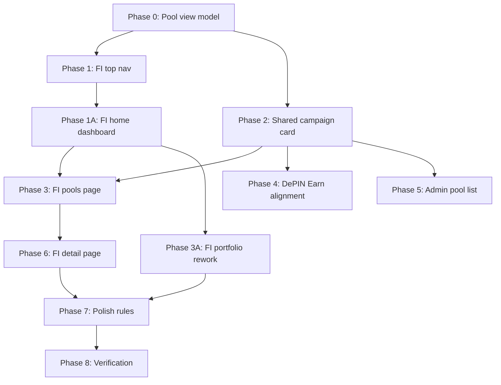

# Nemesis FI UI/UX Rework Plan

> Status: Draft for review only
> Scope: Rework Nemesis FI from sidebar-heavy pages into a cleaner investor webapp, reuse campaign cards across FI, DePIN Earn, and Admin, and redesign pool detail UX.
> Constraint: Do not implement code until this plan is approved.
> Canonical data source: `frontend/src/store/useNemesisStore.ts`

---

## Design References And Principles

Reference screenshots from the user show a calmer investor product: top navigation, compact stats, real asset imagery, clear campaign cards, and a detail page with a left asset summary plus right-side tabbed due diligence.

Guidelines used for this plan:

- Nielsen Norman Group visual design principles: hierarchy, scale, balance, contrast, and grouping should guide attention instead of filling the page with equal-weight text.
- Material 3 app bar/card guidance: app bars should hold navigation and key screen actions; cards should group related content and expose clear action targets.
- Apple HIG tab/navigation guidance: top-level navigation should be stable, concise, and easy to revisit.
- Repo skill: `vercel-react-best-practices`, especially component reuse, stable props, and avoiding duplicated client-heavy UI.

ATM interpretation:

- Adapt: top navigation, compact campaign cards, left summary rail, tabbed detail content, image-led campaign surfaces.
- Transform: keep Nemesis productive EV infrastructure context, not ReFiHub solar-only positioning.
- Merge: combine DePIN Earn card energy with FI investment context and Admin moderation actions.
- Do not copy: brand, exact layout, exact copy, exact color rhythm, or solar-specific assumptions.

---

## Current Audit

### FI Layout

File: `frontend/src/app/(fi)/layout.tsx`

- Uses `AppSidebar`, which makes FI feel like an internal admin portal instead of an investor-facing financing product.
- Wallet connect lives in a separate right-aligned header, disconnected from navigation.
- Mobile still inherits sidebar/mobile-nav behavior from `AppSidebar`, so FI does not have its own investor shell.

### FI Pools Page

File: `frontend/src/app/(fi)/fi/page.tsx`

- Campaign card markup is hand-written inside the page.
- Page has too much explanatory copy and too many repeated text surfaces.
- Header stats are partially static and not fully derived from canonical pool state.
- Filters are useful, but should become quieter and more product-like.
- Visual weight is flat: headline, stats, filters, section copy, badges, and cards all compete.

### DePIN Earn Page

File: `frontend/src/app/(depin)/depin/earn/page.tsx`

- Has the stronger campaign-card direction: image, status, yield, supplied amount, progress, CTA.
- Still duplicates card markup instead of exposing a reusable component.
- Waitlist behavior exists, but should be reusable when campaign status is `upcoming`.

### Admin Pools Page

File: `frontend/src/app/(admin)/admin/pools/page.tsx`

- Moderation actions exist, but published pool cards are a separate dark-mode implementation.
- Admin should reuse the same campaign card structure with admin-only controls layered in.
- Detail modal is useful, but visual density and status controls should be aligned with the shared card/view-model.

### FI Pool Detail

File: `frontend/src/app/(fi)/fi/pools/[poolId]/page.tsx`

- Current detail page is structurally correct but visually generic.
- Many sections use the same white card treatment, so everything feels equally important.
- `PoolSidebar` is useful but should become an image-led summary rail.
- Tabs are functional, but content needs stronger information architecture:
  - Deal terms first
  - Reports and distributions
  - Asset/operator proof
  - Risks
  - Documents
  - Return calculator
- Asset table exists, but should feel like "live operating assets" instead of a raw table dumped inside overview.

### FI Portfolio Page

File: `frontend/src/app/(fi)/fi/portfolio/page.tsx`

- Current portfolio page is functional, but visually feels like a generic internal table view.
- It imports `WorkshopRevenueChart`, which is not semantically tied to FI investor yield.
- `isConnected` is hardcoded to `true`, so wallet state is not represented honestly.
- Summary cards include `Principal recovered`, which should not be a front-end vanity KPI.
- Principal recovery appears as a headline portfolio concept, even though principal accounting should come from actual position/report data and remain contextual.
- There are two separate charts for cash yield and principal recovery, which over-explains the page and makes the portfolio feel busier than needed.
- Active position cards repeat many raw numbers and do not give a clear portfolio-level story.
- Transaction history is useful, but it should sit below a clearer yield/position overview.

### FI Routing

Current FI entry:

- `/fi` is the pools listing page.
- `/fi/portfolio` is portfolio.
- `/fi/stake` is Future `$NMS`.
- `/fi/pools/[poolId]` is detail.

Desired FI entry:

- `/fi` becomes the FI home dashboard.
- `/fi/pools` becomes the pools listing page.
- `/fi/pools/[poolId]` remains pool detail.
- FI navbar logo links to `/fi`.
- FI navbar `Pools` link points to `/fi/pools`.

---

## Desired Product Direction

Nemesis FI should feel like a professional financing workspace for productive EV infrastructure:

- A real home dashboard should greet the investor and summarize what matters now.
- Calm top navigation, not a portal sidebar.
- Fewer words; more scannable proof, economics, status, and actions.
- Campaign cards should look investable and operational, not like generic SaaS cards.
- Portfolio should focus on yield, positions, upcoming payout, and claimable/unclaimed cash yield, not fake-feeling financial stats.
- Pool detail should support investor due diligence without overwhelming the first screen.
- FI, DePIN Earn, and Admin should describe the same pool through one shared view model.
- Admin should feel like a control layer over the same campaign objects, not a separate product.

---

## Phase 0: Data And UI Contract

### Goal

Create one view model that converts `StakingPool` plus linked assets/reports into reusable display props.

### New File

- `frontend/src/lib/poolCampaignViewModel.ts`

### Responsibilities

- Normalize pool status labels and tones.
- Derive fill percentage.
- Derive display image from pool/product/asset context.
- Derive region from `locationLabel`.
- Derive asset count from linked assets where possible, falling back to `unitCount`.
- Derive economics:
  - cash yield
  - principal recovery
  - total annual distribution
  - tenor
  - target raise
  - supplied amount
- Derive mode-specific CTA:
  - FI active/filled: `View campaign`
  - FI upcoming: `Join waitlist`
  - Earn active/filled: `View FI campaign`
  - Earn upcoming: `Join waitlist`
  - Admin pending: `Review`
  - Admin published: `Manage`

### Acceptance

- FI, Earn, and Admin cards no longer compute labels/progress independently.
- No campaign card should rely on static pool copy not present in canonical store.

---

## Phase 1: Replace FI Sidebar With Top Navbar

### Goal

Make FI feel like an investor product with a rounded top navigation bar.

### Files

- Replace FI usage of `AppSidebar` in `frontend/src/app/(fi)/layout.tsx`
- Add `frontend/src/components/fi/FiTopNav.tsx`
- Reuse `frontend/src/components/ui/ConnectWalletButton.tsx`

### Required Changes

1. Remove FI sidebar from desktop and mobile.
2. Add a centered max-width shell with:
   - Nemesis FI logo/wordmark
   - logo route: `/fi`
   - nav links: `Pools`, `Portfolio`, `Future $NMS`
   - wallet button inside the nav
   - compact menu behavior on mobile
3. Use rounded navbar ends and subtle border/shadow.
4. Keep wallet button client-only with `next/dynamic` to avoid hydration issues.
5. Keep nav state visible and stable across FI pages.
6. Update route targets:
   - logo -> `/fi`
   - pools -> `/fi/pools`
   - portfolio -> `/fi/portfolio`
   - future `$NMS` -> `/fi/stake`

### Acceptance

- `/fi`, `/fi/pools`, `/fi/portfolio`, `/fi/stake`, and `/fi/pools/[poolId]` share the new top nav.
- No FI page shows the old left sidebar.
- Connect wallet is visually part of the navbar.
- Mobile has a clean collapsed nav without text overflow.

---

## Phase 1A: FI Home Dashboard

### Goal

Make `/fi` the first FI screen and turn it into a useful investor dashboard instead of sending users straight into the pool catalog.

### Files

- `frontend/src/app/(fi)/fi/page.tsx`
- New file: `frontend/src/app/(fi)/fi/pools/page.tsx`
- `frontend/src/app/(fi)/layout.tsx`
- `frontend/src/components/fi/FiTopNav.tsx`
- New components:
  - `frontend/src/components/fi/FiHomeDashboard.tsx`
  - `frontend/src/components/fi/FiFeaturedAssetCarousel.tsx`
  - `frontend/src/components/fi/FiProjectUpdates.tsx`
  - `frontend/src/components/fi/FiNotificationsPanel.tsx`

### Routing Changes

1. Move the existing pools listing responsibility from `/fi` to `/fi/pools`.
2. Rebuild `/fi` as the home dashboard.
3. Update internal links that currently mean "pool catalog":
   - `/fi` -> `/fi/pools`
4. Keep investor detail links unchanged:
   - `/fi/pools/[poolId]`
5. Logo in `FiTopNav` becomes the only home-dashboard shortcut.

### Dashboard Content

Use the reference as inspiration, not as a direct clone.

Top section:

- Welcome header with concise subcopy.
- Portfolio summary tile:
  - total yield earned
  - average cash yield
  - active positions
  - next payout
- Profile/compliance prompt:
  - connect wallet or complete profile
  - one clear action

Featured campaign carousel:

- Image-led campaign/asset banner.
- One highlighted active or upcoming public pool.
- Left rail with status, ticket/min investment, and short operational description.
- Right image surface with:
  - pool name
  - operator
  - region
  - capacity/unit count
  - cash yield
  - CTA to view campaign
- Carousel indicators should be small and functional, not decorative noise.

Lower section:

- Project/report updates derived from published pool reports.
- Recent notifications panel:
  - payout posted
  - report published
  - pool opened
  - waitlist joined
- Empty states should be quiet and data-aware.

### Data Rules

- Use `selectInvestorPortfolio`, `pools`, `poolReports`, and linked assets.
- No hardcoded portfolio totals.
- No fake "clean energy generated" copy unless it comes from actual impact data.
- Copy should stay broad: productive EV infrastructure, fleets, charging, depot energy, and operator remittance.

### Acceptance

- Opening `/fi` shows home dashboard.
- Clicking the FI logo always returns to `/fi`.
- Clicking `Pools` opens `/fi/pools`.
- Home dashboard uses canonical store data.
- Featured carousel uses real pools from the store.
- No static campaign appears if it is not available in Admin/store data.

---

## Phase 2: Shared Campaign Card Component

### Goal

Use one campaign-card component across FI Pools, DePIN Earn, and Admin list pools.

### New Files

- `frontend/src/components/pools/PoolCampaignCard.tsx`
- `frontend/src/components/pools/PoolStatusBadge.tsx`
- `frontend/src/components/pools/PoolProgressBar.tsx`

### Props

`PoolCampaignCard` should support:

- `pool`
- `mode: "fi" | "earn" | "admin"`
- `image`
- `linkedAssets`
- `onView`
- `onWaitlist`
- `adminActions`:
  - approve
  - reject
  - update status
  - delete
  - open preview

### Design Direction

- Image-led top area, like DePIN Earn.
- Status pill overlay.
- Compact identity row with product type/operator.
- Economics strip:
  - cash yield
  - principal recovery
  - tenor
- Progress block:
  - supplied amount
  - target amount
  - fill percentage
- Tags are secondary and limited to 2-3 visible chips.
- Avoid long descriptions on cards; keep them for detail pages.

### Acceptance

- FI Pools uses `PoolCampaignCard`.
- DePIN Earn uses `PoolCampaignCard`.
- Admin Pools uses `PoolCampaignCard` with admin actions.
- No repeated large card markup remains in those pages.

---

## Phase 3: FI Pools Page Rework

### Goal

Make `/fi/pools` simpler, quieter, and more human-designed.

### File

- `frontend/src/app/(fi)/fi/pools/page.tsx`

### Required Changes

1. Replace current large headline block with a compact dashboard intro:
   - greeting/market label
   - one sentence on productive EV infrastructure financing
   - optional small action pill
2. Derive stats from canonical pools:
   - total capital deployed = sum supplied of public pools
   - available target = sum target of public pools
   - active campaigns = active/upcoming/filled public pools
   - average cash yield = weighted or simple average from public pools
3. Replace verbose stats cards with tighter metric tiles.
4. Keep filters, but style them as a segmented control.
5. Render campaign grid with `PoolCampaignCard`.
6. Empty states should be short and operational, not marketing copy.

### Acceptance

- FI Pools has less copy than the current page.
- Campaign cards visually match the improved Earn card direction.
- Stats update when admin changes pool status or deletes a pool.
- No hardcoded "Phase 1" copy returns.

---

## Phase 3A: FI Portfolio Rework

### Goal

Make `/fi/portfolio` feel like an investor portfolio page, not a stats dump.

### Files

- `frontend/src/app/(fi)/fi/portfolio/page.tsx`
- New components:
  - `frontend/src/components/fi/PortfolioYieldAreaChart.tsx`
  - `frontend/src/components/fi/PortfolioPositionList.tsx`
  - `frontend/src/components/fi/PortfolioLiveProjects.tsx`
  - `frontend/src/components/fi/PortfolioClaimPanel.tsx`
  - `frontend/src/components/fi/PortfolioActivityTable.tsx`

### Required Changes

1. Remove `Principal recovered` as a top-level summary card.
2. Do not hardcode principal portfolio values in the front end.
3. Keep principal information contextual only when backed by actual position/report data:
   - inside a position row
   - inside transaction history
   - inside pool detail/distribution records
4. Replace the two-chart layout with one main yield chart:
   - preferred: area chart for cumulative cash yield over time
   - optional toggle: `Yield` / `Allocation`
   - no separate principal recovery chart as a hero element
5. Build portfolio KPIs from `selectInvestorPortfolio` and `poolReports`:
   - average annualized cash yield
   - total cash yield earned
   - next payout
   - active positions
   - claimable/unclaimed yield if store supports it, otherwise calculated from reports and positions
6. Replace generic active-position cards with a live projects panel:
   - pool thumbnail
   - pool name
   - operator
   - invested amount
   - cash yield
   - status
   - link to pool detail
7. Keep transaction history below the main dashboard area.
8. Wallet disconnected state should be real:
   - use existing wallet/connect state if available
   - otherwise keep the disconnected UI but do not hardcode `isConnected = true`

### Layout Direction

Desktop:

- Top KPI row: 4 compact tiles.
- Main left panel: `Yield Earned Over Time` area chart.
- Right column:
  - live projects list
  - unclaimed/claimable yield panel
- Bottom:
  - banner CTA to browse financing pools
  - transaction/activity table

Mobile:

- KPI tiles become 2-column.
- Chart stays full-width.
- Live projects and claim panel stack below.

### Acceptance

- Portfolio no longer has a top-level `Principal recovered` KPI card.
- Portfolio yield chart is a line or area chart, not the workshop revenue chart unless that component is generalized and renamed.
- Portfolio numbers derive from `selectInvestorPortfolio`, `pools`, and published reports.
- Empty portfolio state nudges the user to browse `/fi/pools`.
- No hardcoded principal portfolio summary remains in page-level UI.

---

## Phase 4: DePIN Earn Alignment

### Goal

Keep Earn visually energetic, but use shared campaign cards and preserve its points context.

### File

- `frontend/src/app/(depin)/depin/earn/page.tsx`

### Required Changes

1. Replace active/upcoming card markup with `PoolCampaignCard`.
2. Use `mode="earn"` to show:
   - points eligible badge
   - waitlist CTA for upcoming pools
   - FI campaign link for public pools
3. Keep existing waitlist modal behavior, but move modal trigger into shared card callback.
4. Keep Earn hero/map/stat context.

### Acceptance

- Earn and FI cards are visibly related, with mode-specific CTA/copy.
- Clicking campaign details navigates to `/fi/pools/[poolId]`, not local state only.
- Upcoming waitlist opens the email modal.

---

## Phase 5: Admin Pool List Rework

### Goal

Admin should manage the same campaign objects using the same card foundation.

### File

- `frontend/src/app/(admin)/admin/pools/page.tsx`

### Required Changes

1. Replace published pool cards with `PoolCampaignCard mode="admin"`.
2. Replace pending pool card body with shared summary sections where possible.
3. Keep admin-only controls:
   - approve
   - reject
   - status select
   - delete
   - view details
   - FI preview
4. Make status changes obvious but not visually noisy.
5. Keep detail modal, but simplify repeated metric sections using shared helpers.

### Acceptance

- Admin can approve, reject, update status, delete, and preview from card/detail modal.
- Admin published cards match the FI/Earn campaign visual system while staying dark-mode compatible.
- Pool deletion/status changes immediately affect FI and Earn lists through the store.

---

## Phase 6: FI Pool Detail Rework

### Goal

Turn pool detail into a credible investor due-diligence page.

### Files

- `frontend/src/app/(fi)/fi/pools/[poolId]/page.tsx`
- `frontend/src/components/fi/PoolSidebar.tsx`
- `frontend/src/components/fi/ReportsTab.tsx`
- New components:
  - `frontend/src/components/fi/PoolDetailSummaryRail.tsx`
  - `frontend/src/components/fi/PoolDetailTabs.tsx`
  - `frontend/src/components/fi/PoolDealFlow.tsx`
  - `frontend/src/components/fi/PoolOperatingAssetsTable.tsx`
  - `frontend/src/components/fi/PoolDistributionTimeline.tsx`

### Layout

Desktop:

- Top nav from Phase 1.
- Thin context bar or breadcrumb below nav.
- Two-column first screen:
  - left: image-led summary rail
  - right: tabbed due-diligence panel
- Operating assets table below.

Mobile:

- Summary rail collapses above tabs.
- Tabs become horizontally scrollable segmented tabs.
- Tables become compact rows/cards if needed.

### Summary Rail

Show:

- pool image/status
- pool name
- location
- next distribution
- amount raised and progress
- cash yield / principal recovery / tenor
- repayments to date
- primary CTA

### Tabs

1. `Deal Terms`
   - revenue model
   - investor cash yield
   - principal recovery
   - fee stack
   - reserve model
   - simple visual flow from asset activity to wallet distribution
2. `Reports`
   - published reports only
   - distribution timeline
   - document rows
3. `Asset & Operator`
   - linked asset list
   - operator history
   - core team from actual pool data
4. `Risks`
   - risk disclosure
   - reserve health
   - proof status
5. `Impact`
   - CO2 avoided
   - green km
   - energy saved
   - ESG narrative
6. `Calculate Returns`
   - existing calculator, visually tightened

### Acceptance

- Detail page no longer looks like stacked generic cards.
- Core team uses actual `pool.teamMembers`.
- Linked assets come from `selectAssetsByPool`.
- Reports use only published reports.
- Investor can understand terms, proof, assets, and risk within one coherent flow.

---

## Phase 7: Visual Polish Rules

### Global FI Rules

- Use a restrained neutral background with white surfaces and teal accents.
- Keep cards at 24px radius max for campaign/product cards, smaller radius for controls.
- Avoid nested cards where a table/list would be cleaner.
- Limit visible text density:
  - cards: no long paragraph descriptions
  - detail tabs: use paragraphs only where due diligence needs explanation
- Use real asset imagery where available.
- Keep icon usage functional, not decorative.
- Keep letter spacing normal except tiny uppercase metadata.

### Accessibility

- Buttons and links must have clear accessible labels.
- Segmented controls need visible active state.
- Nav should preserve focus and keyboard access.
- Color contrast must remain readable on light and dark admin surfaces.

---

## Phase 8: Verification Plan

After implementation approval:

1. Run search checks:
   - no FI import of `AppSidebar`
   - no duplicated `PoolCampaignCard`-like card markup in FI/Earn/Admin
2. Run quality checks:
   - `npm run lint`
   - `npx tsc --noEmit`
   - `npm run build`
3. Visual QA with browser:
   - `/fi`
   - `/fi/pools`
   - `/fi/portfolio`
   - `/fi/pools/[activePoolId]`
   - `/depin/earn`
   - `/admin/pools`
4. Responsive QA:
   - desktop wide
   - tablet-ish
   - mobile
5. Data QA:
   - delete pool in admin, FI/Earn updates
   - status change in admin, FI/Earn visibility updates
   - upcoming pool opens waitlist
   - active pool navigates to detail

---

## Execution Order

---

## Files Expected To Change After Approval

| File | Planned Change |
| --- | --- |
| `frontend/src/app/(fi)/layout.tsx` | Replace FI sidebar shell with rounded top navbar shell |
| `frontend/src/components/fi/FiTopNav.tsx` | New FI navigation component |
| `frontend/src/lib/poolCampaignViewModel.ts` | New shared pool display/data adapter |
| `frontend/src/components/pools/PoolCampaignCard.tsx` | New shared campaign card |
| `frontend/src/components/pools/PoolStatusBadge.tsx` | Shared pool status badge |
| `frontend/src/components/pools/PoolProgressBar.tsx` | Shared progress display |
| `frontend/src/app/(fi)/fi/page.tsx` | New FI home dashboard |
| `frontend/src/app/(fi)/fi/pools/page.tsx` | New FI pools listing route using shared cards |
| `frontend/src/app/(fi)/fi/portfolio/page.tsx` | Rework portfolio dashboard and yield chart |
| `frontend/src/components/fi/FiHomeDashboard.tsx` | New FI home dashboard composition |
| `frontend/src/components/fi/FiFeaturedAssetCarousel.tsx` | New featured pool/asset carousel |
| `frontend/src/components/fi/FiProjectUpdates.tsx` | New dashboard updates section |
| `frontend/src/components/fi/FiNotificationsPanel.tsx` | New dashboard notification panel |
| `frontend/src/components/fi/PortfolioYieldAreaChart.tsx` | New portfolio line/area chart |
| `frontend/src/components/fi/PortfolioPositionList.tsx` | New portfolio positions/live projects component |
| `frontend/src/components/fi/PortfolioClaimPanel.tsx` | New claimable yield panel |
| `frontend/src/components/fi/PortfolioActivityTable.tsx` | New portfolio activity table |
| `frontend/src/app/(depin)/depin/earn/page.tsx` | Replace duplicated card markup with shared cards |
| `frontend/src/app/(admin)/admin/pools/page.tsx` | Replace admin pool cards with shared admin-mode cards |
| `frontend/src/app/(fi)/fi/pools/[poolId]/page.tsx` | Rework detail layout and tab information architecture |
| `frontend/src/components/fi/PoolSidebar.tsx` | Replace or refactor into image-led summary rail |
| `frontend/src/components/fi/ReportsTab.tsx` | Fit into new reports timeline/tab system |
| `frontend/src/components/fi/PoolDetailSummaryRail.tsx` | New detail summary component |
| `frontend/src/components/fi/PoolDetailTabs.tsx` | New detail tab shell |
| `frontend/src/components/fi/PoolDealFlow.tsx` | New visual deal/revenue flow component |
| `frontend/src/components/fi/PoolOperatingAssetsTable.tsx` | New linked assets table/list component |
| `frontend/src/components/fi/PoolDistributionTimeline.tsx` | New distribution/report timeline component |

---

## Acceptance Checklist

- FI uses top navbar, not sidebar.
- Wallet connect lives inside FI navbar.
- `/fi` is a home dashboard.
- FI logo navigates to `/fi`.
- FI pools listing lives at `/fi/pools`.
- FI Pools is quieter, more scannable, and less text-heavy.
- FI Portfolio is redesigned with a yield line/area chart.
- FI Portfolio does not show a top-level principal recovery KPI card.
- FI Portfolio values derive from canonical positions and published reports.
- FI, DePIN Earn, and Admin use one shared campaign card component.
- Admin keeps approve/reject/status/delete/detail/preview actions.
- Campaign cards use canonical store data only.
- Earn campaign detail links route to `/fi/pools/[poolId]`.
- Upcoming campaign waitlist opens email modal.
- FI detail page has a credible investor due-diligence layout.
- FI detail core team, linked assets, reports, documents, and economics all use actual pool/store data.
- No pool campaign appears in FI/Earn if it is not present in admin/store data.
- Lint, typecheck, build, and responsive browser QA pass after implementation.
