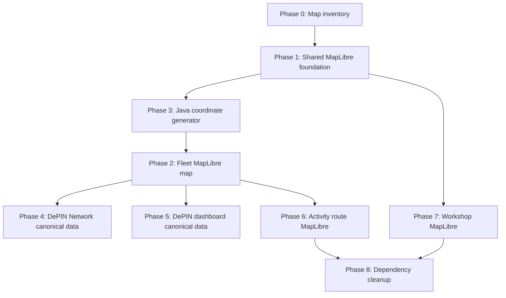

# Nemesis Protocol - MapLibre And DePIN Network Remediation Plan

> Status: Draft for review only
> Scope: Replace remaining Leaflet maps with MapLibre GL, randomize fleet node placement across Java, and reconnect DePIN Network to canonical Nemesis data.
> Constraint: Do not implement code until this plan is approved.
> Canonical data source: `frontend/src/store/useNemesisStore.ts`

---

## Audit Summary

The previous data consistency pass fixed several operator/FI/admin/DePIN flows, but the map layer and DePIN Network page still need a dedicated cleanup.

Current findings:

- Operator fleet map still uses `react-leaflet` through `frontend/src/components/ui/FleetLeafletMap.tsx`.
- DePIN Earn and DePIN dashboard also import `FleetLeafletMap`, so they inherit the same Leaflet dependency and generated marker look.
- `frontend/src/app/(depin)/depin/network/page.tsx` is still mostly static:
  - hardcoded online/offline/in-transit/uptime values
  - hardcoded activity rows
  - hardcoded top zones
  - placeholder map instead of real canonical data
- Driver tracker already uses MapLibre through `frontend/src/components/depin/DriverMap.tsx`.
- Driver route detail already uses MapLibre through `frontend/src/components/depin/RouteDetailMap.tsx`.
- Leaflet remains in:
  - `frontend/src/components/ui/FleetLeafletMap.tsx`
  - `frontend/src/components/ui/LeafletMap.tsx`
  - `frontend/src/components/depin/ActivityTripMap.tsx`
- `frontend/package.json` still contains both map stacks:
  - `leaflet`
  - `react-leaflet`
  - `@types/leaflet`
  - `maplibre-gl`

---

## Desired Outcome

All product maps should use MapLibre GL, with a shared visual language and shared coordinate generator.

Map behavior should feel less obviously generated:

- Operator fleet nodes should be distributed across Java, not clustered in vertical stripes around Jakarta.
- Marker positions should be deterministic per asset id, so refreshes do not jump around.
- Distribution should still be realistic:
  - Jakarta/Jabodetabek can remain the densest region.
  - Bandung, Cirebon, Semarang, Yogyakarta, Surabaya, Malang, and nearby Java corridors should receive plausible node clusters.
  - No generated unit should land in the sea.
- DePIN Network should show the same canonical assets, pools, and derived stats as operator/admin/FI/earn.

---

## Phase 0: Confirm Map Inventory And Ownership

### Goal

Make sure every Leaflet usage has an intended MapLibre replacement.

### Files

- `frontend/src/components/ui/FleetLeafletMap.tsx`
- `frontend/src/components/ui/LeafletMap.tsx`
- `frontend/src/components/depin/ActivityTripMap.tsx`
- `frontend/src/components/depin/DriverMap.tsx`
- `frontend/src/components/depin/RouteDetailMap.tsx`
- `frontend/package.json`

### Required Changes

1. Keep existing MapLibre components as reference:
   - `DriverMap`
   - `RouteDetailMap`

2. Replace remaining Leaflet components:
   - `FleetLeafletMap` -> `FleetMapLibreMap`
   - `LeafletMap` -> `WorkshopMapLibreMap`
   - `ActivityTripMap` Leaflet route preview -> MapLibre route preview

3. After all imports are migrated, remove:
   - `leaflet`
   - `react-leaflet`
   - `@types/leaflet`

### Verification

- `rg "leaflet|react-leaflet|Leaflet" frontend/src frontend/package.json` returns no active imports/usages.
- Driver maps still work unchanged or with shared MapLibre utilities.

---

## Phase 1: Build Shared MapLibre Foundation

### Goal

Avoid three separate MapLibre implementations with duplicated setup code.

### New Files

- `frontend/src/components/maps/MapLibreBase.tsx`
- `frontend/src/components/maps/mapStyles.ts`
- `frontend/src/components/maps/mapMarkers.ts`
- `frontend/src/lib/javaFleetCoordinates.ts`

### Required Changes

1. Add shared MapLibre style constants:
   - dark Carto vector style used by driver map
   - optional light style if workshop map needs it later

2. Add a small base helper/component for:
   - map initialization
   - attribution control
   - navigation control
   - cleanup on unmount
   - dark attribution CSS

3. Keep maps dynamically imported from pages.

4. Follow React/Next performance constraints:
   - MapLibre components remain client-only.
   - Heavy MapLibre code is loaded through `next/dynamic`.
   - Do not import `maplibre-gl` in server components.
   - Use stable primitive props where possible to avoid reinitializing maps.

### Verification

- No SSR/window errors.
- MapLibre CSS loads once per map component group.
- Map unmount cleanup does not leak markers/sources/layers.

---

## Phase 2: Replace FleetLeafletMap With FleetMapLibreMap

### Goal

Migrate operator fleet, DePIN dashboard, and DePIN Earn maps from Leaflet to MapLibre.

### Files

- Replace: `frontend/src/components/ui/FleetLeafletMap.tsx`
- Add or rename to: `frontend/src/components/maps/FleetMapLibreMap.tsx`
- Update imports in:
  - `frontend/src/app/(rwa)/rwa/operator/fleet/page.tsx`
  - `frontend/src/app/(depin)/depin/page.tsx`
  - `frontend/src/app/(depin)/depin/earn/page.tsx`

### Required Changes

1. Preserve current prop shape initially:
   - `vehicles?: FleetMapVehicle[]`
   - `pools?: FleetMapPool[]`

2. Render markers using MapLibre HTML markers or GeoJSON circle layers:
   - For 100-ish points, HTML markers are acceptable.
   - If we expect hundreds/thousands later, use a GeoJSON source + circle layer.

3. Recreate popup content using MapLibre popup:
   - vehicle name/unit
   - health score
   - region
   - odometer
   - owner/operator
   - route log action
   - pool status/unit count/cash yield for pool markers

4. Keep existing route modal behavior:
   - Clicking "View Daily Route Log" still opens `ActivityRouteMap`.

5. Use MapLibre navigation controls instead of Leaflet controls.

### Verification

- Operator fleet map renders with MapLibre, not Leaflet attribution/classes.
- DePIN dashboard map renders with MapLibre.
- DePIN Earn map renders pool markers with MapLibre.
- Popups still work.
- Route modal still opens from operator fleet vehicle popup.

---

## Phase 3: Java-Wide Deterministic Coordinate Generator

### Goal

Make fleet node placement look plausible and less generated, while staying deterministic and land-safe.

### New File

- `frontend/src/lib/javaFleetCoordinates.ts`

### Data Model

Define Java region clusters:

| Cluster | Approx Center | Intended Use |
| --- | --- | --- |
| Jakarta Core | `[-6.20, 106.84]` | main seed density |
| Tangerang | `[-6.20, 106.63]` | Jabodetabek west |
| Bekasi | `[-6.25, 107.00]` | Jabodetabek east |
| Depok/Bogor | `[-6.40, 106.82]` | south corridor |
| Bandung | `[-6.91, 107.61]` | West Java |
| Cirebon | `[-6.73, 108.55]` | north Java corridor |
| Semarang | `[-6.99, 110.42]` | Central Java |
| Yogyakarta | `[-7.80, 110.37]` | Central/south Java |
| Surabaya | `[-7.25, 112.75]` | East Java |
| Malang | `[-7.98, 112.63]` | East Java south |

### Placement Rules

1. Deterministic hash by stable id:
   - vehicle: `asset.id` or `unitId`
   - pool: `pool.id`
   - workshop: `workshop.id`

2. Weighted Java distribution for vehicles:
   - 45% Jakarta/Jabodetabek
   - 15% Bandung/West Java
   - 15% Central Java/Yogyakarta
   - 20% East Java
   - 5% fallback/other

3. Avoid line/grid pattern:
   - use polar jitter with seeded angle/radius
   - use multi-ring distribution per cluster
   - add small road-like corridor offsets rather than fixed vertical offsets

4. Keep points on land:
   - use conservative bounding boxes per cluster
   - clamp latitude/longitude to cluster bounds
   - avoid North Jakarta sea by keeping north bound below safe latitude for Jakarta cluster

5. Pool marker placement:
   - one marker per pool city/region
   - no per-unit jitter for pool marker
   - optionally show count bubble or cluster marker later

### Verification

- 100 seed vehicles spread across Java in a believable way.
- No vertical stripe clusters.
- No points in Laut Jawa.
- Refresh keeps the same node positions.
- Filtering in operator fleet does not reshuffle positions.

---

## Phase 4: Reconnect DePIN Network Page To Canonical Store

### Goal

Make `/depin/network` reflect the same data as operator/admin/FI/earn.

### Files

- `frontend/src/app/(depin)/depin/network/page.tsx`
- `frontend/src/store/useNemesisStore.ts`
- Optional helper: `frontend/src/lib/depinNetworkDerivations.ts`
- Map component from Phase 2: `FleetMapLibreMap`

### Required Changes

1. Replace static stats:
   - Online = active assets
   - Offline = inactive assets
   - In Transit = active assets with odometer/route activity proxy
   - Uptime = active / total assets

2. Replace static activity rows with derived rows from assets:
   - unit = `asset.unitId`
   - category = derive from `asset.category` or `asset.assetSubclass`
   - zone = coordinate cluster/region label
   - time = deterministic recent time from asset id or registeredAt
   - km = derived daily km estimate from odometer
   - on-chain = deterministic short proof hash from asset id/iot id

3. Replace placeholder map with `FleetMapLibreMap`:
   - show canonical assets
   - support filters: Semua, Ojol, Kurir, Logistik
   - map data changes with filter

4. Replace static top zones:
   - aggregate canonical assets by generated Java cluster label
   - show top 4 zones by unit count

5. Replace connectivity metrics:
   - Avg Uptime from active/total
   - Data Lag as deterministic display metric or derived from report recency
   - Blockchain Sync from on-chain/proof count
   - Tx Success from published reports/proof proxy

### Verification

- `/depin/network` total online/offline values match canonical assets.
- Filters change both table and map.
- Network map shows same Java-wide placement style as operator fleet.
- Top zones are computed from actual asset distribution.
- No hardcoded `623`, `224`, `412`, or static activity rows remain.

---

## Phase 5: Update DePIN Dashboard Page

### Goal

Bring `/depin` dashboard in line with `/depin/earn` and `/depin/network`.

### Files

- `frontend/src/app/(depin)/depin/page.tsx`
- `frontend/src/components/ui/DepinStatsBar.tsx`
- `frontend/src/lib/depinNetworkDerivations.ts`

### Required Changes

1. Replace local static:
   - `fleetCategories`
   - `kmData`
   - `txData`
   - `activityRows`
   - `mockVehicles`

2. Derive from canonical assets/reports:
   - category cards from asset categories/subclasses
   - km chart from reports or deterministic 7-day projection
   - on-chain submissions from asset/proof counts
   - activity table from same helper as network page

3. Use `FleetMapLibreMap`, not `FleetLeafletMap`.

### Verification

- `/depin`, `/depin/earn`, and `/depin/network` agree on connected assets, active nodes, pool count, and total supplied.
- No map uses Leaflet.

---

## Phase 6: Migrate ActivityTripMap From Leaflet To MapLibre

### Goal

Remove the remaining Leaflet route modal and keep route visuals consistent with driver route detail.

### Files

- `frontend/src/components/depin/ActivityTripMap.tsx`
- `frontend/src/components/depin/ActivityRouteMap.tsx`
- Reference: `frontend/src/components/depin/RouteDetailMap.tsx`

### Required Changes

1. Replace dynamic `react-leaflet` imports with MapLibre setup.
2. Render the route as a GeoJSON LineString source.
3. Add start/end markers if useful.
4. Preserve modal/non-modal layout and route stats.
5. Keep portal behavior for modal mode.

### Verification

- Opening route log from operator fleet still works.
- No Leaflet CSS/import remains.
- Route line appears correctly inside modal.

---

## Phase 7: Workshop Map Migration

### Goal

Remove the last generic Leaflet component.

### Files

- `frontend/src/components/ui/LeafletMap.tsx`
- Search pages that import it before implementation.

### Required Changes

1. Rename or replace with `WorkshopMapLibreMap`.
2. Preserve workshop marker popup:
   - name
   - rating/reviews
   - badges
   - specialization
   - profile link
3. Use workshop coordinates directly, no Java generator needed.

### Verification

- Workshop map pages still render.
- Workshop popup actions still navigate.
- No Leaflet imports remain.

---

## Phase 8: Dependency Cleanup

### Goal

Remove duplicate map stack and reduce frontend bundle surface.

### Files

- `frontend/package.json`
- lockfile used by the project

### Required Changes

After all Leaflet imports are removed:

- uninstall/remove:
  - `leaflet`
  - `react-leaflet`
  - `@types/leaflet`
- keep:
  - `maplibre-gl`

### Verification

- `rg "leaflet|react-leaflet|Leaflet" frontend/src frontend/package.json` has no active usage.
- `npm run lint` passes.
- `npx tsc --noEmit` passes.
- `npm run build` passes.

---

## Execution Order

---

## Files Expected To Change After Approval

| File | Planned Change |
| --- | --- |
| `frontend/src/components/ui/FleetLeafletMap.tsx` | Replace/rename with MapLibre fleet map |
| `frontend/src/components/maps/FleetMapLibreMap.tsx` | New canonical fleet/pool map |
| `frontend/src/components/maps/MapLibreBase.tsx` | Shared MapLibre initialization pattern |
| `frontend/src/components/maps/mapStyles.ts` | Shared style constants |
| `frontend/src/components/maps/mapMarkers.ts` | Shared marker helpers |
| `frontend/src/lib/javaFleetCoordinates.ts` | Deterministic Java-wide coordinate generator |
| `frontend/src/lib/depinNetworkDerivations.ts` | Shared derived DePIN stats/activity rows |
| `frontend/src/app/(rwa)/rwa/operator/fleet/page.tsx` | Use MapLibre fleet map and Java-wide node placement |
| `frontend/src/app/(depin)/depin/earn/page.tsx` | Use MapLibre pool map |
| `frontend/src/app/(depin)/depin/page.tsx` | Replace static DePIN dashboard data |
| `frontend/src/app/(depin)/depin/network/page.tsx` | Replace static network page with canonical data and MapLibre |
| `frontend/src/components/depin/ActivityTripMap.tsx` | Replace Leaflet route preview with MapLibre |
| `frontend/src/components/ui/LeafletMap.tsx` | Replace/rename workshop map with MapLibre |
| `frontend/package.json` | Remove Leaflet dependencies after migration |

---

## Acceptance Checklist

- No remaining Leaflet usage in source or package dependencies.
- Operator fleet map uses MapLibre GL.
- DePIN dashboard map uses MapLibre GL.
- DePIN Earn map uses MapLibre GL.
- DePIN Network page uses MapLibre GL and no placeholder map.
- Driver map and driver route detail remain MapLibre and still work.
- Fleet node placement is Java-wide, deterministic, and land-safe.
- 100 generated units no longer form obvious vertical stripes.
- DePIN Network stats derive from `useNemesisStore.assets`, `pools`, and reports.
- DePIN Network filters update map and table together.
- `/depin`, `/depin/earn`, `/depin/network`, operator fleet, admin, and FI agree on canonical counts.
- `npm run lint`, `npx tsc --noEmit`, and `npm run build` pass after implementation.
