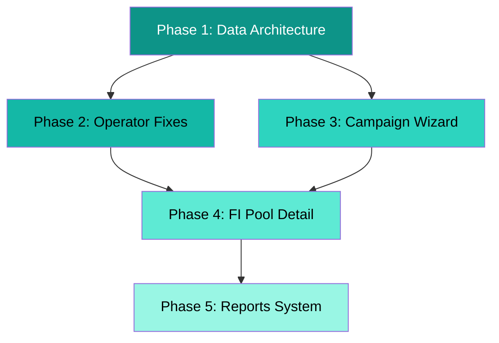

# Nemesis Protocol — Final Implementation Plan

> **Status**: Awaiting user approval  
> **Scope**: 5 phases, ~19 files modified/created  
> **Decisions confirmed**: 100 mock vehicles, IDRX+USDC support, DeCharge 2-col layout, hybrid reports, avatar initials

---

## Phase 1: Unified Data Architecture (Foundation)

> [!IMPORTANT]
> This phase MUST be completed first. Everything else depends on it.

### Goal

Consolidate all scattered mock data sources into `useNemesisStore` as the single source of truth. Scale vehicles to 100.

---

#### [NEW] [generateMockVehicles.ts](file:///d:/Projekan/Nemesis%20Protocol/frontend/src/data/generateMockVehicles.ts)

Generator function that produces 100 `RegisteredVehicle` entries with realistic variety:

```
Generates 100 vehicles with:
- IDs: vhc-0001 through vhc-0100
- unitIds: #NMS-0001 through #NMS-0100
- VINs: NMS2026JKT0001-0100
- Brands: Gesits G1/G2 (60%), Viar Q1/Karya (30%), Honda EM1 (10%)
- Categories: ojol (50), kurir (30), logistik (20)
- Status distribution: active (75), maintenance (10), idle (10), inactive (5)
- Health scores: randomized 65-99
- Odometers: randomized 0-30,000 km
- All assigned to poolId: 'pool-batch-1'
- 83 vehicles get driverId assigned (matching overview stat "83 active")
- Remaining 17 have no driver (available for assignment)
```

#### [MODIFY] [vehicles.ts](file:///d:/Projekan/Nemesis%20Protocol/frontend/src/data/vehicles.ts)

- Replace hardcoded 5-item array with import from `generateMockVehicles()`
- `MOCK_VEHICLES` will now export 100 items

#### [MODIFY] [operators.ts](file:///d:/Projekan/Nemesis%20Protocol/frontend/src/data/operators.ts)

- Remove hardcoded `totalVehicles: 100` and `activeVehicles: 83`
- These become **derived values** computed from actual asset data in the store
- Change type to `totalAssets` / `activeAssets` (already renamed in [rwa.ts](file:///d:/Projekan/Nemesis%20Protocol/frontend/src/types/rwa.ts#L139-L140) types but data file still uses old names)

#### [MODIFY] [useNemesisStore.ts](file:///d:/Projekan/Nemesis%20Protocol/frontend/src/store/useNemesisStore.ts)

Expand store to become unified data hub:

```ts
interface NemesisState {
  assets: RegisteredVehicle[];
  pools: StakingPool[];
  drivers: RegisteredDriver[]; // NEW — moved from driverAuthStore
  operators: OperatorProfile[]; // NEW — moved from data/operators.ts
  investments: InvestorPosition[]; // NEW — for FI invest tracking
  poolReports: PoolReport[]; // NEW — for hybrid reports
  userRole: "investor" | "operator" | "super_operator" | null;
  _hydrated: boolean;
}

interface NemesisActions {
  // Existing
  registerAsset: (asset) => void;
  updateAssetStatus: (assetId, status) => void;
  createPool: (pool) => void;
  updatePoolStatus: (poolId, status) => void;
  setUserRole: (role) => void;

  // NEW — Driver management
  registerDriver: (driver) => void;
  assignVehicleToDriver: (driverId, vehicleId) => void;

  // NEW — Investment actions
  investInPool: (poolId, amount, currency) => void;

  // NEW — Reports
  addPoolReport: (report) => void;
  updatePoolReport: (reportId, updates) => void;

  // Computed selectors (not actions, but documented here)
  // getAvailableVehicles(): assets not assigned to any driver
  // getUnpooledAssets(): assets not assigned to any pool
  // getTotalFleetStats(): derived totals
}
```

#### [MODIFY] [driverAuthStore.ts](file:///d:/Projekan/Nemesis%20Protocol/frontend/src/store/driverAuthStore.ts)

- **Keep**: Auth logic (login, OTP, session management)
- **Remove**: `registeredDrivers` state and `registerDriver` action → moved to `useNemesisStore`
- **Change**: `sendOtp()` and `verifyOtp()` read drivers from `useNemesisStore` instead of local state

---

## Phase 2: Operator Dashboard Fixes

### Goal

Fix all data inconsistencies in the operator portal — stats, driver assignment, admin visibility.

---

#### [MODIFY] [operator/page.tsx](<file:///d:/Projekan/Nemesis%20Protocol/frontend/src/app/(rwa)/rwa/operator/page.tsx>)

**Changes**:

- Replace `MOCK_OPERATOR_PROFILE.totalVehicles` → `useNemesisStore().assets.length`
- Replace `MOCK_OPERATOR_PROFILE.activeVehicles` → derived `assets.filter(a => a.status === 'active').length`
- "Live unit preview" table: show first 8-10 from `assets` instead of sliced 5
- Pool badge remains same (reads from `pools`)
- Ensure "Registered fleet", "Active today" numbers always match actual store data

#### [MODIFY] [drivers/page.tsx](<file:///d:/Projekan/Nemesis%20Protocol/frontend/src/app/(rwa)/rwa/operator/drivers/page.tsx>)

**Changes**:

1. **Vehicle dropdown filter** — only show unassigned vehicles:

```ts
const { assets, drivers } = useNemesisStore();
const assignedVehicleIds = new Set(drivers.map((d) => d.assignedVehicleId));
const availableVehicles = assets.filter(
  (a) => !assignedVehicleIds.has(a.unitId),
);
```

2. **Remove contract/fee inputs from driver form**:
   - ❌ Remove: "Contract Type" select (rent / rent_to_own)
   - ❌ Remove: "Daily Fee" input
   - ✅ Keep: Full Name, Phone, KYC Status, Vehicle selection
   - ✅ Add: Display inherited contract info from selected vehicle (read-only)

3. **Driver list** — read from `useNemesisStore().drivers` instead of `driverAuthStore.registeredDrivers`

4. **Register handler** — call `useNemesisStore().registerDriver()` + also mark vehicle as assigned via `assignVehicleToDriver()`

#### [MODIFY] [useAdminStore.ts](file:///d:/Projekan/Nemesis%20Protocol/frontend/src/store/useAdminStore.ts#L50-L60)

**Changes**:

- Add "Nemesis Protocol" as operator in `seedWallets`:

```ts
{ wallet: "NMS0...opNM", role: "operator", entityName: "Nemesis Protocol",
  status: "active", registeredAt: "2025-01-01", lastActive: "2026-04-24" },
```

- Now admin `/admin/operators` page will show 3 operators including Nemesis Native

---

#### [MODIFY] [mint/page.tsx](<file:///d:/Projekan/Nemesis%20Protocol/frontend/src/app/(rwa)/rwa/operator/mint/page.tsx>)

**Changes** — Fix stepper visual progression:

1. Add `currentOnboardStep` state (1–5)
2. During `handleSubmitReadiness()`:
   - Step 4 starts: `setCurrentOnboardStep(4)` with "Fetching..." animation
   - After 2s delay: `setCurrentOnboardStep(5)` with "Minting..." animation
   - After 1.5s: `setSubmitDone(true)` → show completion
3. Stepper visually highlights current step with teal color + pulse animation
4. Each completed step shows ✅ checkmark

---

## Phase 3: Campaign Wizard Redesign

### Goal

Rebuild campaign creation from 5-step generic form to 7-step V2 Blueprint-compliant wizard with asset selection and proper revenue split.

---

#### [MODIFY] [campaigns/create/page.tsx](<file:///d:/Projekan/Nemesis%20Protocol/frontend/src/app/(rwa)/rwa/operator/campaigns/create/page.tsx>)

**Complete rewrite** — from 278 lines simple form to 7-step wizard:

**Step 1: Pool Identity & Assets**

- Pool name (text)
- Location (text, default from operator profile)
- Asset class type (select: mobility_credit, fleet_remittance, charging_yield, energy_yield)
- **Multi-select registered assets** from `useNemesisStore().assets`:
  - Filter: only assets with `status !== 'inactive'` and no `poolId`
  - Each shows: unitId, brand model, financedCost, healthScore
  - Checkbox selection with "Select All" option
- Auto-derived (read-only):
  - Unit count = selected.length
  - Total Capex = sum(financedCost)
  - Collateral description = auto-generated

**Step 2: Revenue Model & Split (V2 Blueprint)**

Pre-filled 7-way split based on product type selection:

| Field                      | Default (mobility_credit) | Editable? |
| -------------------------- | ------------------------- | --------- |
| Principal Recovery %       | 45                        | ✅        |
| Investor Cash Yield %      | 20                        | ✅        |
| Maintenance Reserve %      | 10                        | ✅        |
| Default Reserve %          | 5                         | ✅        |
| Operator Base Fee %        | 8                         | ✅        |
| Operator Performance Fee % | 2                         | ✅        |
| Protocol Fee %             | 10                        | ❌ Fixed  |

- Live validation: total must equal 100%
- Tenor input (default 36 months)
- Monthly collection assumption per unit (default Rp 1,500,000)
- Auto-derived metrics:
  - Cash Yield APY = (cashYieldPct × collectionRate)
  - Annual Principal Recovery = principal% × totalCapex / tenor × 12
  - Total Annual Cash Distribution = yield + principal recovery
  - Min/Max Investment (auto: min = unitCost × 0.01, max = totalCapex × 0.10)

**Step 3: Project Narrative**

- Overview title (text)
- Overview description (textarea, rich)
- Problem statement (textarea)
- Solution strategy (textarea)
- Delivery timeline: start date, expected first payout, completion date

**Step 4: Team & Operator**

- Operator name (auto from profile)
- Operator history/track record (textarea)
- Team members (repeatable fields):
  - Name (text)
  - Role (text)
  - Bio (textarea, 2-3 lines)
  - Photo: optional upload → fallback to **avatar initials** (e.g., "RS" for Rio Sudrajat)

**Step 5: Impact & ESG**

- Estimated CO2 avoided (kg) — auto-suggest from units × avg daily km × emission factor
- Green km equivalent (number)
- Trees planted equivalent (number)
- Energy saved (kWh)
- ESG narrative paragraph (textarea)

**Step 6: Risk & Legal**

- Risk factors (textarea or structured list)
- Risk mitigations (textarea)
- Legal documents: repeatable [title + URL + type(PDF/legal/report)]
- Compliance warning banner (existing, kept)

**Step 7: Review & Submit**

- Full summary preview (how pool will look to investor)
- Split breakdown visual (pie chart or bar)
- Asset list summary
- Projected returns for Rp 1M investment
- Submit button → status: `pending_approval`

---

## Phase 4: FI Pool Detail Redesign (DeCharge-Inspired)

### Goal

Transform the pool detail page from basic tabbed view to DeCharge-inspired 2-column layout with investment functionality.

---

#### [MODIFY] [fi/pools/[poolId]/page.tsx](<file:///d:/Projekan/Nemesis%20Protocol/frontend/src/app/(fi)/fi/pools/[poolId]/page.tsx>)

**Complete layout overhaul** — from single-column tabs to 2-column:

```
┌────────────────────────────────────────────────────────────────────┐
│  Breadcrumb: FI Earn > Pools > Jakarta Ride-Hailing Credit Pool   │
├──────────────────────────────────┬─────────────────────────────────┤
│                                  │                                 │
│  MAIN CONTENT (left, ~65%)       │  STICKY SIDEBAR (right, ~35%)  │
│                                  │                                 │
│  ┌── Tabs ─────────────────────┐ │  ┌── Pool Summary ───────────┐ │
│  │ Reports │ Overview │Details │ │  │  [Pool Image / Map]       │ │
│  │ Impact │ Calculate │ Docs   │ │  │  "Jakarta Ride-Hailing    │ │
│  └─────────────────────────────┘ │  │   Credit Pool"            │ │
│                                  │  │  📍 Jakarta, ID           │ │
│  [Tab Content Area]              │  │  🟢 Distributing          │ │
│                                  │  │                           │ │
│                                  │  │  NEXT DISTRIBUTION        │ │
│                                  │  │  May 28, 2026             │ │
│                                  │  │                           │ │
│                                  │  │  CAPITAL RAISED           │ │
│                                  │  │  Rp 1,875,000,000        │ │
│                                  │  │  [████████████░░░░] 75%  │ │
│                                  │  │                           │ │
│                                  │  │  CASH YIELD   TENOR       │ │
│                                  │  │  14.4%        36 mo       │ │
│                                  │  │                           │ │
│                                  │  │  ┌── INVEST ───────────┐ │ │
│                                  │  │  │ Amount: [_______]   │ │ │
│                                  │  │  │ Currency: IDRX|USDC │ │ │
│                                  │  │  │ [Connect & Invest]  │ │ │
│                                  │  │  └─────────────────────┘ │ │
│                                  │  │                           │ │
│                                  │  │  RECENT DISTRIBUTIONS     │ │
│                                  │  │  Apr 2026 — 30M IDRX ✓  │ │
│                                  │  │  Mar 2026 — 29.1M IDRX  │ │
│                                  │  │  Feb 2026 — 28.2M IDRX  │ │
│                                  │  └───────────────────────────┘ │
│                                  │                                 │
└──────────────────────────────────┴─────────────────────────────────┘
```

**Tab Restructure**:

| Old Tab          | New Tab                 | Content Changes                                                                      |
| ---------------- | ----------------------- | ------------------------------------------------------------------------------------ |
| Deal Terms       | **Overview**            | Pool description + Asset Details table + Delivery Timeline + Economics summary       |
| Performance      | **Reports**             | Timeline narrative reports (hybrid system) + Distribution table                      |
| Asset & Operator | **Details**             | Problem statement + Solution strategy + Team section (with initials) + Operator info |
| — (missing)      | **Impact**              | Dedicated: CO2, kWh, km, trees with visual icons + ESG narrative                     |
| Calculator       | **Calculate**           | Keep existing calculator with improvements                                           |
| Documents        | **Documents**           | Keep as-is                                                                           |
| Risks            | Merged into **Details** | Risk section folded into Details tab bottom section                                  |

#### [NEW] [PoolSidebar.tsx](file:///d:/Projekan/Nemesis%20Protocol/frontend/src/components/fi/PoolSidebar.tsx)

Sticky sidebar component containing:

- Pool image (placeholder with gradient + pool name overlay)
- Location + status badge
- Next distribution date
- Capital raised progress bar (visual, with percentage)
- Key metrics (cash yield, tenor, installment type)
- **Investment Action Card**:
  - Amount input (numeric, formatted)
  - Currency toggle: IDRX / USDC (pill buttons)
  - Min/Max investment info
  - Projected monthly return (auto-calculated)
  - "Connect Wallet & Invest" button (primary CTA, teal)
  - Settlement info line
- Recent distributions mini-list (last 4)

#### [NEW] [InvestModal.tsx](file:///d:/Projekan/Nemesis%20Protocol/frontend/src/components/fi/InvestModal.tsx)

Full-screen modal triggered by "Connect & Invest" button:

```
┌─────────────────────────────────────┐
│  Invest in Jakarta Ride-Hailing Pool│
│                                     │
│  Investment Amount                  │
│  [  1,000,000                    ]  │
│  Min: Rp 300,000 • Max: Rp 250M   │
│                                     │
│  Select Currency                    │
│  ┌────────┐  ┌────────┐            │
│  │  IDRX  │  │  USDC  │            │
│  │  ●     │  │        │            │
│  └────────┘  └────────┘            │
│                                     │
│  ┌── PROJECTED RETURNS ──────────┐ │
│  │ Monthly Cash Yield:  24,000   │ │
│  │ Monthly Principal:   54,000   │ │
│  │ Annual Cash Total:   936,000  │ │
│  │ Maturity Settlement: 700,000  │ │
│  └───────────────────────────────┘ │
│                                     │
│  ☑ I understand the risks          │
│                                     │
│  [ Confirm Investment ]             │
│  Powered by Solana • USDC settled  │
└─────────────────────────────────────┘
```

After confirm → updates `useNemesisStore().investments[]` and `pool.totalSupplied`

#### [NEW] [AvatarInitials.tsx](file:///d:/Projekan/Nemesis%20Protocol/frontend/src/components/ui/AvatarInitials.tsx)

Simple reusable component:

```tsx
// Input: name="Rio Sudrajat" size="md"
// Output: Circle with "RS" text, random deterministic background color based on name
```

---

## Phase 5: Reports System (Hybrid)

### Goal

Implement the Reports tab with auto-generated + operator-editable monthly performance reports.

---

#### [MODIFY] [types/fi.ts](file:///d:/Projekan/Nemesis%20Protocol/frontend/src/types/fi.ts#L100-L111)

Extend existing `PoolReport` type:

```ts
export interface PoolReport {
  id: string;
  poolId: string;
  period: string; // "2026-04"
  type: "monthly" | "quarterly";

  // Auto-generated fields
  avgCollectionHealth: number;
  yieldDistributed: number;
  principalReturned: number;
  reserveBalance: number;
  activeUnits: number;
  totalKm: number;
  maintenanceEvents: number;

  // Auto-generated narrative (system creates from data above)
  autoNarrative: string;

  // Operator-edited fields
  operatorNarrative?: string; // NEW — operator can override/supplement
  operatorHeadline?: string; // NEW — e.g. "Strong Collection Month"
  isPublished: boolean; // NEW — whether visible to investors
  editedByOperator: boolean; // NEW — flag if operator customized

  highlights: string[];
  downloadUrl?: string;
  periodData: {
    period: string;
    yield: number;
    principal: number;
    reserve: number;
  }[];
}
```

#### [NEW] [generateAutoReport.ts](file:///d:/Projekan/Nemesis%20Protocol/frontend/src/lib/generateAutoReport.ts)

Utility that takes pool data + distributions and generates narrative:

```ts
function generateAutoReport(
  pool: StakingPool,
  distribution: YieldDistribution,
): PoolReport {
  // Auto-generate narrative like:
  // "April 2026 — 83 of 100 units active (83% utilization).
  //  Total fleet distance: 125,000 km. Collection rate: 94.2%.
  //  Investor distributions totaled 30,000,000 IDRX in yield
  //  and 67,500,000 IDRX in principal recovery.
  //  2 units under scheduled maintenance."
}
```

#### [NEW] [data/reports.ts](file:///d:/Projekan/Nemesis%20Protocol/frontend/src/data/reports.ts)

Seed data: 6 months of auto-generated reports for pool-batch-1 with some having `operatorNarrative` overrides.

#### [NEW] [ReportsTab.tsx](file:///d:/Projekan/Nemesis%20Protocol/frontend/src/components/fi/ReportsTab.tsx)

FI pool detail Reports tab:

- Timeline view (left border line with dots, like DeCharge)
- Each report card shows:
  - Period badge (e.g., "April 2026")
  - Headline (operatorHeadline if exists, else auto: "Monthly Report")
  - Narrative text (operatorNarrative if exists, else autoNarrative)
  - Key metrics row: active units, collection %, yield, principal
  - "Download PDF" link if available

---

## Execution Order



| Phase                          | Est. Files                                           | Dependencies  |
| ------------------------------ | ---------------------------------------------------- | ------------- |
| **Phase 1**: Data Architecture | 4 files (generate, vehicles, operators, store)       | None          |
| **Phase 2**: Operator Fixes    | 4 files (overview, drivers, admin, mint)             | Phase 1       |
| **Phase 3**: Campaign Wizard   | 1 file (campaigns/create rewrite)                    | Phase 1       |
| **Phase 4**: FI Pool Detail    | 4 files (pool page, sidebar, invest modal, avatar)   | Phase 1, 2, 3 |
| **Phase 5**: Reports System    | 4 files (types, generator, seed data, tab component) | Phase 4       |
| **Total**                      | ~17-19 files                                         |               |

---

## Files Summary

### New Files (8)

| File                               | Purpose                                                |
| ---------------------------------- | ------------------------------------------------------ |
| `data/generateMockVehicles.ts`     | Generate 100 mock vehicles with realistic distribution |
| `data/reports.ts`                  | Seed report data (6 months)                            |
| `lib/generateAutoReport.ts`        | Auto-generate narrative reports from pool data         |
| `components/fi/PoolSidebar.tsx`    | Sticky sidebar with pool info + invest CTA             |
| `components/fi/InvestModal.tsx`    | Investment flow modal (IDRX/USDC)                      |
| `components/fi/ReportsTab.tsx`     | Timeline reports component                             |
| `components/ui/AvatarInitials.tsx` | Reusable avatar with name initials                     |
| `task.md`                          | Progress tracking                                      |

### Modified Files (11)

| File                                               | Key Changes                                      |
| -------------------------------------------------- | ------------------------------------------------ |
| `data/vehicles.ts`                                 | Use generated 100 vehicles                       |
| `data/operators.ts`                                | Remove hardcoded counts                          |
| `store/useNemesisStore.ts`                         | Add drivers, operators, investments, reports     |
| `store/driverAuthStore.ts`                         | Remove registeredDrivers, read from NemesisStore |
| `store/useAdminStore.ts`                           | Add Nemesis Protocol operator to seedWallets     |
| `types/fi.ts`                                      | Extend PoolReport with hybrid fields             |
| `app/(rwa)/rwa/operator/page.tsx`                  | Derive stats from store                          |
| `app/(rwa)/rwa/operator/drivers/page.tsx`          | Filter vehicles, simplify form                   |
| `app/(rwa)/rwa/operator/mint/page.tsx`             | Fix stepper visual progression                   |
| `app/(rwa)/rwa/operator/campaigns/create/page.tsx` | Complete 7-step wizard rewrite                   |
| `app/(fi)/fi/pools/[poolId]/page.tsx`              | DeCharge 2-col layout + new tabs                 |

---

## Verification Plan

### Per-Phase Testing

**Phase 1** — Data integrity:

- Console log `useNemesisStore.getState().assets.length` → must be 100
- Check that `assets.filter(a => a.status === 'active').length` ≈ 75

**Phase 2** — Operator dashboard:

- Overview: "Registered fleet" shows 100, "Active today" shows ~75
- Fleet page lists all 100 vehicles with pagination/scroll
- Driver registration: vehicle dropdown only shows ~17 unassigned vehicles
- Driver form no longer has contract/fee fields
- Admin operators page shows 3 operators (including Nemesis Protocol)
- Mint stepper visually progresses 4 → 5 → completion

**Phase 3** — Campaign wizard:

- Step 1: Can multi-select assets, auto-calculates capex
- Step 2: 7-way split totals 100%, derived metrics update live
- Steps 3-6: All narrative fields present and functional
- Step 7: Review shows complete preview
- After submit: new pool appears in `useNemesisStore().pools`

**Phase 4** — FI pool detail:

- Layout: 2-column with sticky sidebar on desktop
- Sidebar shows progress bar, metrics, distribution history
- Investment card: can enter amount, toggle IDRX/USDC
- "Connect & Invest" shows modal with projected returns
- After invest: pool.totalSupplied increases, investment appears in store
- Responsive: sidebar stacks on mobile

**Phase 5** — Reports:

- Reports tab shows 6 months timeline
- Each report has auto-generated narrative
- Reports with operatorNarrative show customized text
- Key metrics row visible per report

### Browser Visual Test

- Navigate full flow: Register asset → Mint → Create campaign → View in FI → Invest
- Verify all numbers stay consistent across portals
